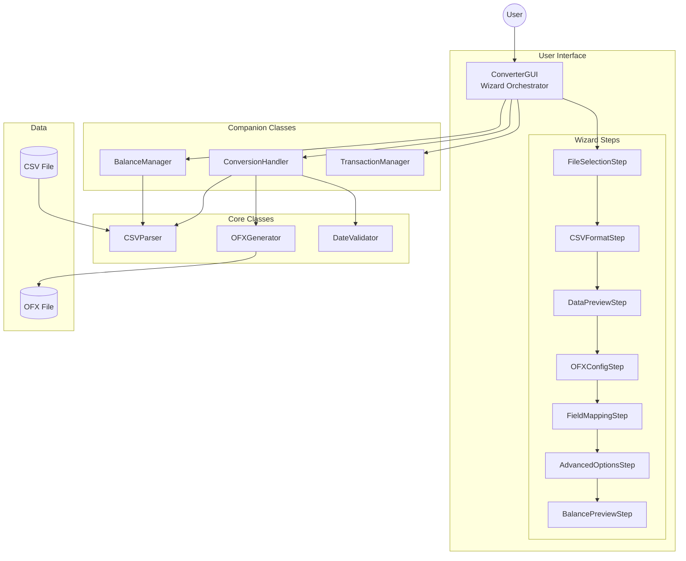

# CSV to OFX Converter - Technical Documentation

## 1. Description

**CSV to OFX Converter** is a desktop application developed in Python that converts CSV (Comma-Separated Values) files to OFX (Open Financial Exchange) format. The application offers full support for Brazilian banking formats and features an intuitive graphical interface based on a 7-step wizard.

### 1.1 General Objective

Provide a robust and easy-to-use tool for converting financial statements from CSV format to the OFX 1.0.2 (SGML) standard, enabling import into financial management software such as GnuCash, Microsoft Money, Quicken, and others.

### 1.2 Target Audience

This documentation is intended for **developers** who want to:
- Understand the architecture and internal workings of the application
- Contribute improvements and bug fixes
- Extend functionalities or integrate with other systems
- Perform maintenance and testing on the code

## 2. Index

### Global Documents

| Document | Description |
|----------|-------------|
| [Overview](overview.md) | Functional description, flows, and business rules |
| [Architecture](architecture.md) | System architecture, layers, and technologies |
| [Unit Tests](unit-tests.md) | Testing strategy, tools, and examples |

### Class Documentation

#### Core Classes

| Class | Description |
|-------|-------------|
| [CSVParser](classes/CSVParser.md) | CSV file parser with Brazilian format support |
| [OFXGenerator](classes/OFXGenerator.md) | OFX 1.0.2 file generator |
| [DateValidator](classes/DateValidator.md) | Date validator for statement periods |

#### GUI Classes - Orchestration

| Class | Description |
|-------|-------------|
| [ConverterGUI](classes/ConverterGUI.md) | Main graphical interface orchestrator |
| [WizardStep](classes/WizardStep.md) | Abstract base class for wizard steps |
| [BalanceManager](classes/BalanceManager.md) | Balance calculation manager |
| [ConversionHandler](classes/ConversionHandler.md) | Conversion process orchestrator |
| [TransactionManager](classes/TransactionManager.md) | Transaction operations manager |

#### GUI Classes - Wizard Steps

| Class | Description |
|-------|-------------|
| [FileSelectionStep](classes/WizardSteps.md#fileselectionstep-step-1) | Step 1: CSV file selection |
| [CSVFormatStep](classes/WizardSteps.md#csvformatstep-step-2) | Step 2: CSV format configuration |
| [DataPreviewStep](classes/WizardSteps.md#datapreviewstep-step-3) | Step 3: Data preview |
| [OFXConfigStep](classes/WizardSteps.md#ofxconfigstep-step-4) | Step 4: OFX configuration |
| [FieldMappingStep](classes/WizardSteps.md#fieldmappingstep-step-5) | Step 5: Field mapping |
| [AdvancedOptionsStep](classes/WizardSteps.md#advancedoptionsstep-step-6) | Step 6: Advanced options |
| [BalancePreviewStep](classes/WizardSteps.md#balancepreviewstep-step-7) | Step 7: Balance preview |

#### Utility Modules and Wizard Steps

| Document | Description |
|----------|-------------|
| [Wizard Steps](classes/WizardSteps.md) | Documentation of all 7 wizard steps |
| [Utility Modules](classes/UtilityModules.md) | Utility functions and constants |

## 3. System Overview Diagram



## 4. Directory Structure

```
csv-to-ofx-converter/
├── main.py                      # Application entry point
├── src/                         # Source code
│   ├── csv_to_ofx_converter.py  # Main module
│   ├── csv_parser.py            # CSV Parser
│   ├── ofx_generator.py         # OFX Generator
│   ├── date_validator.py        # Date Validator
│   ├── converter_gui.py         # Main GUI
│   ├── gui_wizard_step.py       # WizardStep base class
│   ├── gui_balance_manager.py   # Balance manager
│   ├── gui_conversion_handler.py # Conversion handler
│   ├── gui_transaction_manager.py # Transaction manager
│   ├── gui_utils.py             # GUI utilities
│   ├── transaction_utils.py     # Transaction utilities
│   ├── constants.py             # Constants
│   └── gui_steps/               # Step implementations
│       ├── file_selection_step.py
│       ├── csv_format_step.py
│       ├── data_preview_step.py
│       ├── ofx_config_step.py
│       ├── field_mapping_step.py
│       ├── advanced_options_step.py
│       └── balance_preview_step.py
├── tests/                       # Unit tests
│   ├── test_csv_parser.py
│   ├── test_ofx_generator.py
│   ├── test_date_validator.py
│   └── ...
└── docs/                        # Technical documentation
    ├── README.md                # Landing page
    ├── en/                      # English documentation
    └── pt-BR/                   # Portuguese documentation
```

## 5. Technologies Used

| Technology | Version | Usage |
|------------|---------|-------|
| Python | 3.7+ | Main language |
| Tkinter | Standard | Graphical interface |
| unittest | Standard | Testing framework |
| PyInstaller | dev | Executable builds |

## 6. Additional Information

- **Current Version**: 3.1.0 (November 2025)
- **License**: MIT
- **Author**: André Claudinei Barsotti Salvadeo
- **Repository**: [GitHub](https://github.com/andrebarsotti/csv-to-ofx-converter)

---

*Documentation generated in December 2025*
