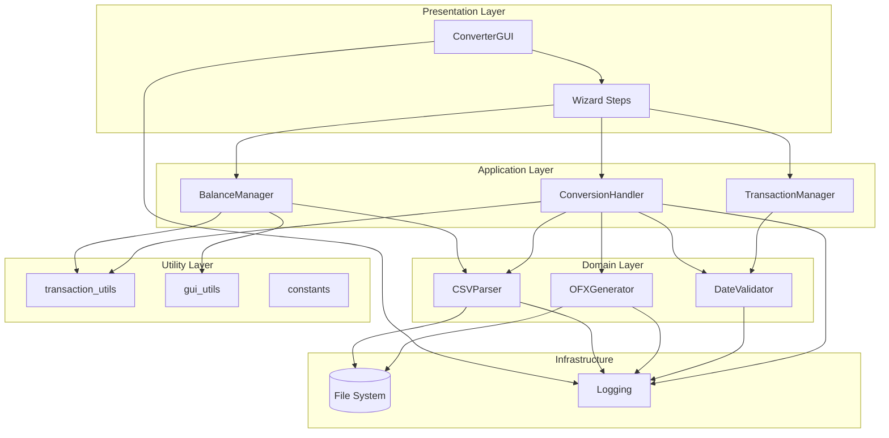
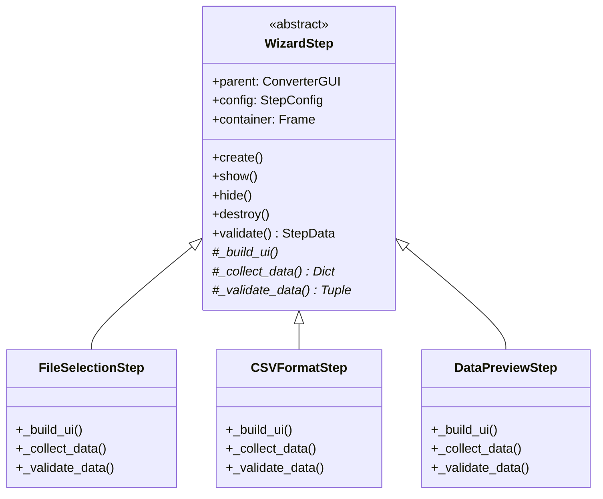
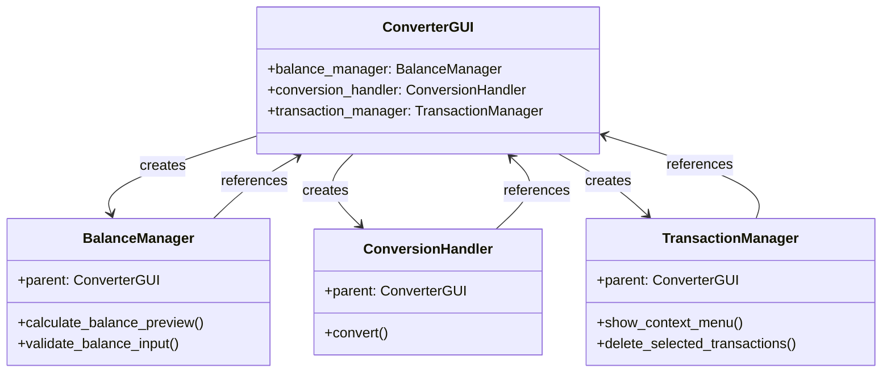
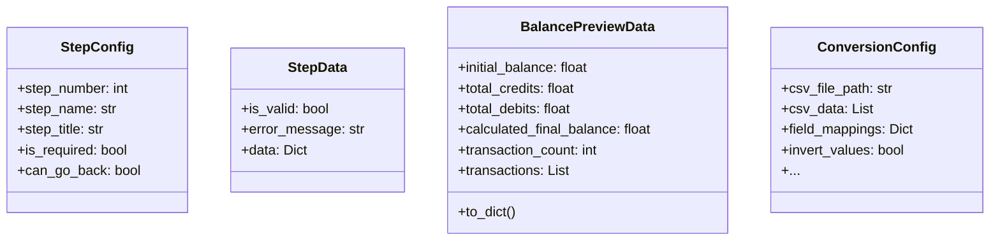
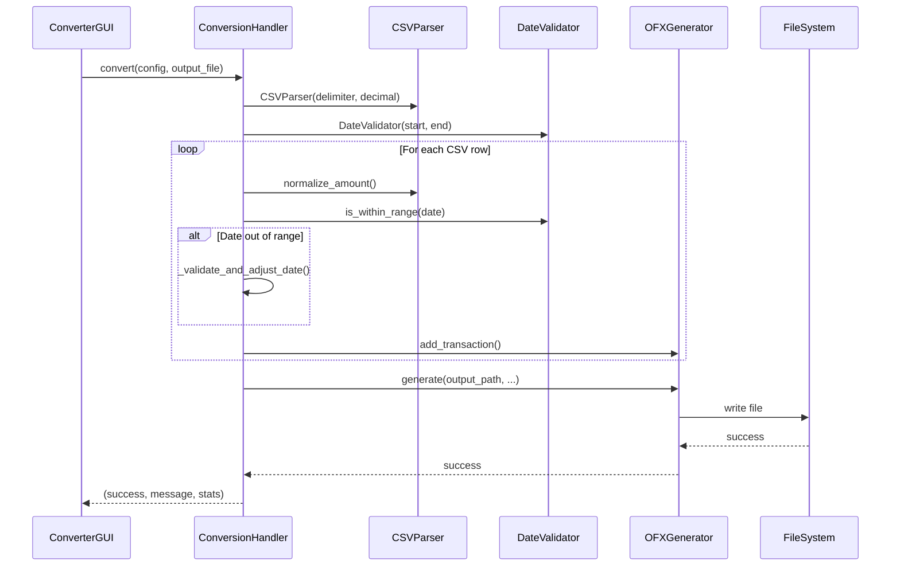
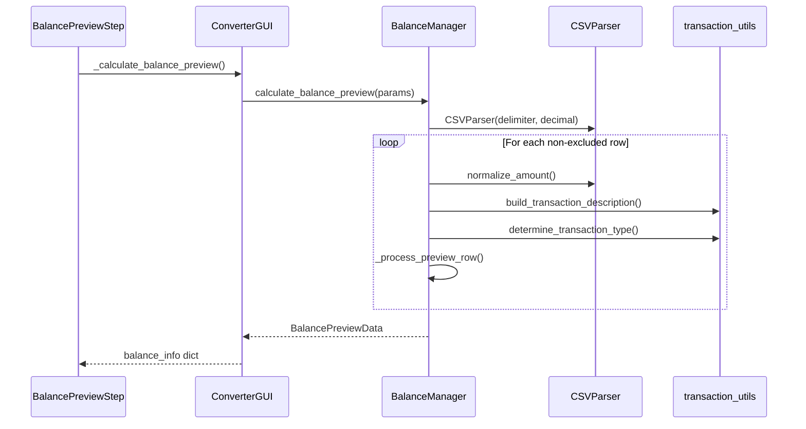
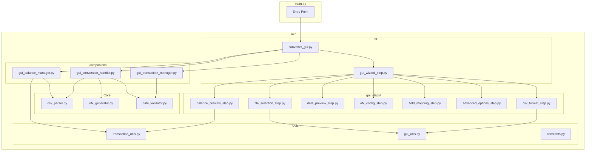
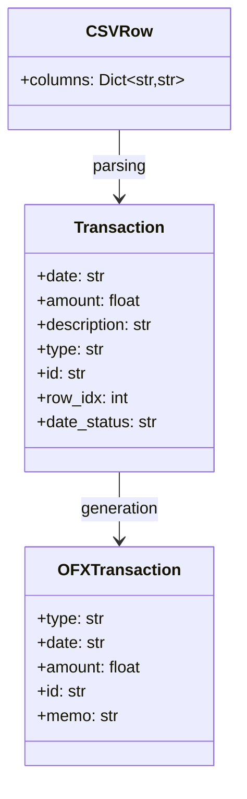
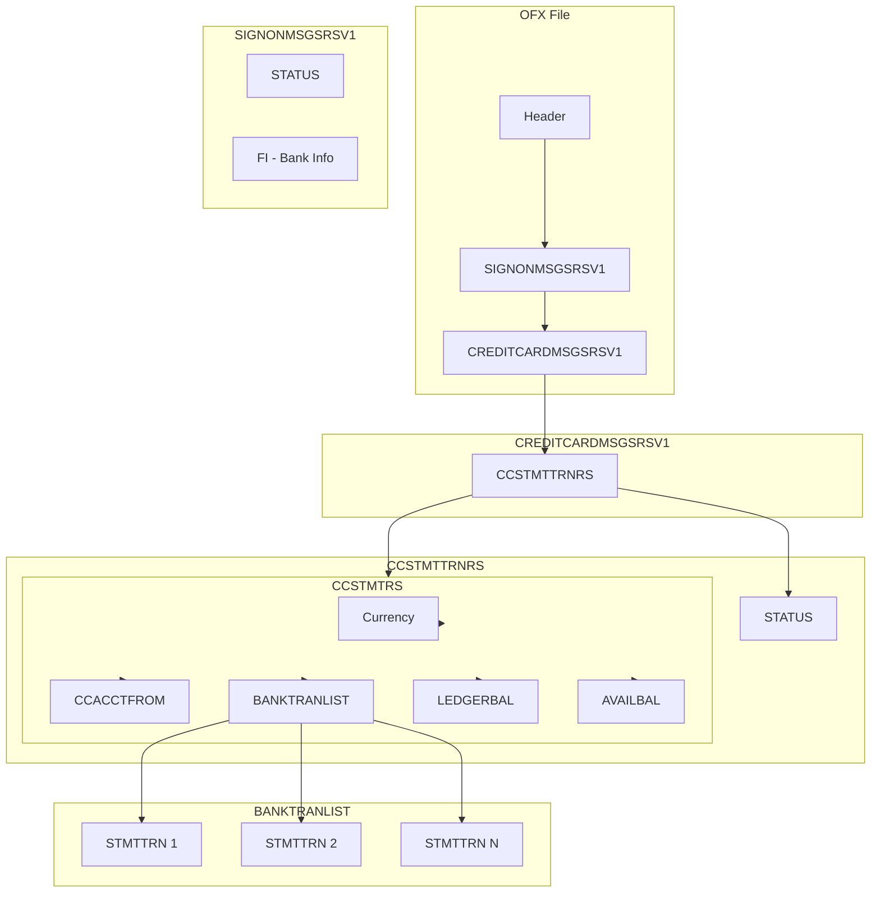

# System Architecture

## 1. Architecture Overview

**CSV to OFX Converter** follows a layered architecture with clear separation of responsibilities. The application uses an adapted **Model-View-Controller (MVC)** pattern, with emphasis on:

- **Separation of Concerns**: Business logic separated from graphical interface
- **Dependency Injection**: Companion classes receive GUI as parameter
- **Testability**: Pure functions and independently testable classes

### 1.1 Layer Architecture Diagram



## 2. Layer Descriptions

### 2.1 Presentation Layer

Responsible for user interface through Tkinter widgets.

| Component | Responsibility |
|-----------|----------------|
| **ConverterGUI** | Main wizard orchestrator, manages navigation and global state |
| **WizardStep** | Abstract base class for all wizard steps |
| **FileSelectionStep** | UI for CSV file selection |
| **CSVFormatStep** | UI for CSV format configuration |
| **DataPreviewStep** | UI for data preview in table |
| **OFXConfigStep** | UI for OFX configuration (account, bank, currency) |
| **FieldMappingStep** | UI for CSV→OFX field mapping |
| **AdvancedOptionsStep** | UI for advanced options (inversion, validation) |
| **BalancePreviewStep** | UI for balance preview and confirmation |

### 2.2 Application Layer

Companion classes that orchestrate business operations without direct Tkinter dependency.

| Component | Responsibility |
|-----------|----------------|
| **BalanceManager** | Balance calculations and transaction preview |
| **ConversionHandler** | CSV→OFX conversion process orchestration |
| **TransactionManager** | Transaction management and context menus |

### 2.3 Domain Layer

Core classes that implement main business logic.

| Component | Responsibility |
|-----------|----------------|
| **CSVParser** | CSV file parsing with multiple format support |
| **OFXGenerator** | OFX 1.0.2 file generation |
| **DateValidator** | Date validation against statement period |

### 2.4 Utility Layer

Pure functions and shared constants.

| Component | Responsibility |
|-----------|----------------|
| **transaction_utils** | Transaction processing functions |
| **gui_utils** | GUI operation utility functions |
| **constants** | Shared constants (NOT_MAPPED, NOT_SELECTED) |

## 3. Design Patterns Used

### 3.1 Wizard Pattern

The user interface implements the Wizard pattern to guide users through a multi-step process.



### 3.2 Dependency Injection

Companion classes receive GUI as parameter, enabling testing with mocks.



### 3.3 Template Method

The `WizardStep` class uses the Template Method pattern to define the validation algorithm skeleton.

```python
# Template Method in WizardStep
def validate(self) -> StepData:
    data = self._collect_data()      # Hook for subclass
    is_valid, error = self._validate_data(data)  # Hook for subclass
    return StepData(is_valid, error, data)
```

### 3.4 Data Transfer Objects (DTOs)

Use of dataclasses for data transfer between layers.



## 4. Component Communication

### 4.1 Conversion Data Flow



### 4.2 Balance Calculation Flow



## 5. Frameworks and Technologies

### 5.1 Technology Stack

| Layer | Technology | Justification |
|-------|------------|---------------|
| **Language** | Python 3.7+ | Portability, rich standard library |
| **GUI** | Tkinter/ttk | Included in standard library, cross-platform |
| **Testing** | unittest | Standard framework, no external dependencies |
| **Build** | PyInstaller | Standalone executable generation |
| **Logging** | logging | Standard module, configurable |

### 5.2 Dependencies

The application uses **only Python standard library** for runtime, ensuring:
- Zero external dependencies
- Easy installation
- Maximum portability

Development dependencies:
- **PyInstaller**: Only for executable builds

## 6. Component Diagram



## 7. Data Model

### 7.1 Transaction Structure



### 7.2 OFX File Structure



## 8. Design Considerations

### 8.1 Architecture Decisions

| Decision | Justification |
|----------|---------------|
| **No external dependencies** | Simplifies installation and distribution |
| **Tkinter for GUI** | Cross-platform, included in Python |
| **Companion classes** | Separates business logic from UI |
| **Pure functions in utils** | Facilitates unit testing |
| **Wizard pattern** | Guides user through complex process |
| **Dataclasses for DTOs** | Clean code and type hints |

### 8.2 Trade-offs

| Choice | Benefit | Cost |
|--------|---------|------|
| **Python** | Portability, readability | Performance (not critical) |
| **Tkinter** | No dependencies | Less modern interface |
| **OFX 1.0.2** | Wide compatibility | Verbose format |
| **Single-file executable** | Easy distribution | File size |

---

*Back to [Main Documentation](README.md)*
