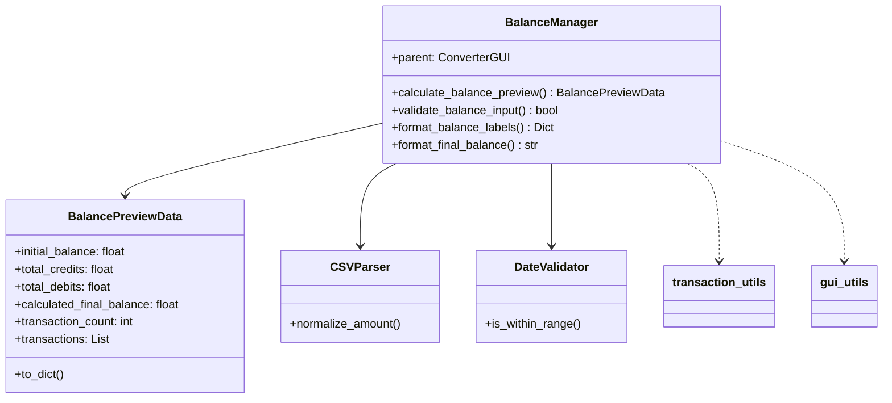

# BalanceManager

## 1. General Information

| Attribute | Value |
|-----------|-------|
| **Module** | `src/gui_balance_manager.py` |
| **Type** | Companion Class |
| **Responsibility** | Balance calculations and transaction preview |

## 2. Description

The `BalanceManager` class is a companion class that manages balance calculations and transaction preview generation. It uses the Dependency Injection pattern, receiving the parent GUI as a parameter.

### 2.1 Main Responsibility

- Calculate initial balance, credits, debits, and final balance
- Process transactions for preview
- Validate numeric balance input
- Format values for display

## 3. BalancePreviewData Dataclass

```python
class BalancePreviewData:
    initial_balance: float
    total_credits: float
    total_debits: float
    calculated_final_balance: float
    transaction_count: int
    transactions: List[Dict]
```

## 4. Main Methods

### 4.1 `calculate_balance_preview(...) -> BalancePreviewData`

Calculates balance information for preview.

**Parameters:**
- `initial_balance_str`: Initial balance as string
- `csv_data`: List of CSV data dictionaries
- `field_mappings`: Field mappings
- `description_columns`: Columns for composite description
- `invert_values`: Whether to invert values
- `deleted_transactions`: Set of excluded transactions
- `enable_date_validation`: Whether date validation is active

### 4.2 `validate_balance_input(action, value) -> bool`

Validates numeric input for balance fields.

### 4.3 `format_final_balance(value) -> str`

Formats balance value for display.

## 5. Dependency Diagram



## 6. Usage Example

```python
from src.gui_balance_manager import BalanceManager

# Create with parent GUI
manager = BalanceManager(parent_gui)

# Calculate preview
result = manager.calculate_balance_preview(
    initial_balance_str="1000.00",
    csv_data=csv_data,
    field_mappings={'date': 'Date', 'amount': 'Amount'},
    description_columns=[],
    description_separator=' ',
    delimiter=',',
    decimal_separator='.',
    invert_values=False,
    deleted_transactions=set()
)

print(f"Total Credits: {result.total_credits}")
print(f"Total Debits: {result.total_debits}")
print(f"Final Balance: {result.calculated_final_balance}")
```

## 7. Design Patterns

| Pattern | Application |
|---------|-------------|
| **Companion Class** | Extracts logic from ConverterGUI |
| **Dependency Injection** | Receives parent in constructor |
| **Data Transfer Object** | BalancePreviewData |

## 8. Related Tests

- `tests/test_gui_balance_manager.py` - 14 tests

---

*Back to [Main Documentation](../README.md)*
