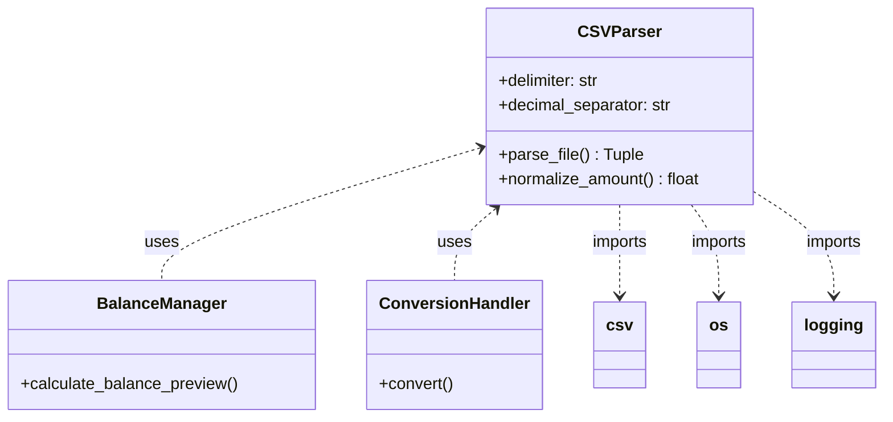
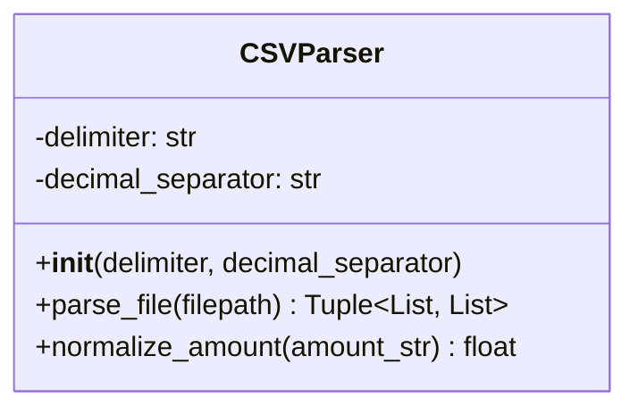

# CSVParser

## 1. General Information

| Attribute | Value |
|-----------|-------|
| **Module** | `src/csv_parser.py` |
| **Type** | Class |
| **Responsibility** | CSV file parser with Brazilian and international format support |

## 2. Description

The `CSVParser` class is responsible for reading and interpreting CSV files, offering support for different delimiter and decimal separator formats. It is specially optimized to handle Brazilian bank statements.

### 2.1 Main Responsibility

- Parsing CSV files with header detection
- Normalizing monetary values to float
- Support for Brazilian and international formats

## 3. Attributes

| Attribute | Type | Description |
|-----------|------|-------------|
| `delimiter` | `str` | Column separator character (default: `,`) |
| `decimal_separator` | `str` | Decimal separator character (default: `.`) |

## 4. Methods

### 4.1 `__init__(delimiter: str = ',', decimal_separator: str = '.')`

Initializes the parser with format settings.

**Parameters:**
- `delimiter`: Character used to separate columns
- `decimal_separator`: Character used as decimal point

### 4.2 `parse_file(filepath: str) -> Tuple[List[str], List[Dict[str, str]]]`

Reads and parses a CSV file, returning headers and data rows.

**Parameters:**
- `filepath`: Path to the CSV file

**Returns:**
- Tuple containing list of headers and list of dictionaries (rows)

**Exceptions:**
- `FileNotFoundError`: If file doesn't exist
- `ValueError`: If file is empty or malformed

### 4.3 `normalize_amount(amount_str: str) -> float`

Converts monetary value string to float.

**Parameters:**
- `amount_str`: String representing the value (e.g., "R$ -100.50")

**Returns:**
- Value as float

**Supported Formats:**
- Negative values with sign: `-100.50`, `-R$ 100.00`
- Negative values after currency: `R$ -100.00`
- Parentheses notation: `(R$ 100.50)` → `-100.50`
- Thousands with period: `1.234,56` (Brazilian format)
- Thousands with comma: `1,234.56` (international format)

## 5. Dependencies



## 6. Class Diagram



## 7. Usage Example

```python
from src.csv_parser import CSVParser

# Parser for Brazilian format
parser = CSVParser(delimiter=';', decimal_separator=',')

# Read CSV file
headers, rows = parser.parse_file('/path/to/statement.csv')

print(f"Columns found: {headers}")
print(f"Total rows: {len(rows)}")

# Process each row
for row in rows:
    amount = parser.normalize_amount(row['valor'])
    print(f"Normalized value: {amount}")
```

### Example with standard format

```python
# Parser for international format
parser = CSVParser(delimiter=',', decimal_separator='.')

# Normalize values
value1 = parser.normalize_amount("-100.50")  # -100.5
value2 = parser.normalize_amount("1,234.56")  # 1234.56
```

### Example with Brazilian format

```python
# Parser for Brazilian format
parser = CSVParser(delimiter=';', decimal_separator=',')

# Normalize Brazilian values
value1 = parser.normalize_amount("-R$ 100,50")  # -100.5
value2 = parser.normalize_amount("1.234,56")    # 1234.56
value3 = parser.normalize_amount("(R$ 100,50)") # -100.5 (parentheses = negative)
```

## 8. Design Patterns

| Pattern | Application |
|---------|-------------|
| **Single Responsibility** | Class focused only on CSV parsing |
| **Factory-like** | Configurable parser via constructor |

## 9. Related Tests

- `tests/test_csv_parser.py` - 8 tests
  - `test_parse_standard_csv`
  - `test_parse_brazilian_csv`
  - `test_normalize_standard_amount`
  - `test_normalize_brazilian_amount`
  - `test_normalize_negative_with_currency`
  - `test_normalize_parentheses_notation`
  - `test_file_not_found`
  - `test_empty_file`

---

*Back to [Main Documentation](../README.md)*
