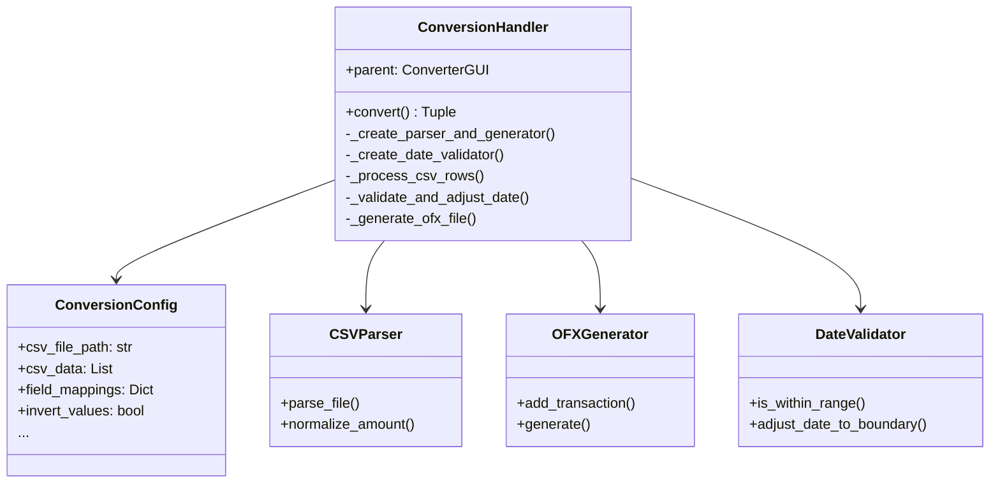
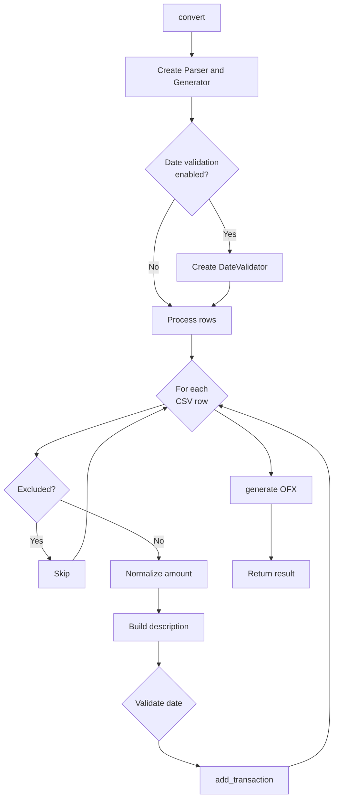

# ConversionHandler

## 1. General Information

| Attribute | Value |
|-----------|-------|
| **Module** | `src/gui_conversion_handler.py` |
| **Type** | Companion Class |
| **Responsibility** | CSV to OFX conversion process orchestration |

## 2. Description

The `ConversionHandler` class is a companion class that orchestrates the entire CSV to OFX conversion process. It uses the Dependency Injection pattern and returns structured results.

### 2.1 Main Responsibility

- Coordinate conversion flow
- Process CSV rows
- Manage date validation and adjustment
- Generate final OFX file

## 3. ConversionConfig Dataclass

```python
@dataclass
class ConversionConfig:
    csv_file_path: str
    csv_data: List[Dict[str, str]]
    field_mappings: Dict[str, str]
    description_columns: List[str]
    description_separator: str
    delimiter: str
    decimal_separator: str
    invert_values: bool
    account_id: str
    bank_name: str
    currency: str
    initial_balance: float
    statement_start_date: str
    statement_end_date: str
    date_action: str
    deleted_transactions: set
    date_action_decisions: Dict[int, str]
    enable_date_validation: bool
    final_balance: Optional[float] = None
```

## 4. Main Methods

### 4.1 `convert(config, output_file) -> Tuple[bool, str, Dict]`

Executes CSV to OFX conversion.

**Returns:**
- `success`: True if conversion successful
- `message`: Success or error message
- `stats`: Conversion statistics

### 4.2 `_process_csv_rows(...) -> Dict`

Processes all CSV rows and adds transactions to generator.

### 4.3 `_validate_and_adjust_date(...) -> Tuple[Optional[str], Dict]`

Validates and adjusts out-of-range dates.

## 5. Dependency Diagram



## 6. Conversion Flow



## 7. Usage Example

```python
from src.gui_conversion_handler import ConversionHandler, ConversionConfig

# Create handler
handler = ConversionHandler(parent_gui)

# Create configuration
config = ConversionConfig(
    csv_file_path='/path/to/file.csv',
    csv_data=csv_data,
    field_mappings={'date': 'Date', 'amount': 'Amount'},
    # ... other parameters
)

# Execute conversion
success, message, stats = handler.convert(config, '/path/to/output.ofx')

if success:
    print(f"Conversion complete: {stats['processed']} transactions")
else:
    print(f"Error: {message}")
```

## 8. Design Patterns

| Pattern | Application |
|---------|-------------|
| **Companion Class** | Extracts conversion logic |
| **Dependency Injection** | Receives parent in constructor |
| **Configuration Object** | ConversionConfig bundles parameters |

## 9. Related Tests

- `tests/test_gui_conversion_handler.py` - 23 tests

---

*Back to [Main Documentation](../README.md)*
