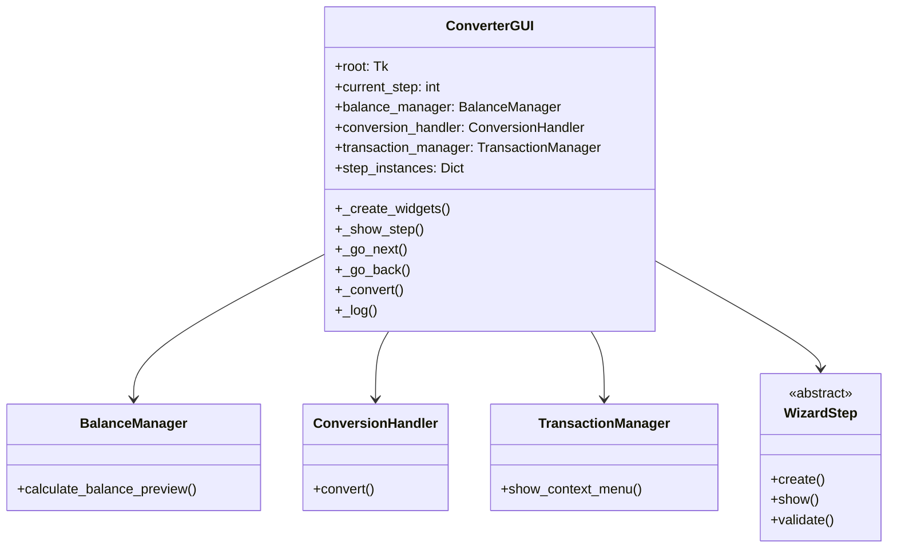
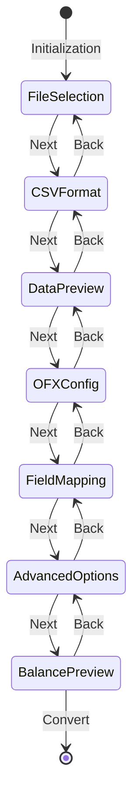

# ConverterGUI

## 1. General Information

| Attribute | Value |
|-----------|-------|
| **Module** | `src/converter_gui.py` |
| **Type** | Class |
| **Responsibility** | Main graphical interface orchestrator with 7-step wizard |

## 2. Description

The `ConverterGUI` class is the main orchestrator of the graphical user interface. It implements a 7-step wizard that guides the user through the CSV to OFX conversion process.

### 2.1 Main Responsibility

- Manage navigation between wizard steps
- Coordinate global application state
- Delegate operations to companion classes
- Orchestrate validation and conversion

## 3. Main Attributes

| Attribute | Type | Description |
|-----------|------|-------------|
| `root` | `tk.Tk` | Tkinter main window |
| `current_step` | `int` | Current wizard step (0-6) |
| `step_instances` | `Dict` | Wizard step instances |
| `csv_headers` | `List[str]` | Loaded CSV headers |
| `csv_data` | `List[Dict]` | Loaded CSV data |
| `balance_manager` | `BalanceManager` | Balance calculation manager |
| `conversion_handler` | `ConversionHandler` | Conversion handler |
| `transaction_manager` | `TransactionManager` | Transaction manager |

## 4. Main Methods

### 4.1 `__init__(root: tk.Tk)`

Initializes GUI with main window.

### 4.2 `_create_widgets()`

Creates all interface widgets.

### 4.3 `_show_step(step_num: int)`

Displays the specified wizard step.

### 4.4 `_go_next()` / `_go_back()`

Navigates to next/previous step.

### 4.5 `_convert()`

Executes CSV to OFX conversion.

### 4.6 `_log(message: str)`

Adds message to activity log.

## 5. Dependency Diagram



## 6. Wizard Flow



## 7. Usage Example

```python
import tkinter as tk
from src.converter_gui import ConverterGUI

# Create main window
root = tk.Tk()

# Initialize GUI
app = ConverterGUI(root)

# Start event loop
root.mainloop()
```

## 8. Design Patterns

| Pattern | Application |
|---------|-------------|
| **Wizard** | Multi-step interface |
| **Dependency Injection** | Companion classes injected |
| **Observer** | Tkinter variables for state |
| **Template Method** | Validation via WizardStep |

## 9. Related Tests

- `tests/test_gui_integration.py` - 15 tests
- `tests/test_gui_wizard_step.py` - 32 tests
- `tests/test_gui_steps/` - 206 tests

---

*Back to [Main Documentation](../README.md)*
