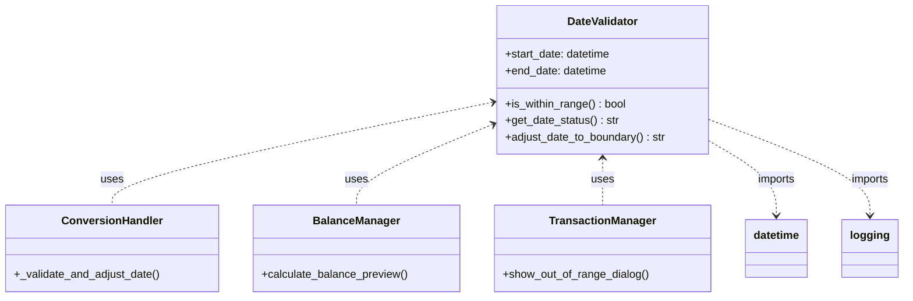
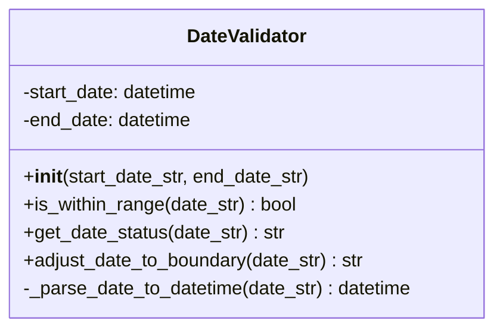
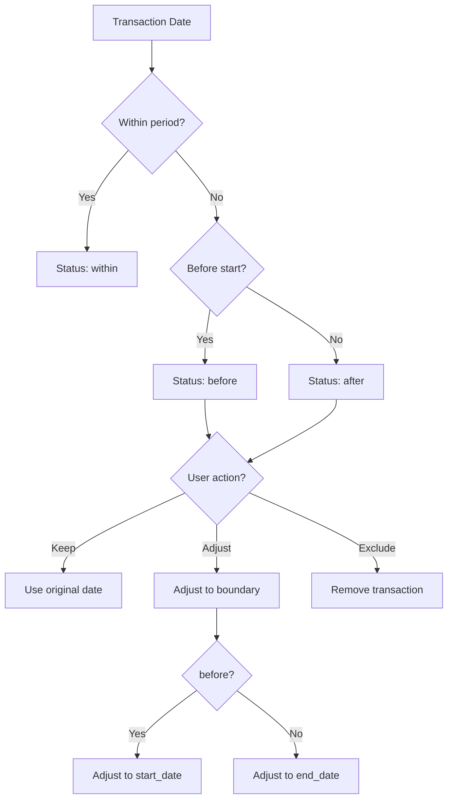

# DateValidator

## 1. General Information

| Attribute | Value |
|-----------|-------|
| **Module** | `src/date_validator.py` |
| **Type** | Class |
| **Responsibility** | Transaction date validation against statement period |

## 2. Description

The `DateValidator` class validates whether transactions are within a specific statement period (like a credit card billing period). It provides functionalities to verify, categorize, and adjust dates outside the period.

### 2.1 Main Responsibility

- Validate if dates are within a range
- Identify if dates are before or after the period
- Adjust out-of-range dates to boundaries

## 3. Attributes

| Attribute | Type | Description |
|-----------|------|-------------|
| `start_date` | `datetime` | Valid period start date |
| `end_date` | `datetime` | Valid period end date |

## 4. Methods

### 4.1 `__init__(start_date_str: str, end_date_str: str)`

Initializes the validator with the date period.

**Parameters:**
- `start_date_str`: Start date (various formats accepted)
- `end_date_str`: End date (various formats accepted)

**Exceptions:**
- `ValueError`: If dates cannot be parsed or if start > end

### 4.2 `is_within_range(date_str: str) -> bool`

Checks if a date is within the valid period.

**Parameters:**
- `date_str`: Date to check

**Returns:**
- `True` if date is within period, `False` otherwise

### 4.3 `get_date_status(date_str: str) -> str`

Determines the date's position relative to the period.

**Parameters:**
- `date_str`: Date to check

**Returns:**
- `'before'`: Date is before period start
- `'within'`: Date is within period
- `'after'`: Date is after period end

**Exceptions:**
- `ValueError`: If date cannot be parsed

### 4.4 `adjust_date_to_boundary(date_str: str) -> str`

Adjusts an out-of-range date to the nearest boundary.

**Parameters:**
- `date_str`: Date to adjust

**Returns:**
- Adjusted date in `YYYY-MM-DD` format
  - If `before`: returns `start_date`
  - If `after`: returns `end_date`
  - If `within`: returns original date formatted

### 4.5 `_parse_date_to_datetime(date_str: str) -> datetime`

Private method that converts date string to datetime object.

**Supported Formats:**
- `YYYY-MM-DD`
- `DD/MM/YYYY`
- `MM/DD/YYYY`
- `YYYY/MM/DD`
- `DD-MM-YYYY`
- `DD.MM.YYYY`
- `YYYYMMDD`

## 5. Dependencies



## 6. Class Diagram



## 7. Validation Flow



## 8. Usage Example

```python
from src.date_validator import DateValidator

# Create validator for October 2025 period
validator = DateValidator('01/10/2025', '31/10/2025')

# Check dates
print(validator.is_within_range('15/10/2025'))  # True
print(validator.is_within_range('15/09/2025'))  # False
print(validator.is_within_range('15/11/2025'))  # False

# Get status
print(validator.get_date_status('15/10/2025'))  # 'within'
print(validator.get_date_status('15/09/2025'))  # 'before'
print(validator.get_date_status('15/11/2025'))  # 'after'

# Adjust dates
print(validator.adjust_date_to_boundary('15/09/2025'))  # '2025-10-01'
print(validator.adjust_date_to_boundary('15/11/2025'))  # '2025-10-31'
print(validator.adjust_date_to_boundary('15/10/2025'))  # '2025-10-15'
```

### Integration Example with Conversion

```python
from src.date_validator import DateValidator
from src.csv_parser import CSVParser

validator = DateValidator('01/10/2025', '31/10/2025')
parser = CSVParser()

headers, rows = parser.parse_file('statement.csv')

for row in rows:
    date = row['date']
    
    if validator.is_within_range(date):
        # Process normally
        process_transaction(row)
    else:
        status = validator.get_date_status(date)
        if status == 'before':
            # Adjust to period start
            adjusted = validator.adjust_date_to_boundary(date)
            row['date'] = adjusted
            process_transaction(row)
        else:  # after
            # Exclude transaction
            print(f"Excluding transaction from {date}")
```

## 9. Design Patterns

| Pattern | Application |
|---------|-------------|
| **Single Responsibility** | Focused only on date validation |
| **Immutable Configuration** | Period defined at construction |

## 10. Edge Cases

| Scenario | Behavior |
|----------|----------|
| Date = period start | `within` |
| Date = period end | `within` |
| Year transition | Supported (e.g., 2024-12-31 to 2025-01-31) |
| Leap year (02/29) | Supported via datetime |
| Invalid date format | Raises `ValueError` |
| Start > End | Raises `ValueError` at constructor |

## 11. Related Tests

- `tests/test_date_validator.py` - 12 tests
  - `test_date_within_range`
  - `test_date_before_range`
  - `test_date_after_range`
  - `test_adjust_to_start_boundary`
  - `test_adjust_to_end_boundary`
  - `test_date_at_boundaries`
  - `test_year_boundary`
  - `test_multiple_date_formats`
  - `test_invalid_date_format`
  - `test_invalid_date_range`

---

*Back to [Main Documentation](../README.md)*
