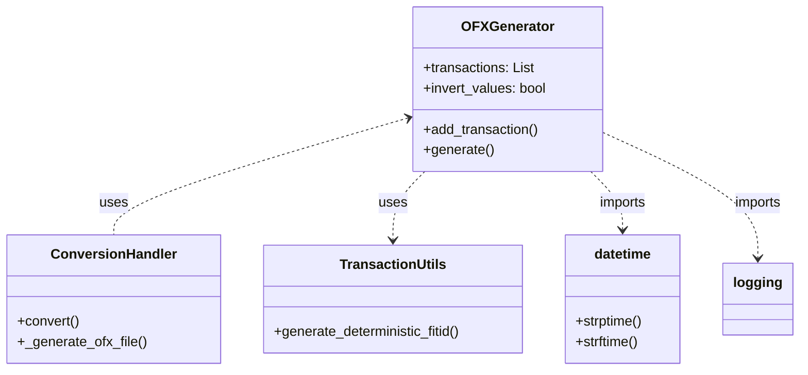
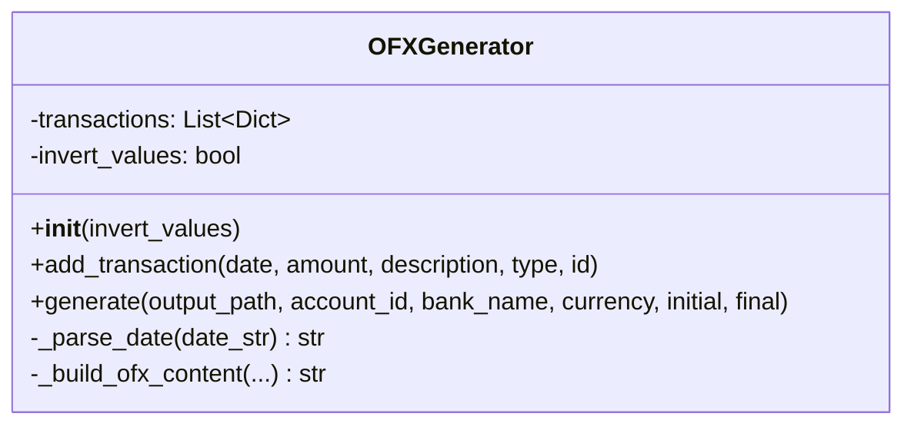
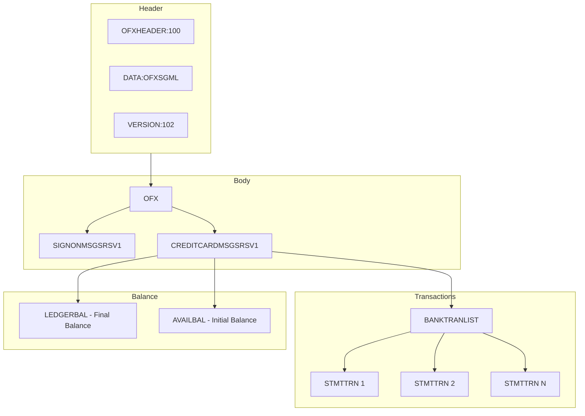

# OFXGenerator

## 1. General Information

| Attribute | Value |
|-----------|-------|
| **Module** | `src/ofx_generator.py` |
| **Type** | Class |
| **Responsibility** | OFX 1.0.2 (SGML) file generation for credit card statements |

## 2. Description

The `OFXGenerator` class is responsible for creating files in OFX (Open Financial Exchange) format version 1.0.2. The generated format is SGML (not XML) and specific for credit card statements (CREDITCARDMSGSRSV1).

### 2.1 Main Responsibility

- Accumulate transactions for export
- Generate valid OFX file with complete structure
- Support value inversion (debits ↔ credits)
- Automatic final balance calculation

## 3. Attributes

| Attribute | Type | Description |
|-----------|------|-------------|
| `transactions` | `List[Dict]` | List of transactions to be exported |
| `invert_values` | `bool` | If True, inverts all values |

## 4. Methods

### 4.1 `__init__(invert_values: bool = False)`

Initializes the OFX generator.

**Parameters:**
- `invert_values`: If True, inverts all transaction values

### 4.2 `add_transaction(date, amount, description, transaction_type, transaction_id)`

Adds a transaction to the export list.

**Parameters:**
- `date` (str): Transaction date (various formats accepted)
- `amount` (float): Transaction amount
- `description` (str): Transaction description/memo
- `transaction_type` (str): Type: 'DEBIT' or 'CREDIT'
- `transaction_id` (str, optional): Unique ID (deterministic UUID v5 generated if not provided)

If `transaction_id` is omitted, the generator calls `transaction_utils.generate_deterministic_fitid()` to produce a consistent identifier based on normalized date, amount, memo, and account context.

**Inversion Behavior:**
When `invert_values=True`:
- Value is multiplied by -1
- DEBIT ↔ CREDIT are swapped

### 4.3 `generate(output_path, account_id, bank_name, currency, initial_balance, final_balance)`

Generates the OFX file with all transactions.

**Parameters:**
- `output_path` (str): Output file path
- `account_id` (str): Account identifier (default: "UNKNOWN")
- `bank_name` (str): Bank name (default: "CSV Import")
- `currency` (str): Currency code (default: "BRL")
- `initial_balance` (float): Initial balance (default: 0.0)
- `final_balance` (float, optional): Final balance (calculated automatically if not provided)

**Exceptions:**
- `ValueError`: If there are no transactions to export

### 4.4 `_parse_date(date_str: str) -> str`

Private method that converts date to OFX format.

**Supported Input Formats:**
- `YYYY-MM-DD` (2025-10-22)
- `DD/MM/YYYY` (22/10/2025)
- `MM/DD/YYYY` (10/22/2025)
- `YYYY/MM/DD` (2025/10/22)
- `DD-MM-YYYY` (22-10-2025)
- `DD.MM.YYYY` (22.10.2025)
- `YYYYMMDD` (20251022)

**Output Format:**
- `YYYYMMDD000000[-3:BRT]`

### 4.5 `_build_ofx_content(...) -> str`

Private method that builds complete OFX file content.

## 5. Dependencies



## 6. Class Diagram



## 7. Generated OFX Structure



## 8. Usage Example

```python
from src.ofx_generator import OFXGenerator

# Create generator
generator = OFXGenerator(invert_values=False)

# Add transactions
generator.add_transaction(
    date='01/10/2025',
    amount=-100.50,
    description='ABC Supermarket',
    transaction_type='DEBIT'
)

generator.add_transaction(
    date='02/10/2025',
    amount=1000.00,
    description='Salary',
    transaction_type='CREDIT'
)

# Generate file
generator.generate(
    output_path='/path/to/output.ofx',
    account_id='12345',
    bank_name='My Bank',
    currency='BRL',
    initial_balance=500.00
)
```

### Example with Value Inversion

```python
# Generator with inversion
generator = OFXGenerator(invert_values=True)

# Originally DEBIT transaction with negative value
generator.add_transaction(
    date='01/10/2025',
    amount=-100.50,  # Will be inverted to +100.50
    description='Purchase',
    transaction_type='DEBIT'  # Will be swapped to CREDIT
)
```

## 9. Design Patterns

| Pattern | Application |
|---------|-------------|
| **Builder** | Accumulates transactions before generating file |
| **Template Method** | `_build_ofx_content` structures the document |
| **Single Responsibility** | Focused only on OFX generation |

## 10. Related Tests

- `tests/test_ofx_generator.py` - 19 tests
  - `test_add_transaction`
  - `test_add_credit_transaction`
  - `test_parse_date_formats`
  - `test_value_inversion`
  - `test_generate_ofx_file`
  - `test_multiple_currencies`
  - `test_description_limit`
  - `test_transaction_sorting`

---

*Back to [Main Documentation](../README.md)*
