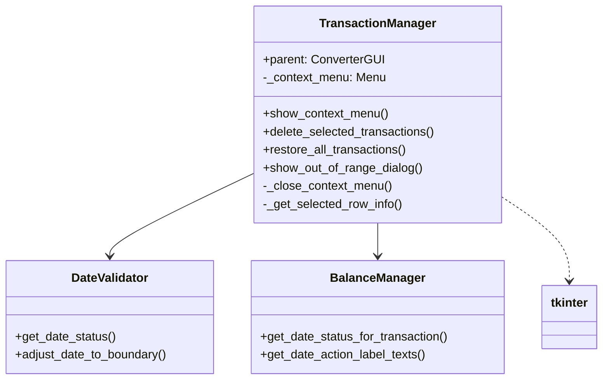
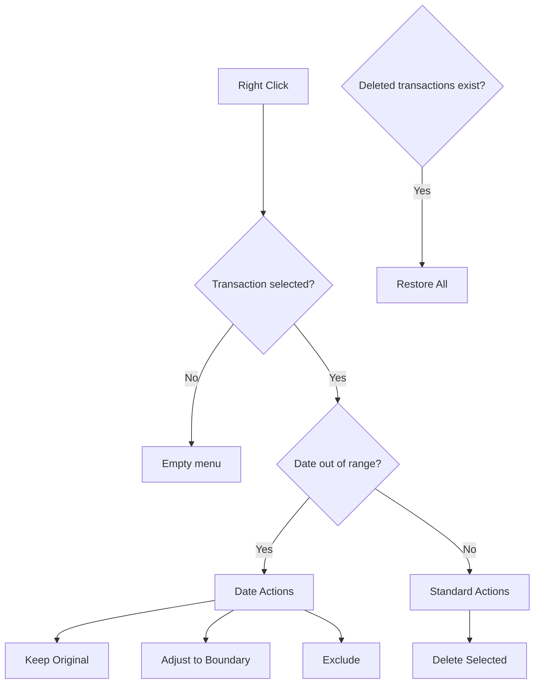

# TransactionManager

## 1. General Information

| Attribute | Value |
|-----------|-------|
| **Module** | `src/gui_transaction_manager.py` |
| **Type** | Companion Class |
| **Responsibility** | Transaction management and context menus |

## 2. Description

The `TransactionManager` class is a companion class that manages transaction operations, including deletion, restoration, and date actions. It also manages context menus for the transaction preview.

### 2.1 Main Responsibility

- Display context menus for transactions
- Manage transaction deletion and restoration
- Handle date action decisions
- Display dialogs for out-of-range transactions

## 3. Main Methods

### 3.1 `show_context_menu(event, tree_widget, ...)`

Displays context menu for transaction operations.

### 3.2 `delete_selected_transactions(tree, items, deleted)`

Deletes selected transactions from preview.

### 3.3 `restore_all_transactions(deleted)`

Restores all deleted transactions.

### 3.4 `show_out_of_range_dialog(...) -> Tuple[str, str]`

Displays dialog to handle out-of-range transaction.

## 4. Dependency Diagram



## 5. Context Menu



## 6. Usage Example

```python
from src.gui_transaction_manager import TransactionManager

# Create with parent GUI
manager = TransactionManager(parent_gui)

# Show context menu
def on_right_click(event):
    manager.show_context_menu(
        event,
        tree_widget,
        transaction_tree_items,
        deleted_transactions,
        date_action_decisions
    )

# Delete selected transactions
manager.delete_selected_transactions(
    tree_widget,
    transaction_tree_items,
    deleted_transactions
)

# Restore all
manager.restore_all_transactions(deleted_transactions)
```

## 7. Design Patterns

| Pattern | Application |
|---------|-------------|
| **Companion Class** | Extracts transaction logic |
| **Command** | Menu actions as commands |
| **Dependency Injection** | Receives parent in constructor |

## 8. Related Tests

- `tests/test_gui_transaction_manager.py` - 26 tests

---

*Back to [Main Documentation](../README.md)*
