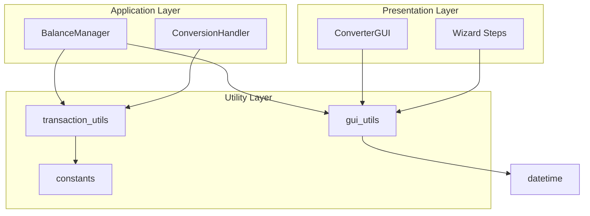

# Utility Modules

This page documents the utility modules that provide pure functions and shared constants.

## transaction_utils

| Attribute | Value |
|-----------|-------|
| **Module** | `src/transaction_utils.py` |
| **Type** | Pure Functions |
| **Tests** | 50 |

### Description

Utility functions for transaction processing with no UI dependencies.

### Functions

| Function | Description |
|----------|-------------|
| `build_transaction_description()` | Builds description from columns |
| `determine_transaction_type()` | Determines DEBIT/CREDIT |
| `extract_transaction_id()` | Extracts transaction ID |
| `calculate_balance_summary()` | Calculates balance summary |
| `validate_field_mappings()` | Validates required mappings |
| `parse_balance_value()` | Parses balance string to float |

### Example

```python
from src.transaction_utils import (
    build_transaction_description,
    determine_transaction_type,
    calculate_balance_summary
)

# Build composite description
row = {'memo': 'Purchase', 'vendor': 'Store'}
desc = build_transaction_description(
    row=row,
    desc_col='memo',
    description_columns=['memo', 'vendor'],
    separator=' - ',
    use_composite=True
)
# Result: 'Purchase - Store'

# Determine type
trans_type = determine_transaction_type(
    type_col='<Not Mapped>',
    row={},
    amount=-100.0
)
# Result: 'DEBIT'

# Calculate balance
transactions = [{'amount': 100}, {'amount': -50}]
summary = calculate_balance_summary(transactions, 1000)
# Result: {'total_credits': 100, 'total_debits': 50, ...}
```

---

## gui_utils

| Attribute | Value |
|-----------|-------|
| **Module** | `src/gui_utils.py` |
| **Type** | Pure Functions |
| **Tests** | 58 |

### Description

Utility functions for GUI operations with no Tkinter dependencies.

### Function Sections

| Section | Functions |
|---------|-----------|
| **File Validation** | `validate_csv_file_selection()` |
| **Field Mapping** | `validate_required_field_mappings()`, `validate_description_mapping()` |
| **Date Formatting** | `format_date_string()`, `validate_date_format()` |
| **Numeric Validation** | `validate_numeric_input()`, `parse_numeric_value()` |
| **Balance Calculations** | `calculate_cursor_position_after_format()`, `format_balance_value()` |
| **Date Parsing** | `parse_date_for_sorting()` |
| **Conversion Validation** | `validate_conversion_prerequisites()`, `validate_date_range_inputs()` |
| **Statistics** | `format_preview_stats()`, `format_conversion_stats()` |

### Example

```python
from src import gui_utils

# Validate file selection
is_valid, error = gui_utils.validate_csv_file_selection('/path/to/file.csv')

# Format date
formatted = gui_utils.format_date_string('01102025')
# Result: '01/10/2025'

# Validate numeric input
is_valid = gui_utils.validate_numeric_input('-100.50')
# Result: True

# Parse date for sorting
from datetime import datetime
dt = gui_utils.parse_date_for_sorting('01/10/2025')
# Result: datetime(2025, 10, 1)
```

---

## constants

| Attribute | Value |
|-----------|-------|
| **Module** | `src/constants.py` |
| **Type** | Constants |

### Description

Shared constants used throughout the application.

### Constants

```python
NOT_MAPPED = "<Not Mapped>"    # Value for unmapped field
NOT_SELECTED = "<Not Selected>" # Value for unselected column
```

### Usage

```python
from src.constants import NOT_MAPPED, NOT_SELECTED

# Check if field is mapped
if field_mapping == NOT_MAPPED:
    print("Field not mapped")

# Check if column is selected
if column == NOT_SELECTED:
    print("Column not selected")
```

---

## Dependency Diagram



---

*Back to [Main Documentation](../README.md)*
