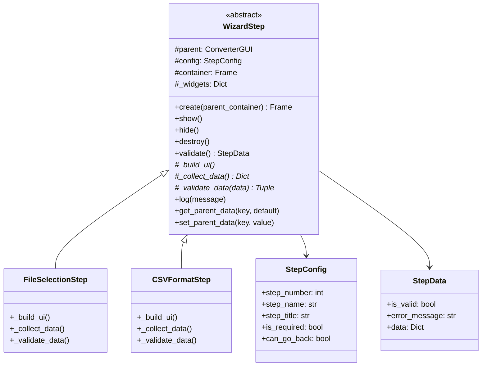
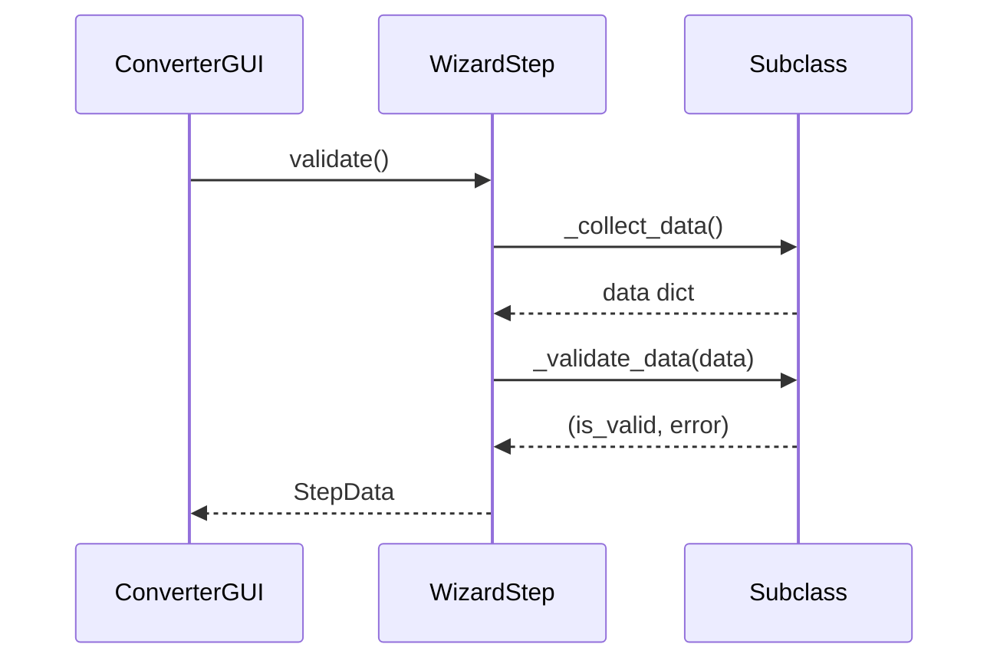

# WizardStep

## 1. General Information

| Attribute | Value |
|-----------|-------|
| **Module** | `src/gui_wizard_step.py` |
| **Type** | Abstract Class |
| **Responsibility** | Base class for wizard step implementations |

## 2. Description

The `WizardStep` class is an abstract base class that defines the interface and common behavior for all wizard steps. It uses the Template Method pattern to orchestrate validation and data collection.

### 2.1 Main Responsibility

- Define step lifecycle (create, show, hide, destroy)
- Provide common interface for validation
- Manage communication with parent orchestrator

## 3. Auxiliary Dataclasses

### 3.1 StepConfig

```python
@dataclass
class StepConfig:
    step_number: int      # Position in wizard (0-based)
    step_name: str        # Display name
    step_title: str       # Full title
    is_required: bool     # If can be skipped
    can_go_back: bool     # If allows going back
    show_next: bool       # Show next button
    show_convert: bool    # Show convert button
```

### 3.2 StepData

```python
@dataclass
class StepData:
    is_valid: bool              # If data is valid
    error_message: Optional[str] # Error message
    data: Dict[str, Any]        # Collected data
```

## 4. Methods

### 4.1 Lifecycle

| Method | Description |
|--------|-------------|
| `create(parent_container)` | Creates UI in parent container |
| `show()` | Shows the step (when active) |
| `hide()` | Hides the step (when no longer active) |
| `destroy()` | Destroys step and cleans up resources |

### 4.2 Abstract Methods (Must be implemented)

| Method | Description |
|--------|-------------|
| `_build_ui()` | Builds step-specific UI elements |
| `_collect_data()` | Collects data from UI elements |
| `_validate_data(data)` | Validates collected data |

### 4.3 Helpers

| Method | Description |
|--------|-------------|
| `log(message)` | Logs message to parent's log |
| `get_parent_data(key, default)` | Gets data from orchestrator |
| `set_parent_data(key, value)` | Sets data in orchestrator |

## 5. Class Diagram



## 6. Template Method Pattern



## 7. Implementation Example

```python
from src.gui_wizard_step import WizardStep, StepConfig, StepData

class MyCustomStep(WizardStep):
    def __init__(self, parent):
        config = StepConfig(
            step_number=0,
            step_name="Custom Step",
            step_title="Step 1: Custom Step"
        )
        super().__init__(parent, config)

    def _build_ui(self):
        # Create widgets
        self._widgets['entry'] = ttk.Entry(self.container)
        self._widgets['entry'].grid(row=0, column=0)

    def _collect_data(self):
        return {
            'value': self._widgets['entry'].get()
        }

    def _validate_data(self, data):
        if not data['value']:
            return False, "Please enter a value"
        return True, None
```

## 8. Design Patterns

| Pattern | Application |
|---------|-------------|
| **Template Method** | `validate()` calls abstract hooks |
| **Factory Method** | `create()` builds UI |
| **Dependency Injection** | Receives parent in constructor |

## 9. Related Tests

- `tests/test_gui_wizard_step.py` - 32 tests
  - Lifecycle tests
  - StepConfig and StepData tests
  - Helper tests
  - Validation tests

---

*Back to [Main Documentation](../README.md)*
