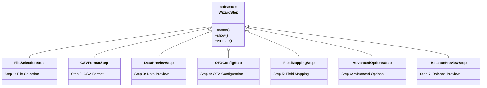
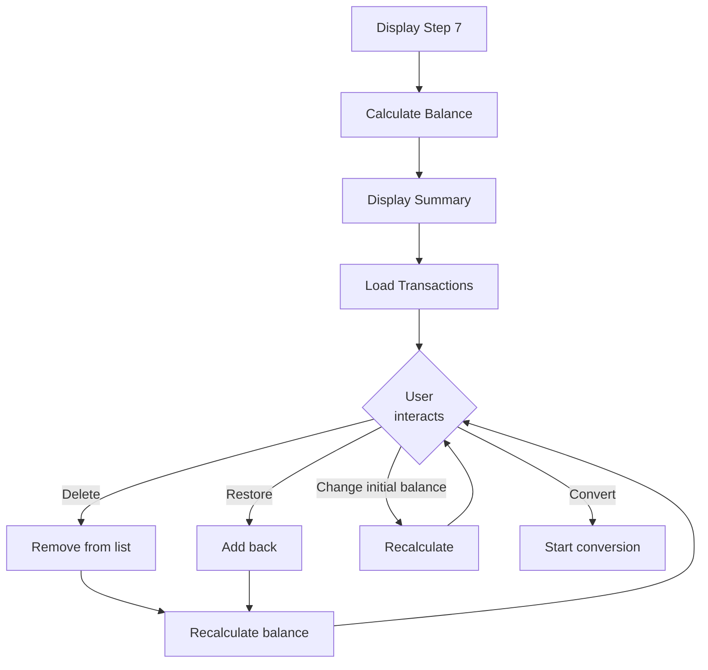

# Wizard Steps

This page documents all 7 wizard steps implemented in the `src/gui_steps/` package.

## Overview

All steps inherit from the `WizardStep` base class and implement the abstract methods:
- `_build_ui()`: Builds step-specific UI elements
- `_collect_data()`: Collects data from UI elements
- `_validate_data()`: Validates collected data

## Hierarchy Diagram

---

## FileSelectionStep (Step 1)

| Attribute | Value |
|-----------|-------|
| **Module** | `src/gui_steps/file_selection_step.py` |
| **Lines** | ~174 |
| **Tests** | 7 |

### Responsibility

Allows user to select the CSV file to be converted.

### Widgets

- Label with instructions
- Entry for file path
- "Browse..." button for selection

### Validation

- File must be selected
- File must exist
- Path must be a valid file

---

## CSVFormatStep (Step 2)

| Attribute | Value |
|-----------|-------|
| **Module** | `src/gui_steps/csv_format_step.py` |
| **Lines** | ~197 |
| **Tests** | 31 |

### Responsibility

Configures CSV file format (delimiter and decimal separator).

### Widgets

- Radiobuttons for predefined formats (Standard, Brazilian, Tab)
- Combobox for custom delimiter
- Combobox for decimal separator

### Predefined Formats

| Format | Delimiter | Decimal |
|--------|-----------|---------|
| Standard | `,` | `.` |
| Brazilian | `;` | `,` |
| Tab | `\t` | `.` |

---

## DataPreviewStep (Step 3)

| Attribute | Value |
|-----------|-------|
| **Module** | `src/gui_steps/data_preview_step.py` |
| **Lines** | ~285 |
| **Tests** | 31 |

### Responsibility

Displays CSV data preview in a table for verification.

### Widgets

- Treeview with CSV data
- Horizontal and vertical scrollbars
- Label with statistics (rows displayed/total)
- "Reload Data" button

### Behavior

- Automatically loads when step is displayed
- Limits preview to 100 rows for performance
- Allows reloading data after format change

---

## OFXConfigStep (Step 4)

| Attribute | Value |
|-----------|-------|
| **Module** | `src/gui_steps/ofx_config_step.py` |
| **Lines** | ~271 |
| **Tests** | 40 |

### Responsibility

Configures output OFX file parameters.

### Widgets

- Entry for account ID
- Entry for bank name
- Combobox for currency (BRL, USD, EUR, GBP)

### Default Values

- Account ID: (empty - optional)
- Bank: "CSV Import"
- Currency: BRL

---

## FieldMappingStep (Step 5)

| Attribute | Value |
|-----------|-------|
| **Module** | `src/gui_steps/field_mapping_step.py` |
| **Lines** | ~390 |
| **Tests** | 38 |

### Responsibility

Maps CSV columns to OFX fields.

### Widgets

- Comboboxes for field mapping
  - Date (required)
  - Amount (required)
  - Description
  - Type
  - ID
- Composite description section
  - 4 Comboboxes for columns
  - Combobox for separator

### Validation

- Date must be mapped
- Amount must be mapped
- Description must be mapped OR composite description configured

---

## AdvancedOptionsStep (Step 6)

| Attribute | Value |
|-----------|-------|
| **Module** | `src/gui_steps/advanced_options_step.py` |
| **Lines** | ~354 |
| **Tests** | 30 |

### Responsibility

Configures advanced conversion options.

### Widgets

- Checkbox for value inversion
- Checkbox for date validation
- Entries for start and end date (DD/MM/YYYY format)

### Features

- **Value Inversion**: Multiplies all values by -1 and swaps DEBIT↔CREDIT
- **Date Validation**: Checks if transactions are within period

---

## BalancePreviewStep (Step 7)

| Attribute | Value |
|-----------|-------|
| **Module** | `src/gui_steps/balance_preview_step.py` |
| **Lines** | ~641 |
| **Tests** | 29 |

### Responsibility

Displays balance preview and allows transaction management before conversion.

### Widgets

- Entry for initial balance
- Labels for credits, debits, and calculated balance
- Treeview with all transactions
- Checkbox for automatic final balance calculation
- Entry for manual final balance

### Features

- Exclude transactions via context menu
- Adjust date actions for out-of-range transactions
- Recalculate balance when modifying initial balance
- Restore excluded transactions

### Flow Diagram

---

## Test Summary

| Step | Test Module | Tests |
|------|-------------|-------|
| 1 | `test_file_selection_step.py` | 7 |
| 2 | `test_csv_format_step.py` | 31 |
| 3 | `test_data_preview_step.py` | 31 |
| 4 | `test_ofx_config_step.py` | 40 |
| 5 | `test_field_mapping_step.py` | 38 |
| 6 | `test_advanced_options_step.py` | 30 |
| 7 | `test_balance_preview_step.py` | 29 |
| **Total** | | **206** |

---

*Back to [Main Documentation](../README.md)*
