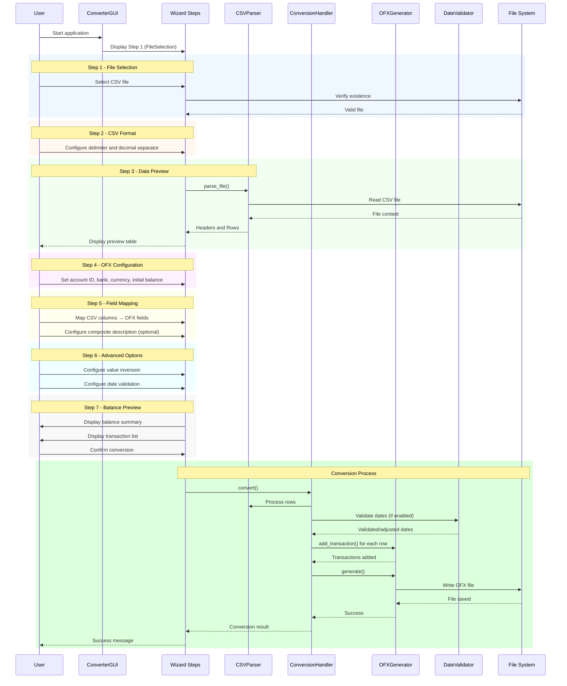
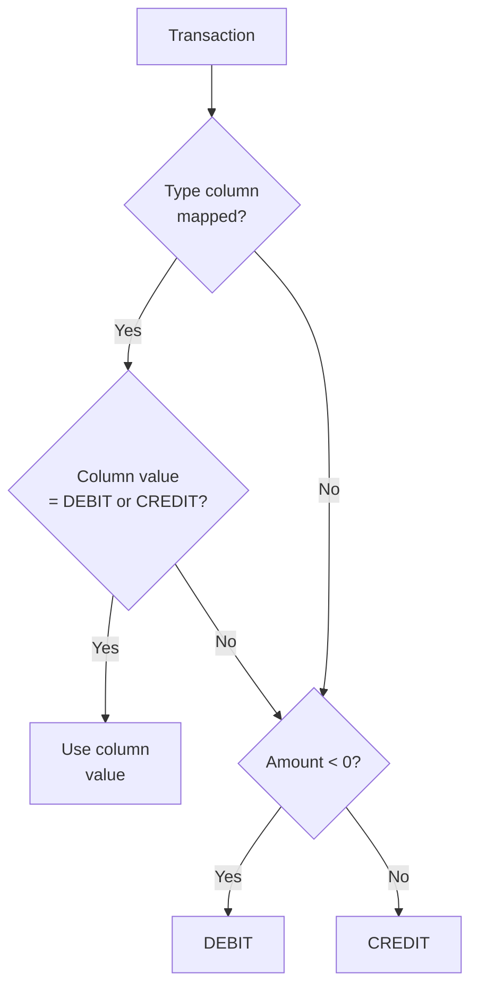
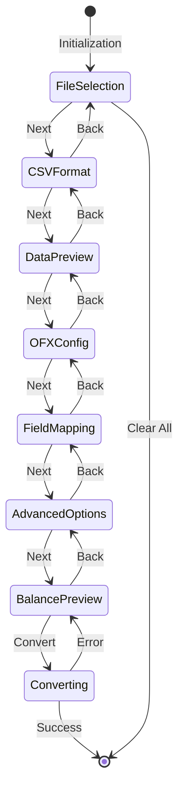

# System Overview

## 1. Functional Description

**CSV to OFX Converter** is a desktop application that allows users to convert bank statements from CSV format to OFX (Open Financial Exchange) format. The application was developed with special focus on support for Brazilian banking formats.

### 1.1 Main Features

| Feature | Description |
|---------|-------------|
| **CSV Import** | Support for multiple CSV formats (standard and Brazilian) |
| **Data Preview** | Tabular data visualization before conversion |
| **Flexible Mapping** | Customizable CSV column to OFX field mapping |
| **Composite Descriptions** | Combine up to 4 columns to create descriptions |
| **Value Inversion** | Option to invert debits/credits |
| **Date Validation** | Transaction validation against statement period |
| **Balance Management** | Automatic or manual initial/final balance calculation |
| **OFX Export** | Compatible OFX 1.0.2 (SGML) file generation |

### 1.2 Supported Formats

#### Standard CSV Format (International)
```csv
date,amount,description
2025-10-01,-100.50,Grocery Store
2025-10-02,1000.00,Salary
```
- Delimiter: Comma (`,`)
- Decimal separator: Period (`.`)

#### Brazilian CSV Format
```csv
data;valor;descricao
01/10/2025;-100,50;Supermercado
02/10/2025;1.000,00;Salário
```
- Delimiter: Semicolon (`;`)
- Decimal separator: Comma (`,`)

### 1.3 Generated OFX Format

The application generates OFX 1.0.2 files in SGML format (not XML), specific for credit card statements (CREDITCARDMSGSRSV1).

## 2. Step-by-Step Functional Flow

### 2.1 Main Flow Sequence Diagram



### 2.2 Detailed Flow by Step

#### Step 1: File Selection
1. User clicks "Browse..."
2. System opens file selection dialog
3. User selects CSV file
4. System validates file existence
5. Path is stored for next steps

#### Step 2: CSV Format
1. User selects predefined format (Standard/Brazilian/Tab)
2. Or manually configures delimiter and decimal separator
3. System prepares parser with selected settings

#### Step 3: Data Preview
1. System automatically loads the CSV file
2. Displays first 100 rows in table
3. User verifies data was parsed correctly
4. Can go back to step 2 to adjust format

#### Step 4: OFX Configuration
1. User defines account ID (optional)
2. Defines bank name (default: "CSV Import")
3. Selects currency (BRL, USD, EUR, GBP)
4. System prepares settings for OFX generation

#### Step 5: Field Mapping
1. User maps Date column (required)
2. Maps Amount column (required)
3. Maps Description column or configures composite description
4. Optionally maps Type and transaction ID

#### Step 6: Advanced Options
1. User enables value inversion (if needed)
2. Enables date validation (if desired)
3. Defines statement period (start and end date)

#### Step 7: Balance Preview and Conversion
1. System calculates initial balance, credits, debits, and final balance
2. Displays complete transaction list
3. User can exclude individual transactions
4. User can adjust actions for out-of-range dates
5. Clicks "Convert to OFX" to generate file

## 3. Business Rules

### 3.1 Value Processing

| Rule | Description |
|------|-------------|
| **Normalization** | Values are normalized to float considering configured decimal separator |
| **Currency** | Currency symbols (R$, $) are removed before conversion |
| **Negatives** | Supports sign notation (`-100.00`) and parentheses (`(100.00)`) |
| **Inversion** | When enabled, multiplies all values by -1 and inverts DEBIT↔CREDIT |

### 3.2 Transaction Type Determination



### 3.3 Date Validation

When enabled, date validation checks if each transaction is within the statement period:

| Status | Default Action | User Options |
|--------|----------------|--------------|
| **Before start** | Adjust to start date | Keep / Adjust / Exclude |
| **Within period** | Process normally | - |
| **After end** | Keep original date | Keep / Adjust / Exclude |

### 3.4 Description Building

```mermaid
flowchart TD
    A[Build Description] --> B{Composite<br/>description?}
    B -->|Yes| C[Combine selected<br/>columns]
    C --> D[Apply chosen<br/>separator]
    D --> E[Return combined<br/>description]
    B -->|No| F{Description column<br/>mapped?}
    F -->|Yes| G[Use column<br/>value]
    F -->|No| H[Use "Transaction"<br/>as default]
    E --> I[Limit to<br/>255 characters]
    G --> I
    H --> I
```

### 3.5 Balance Calculation

| Field | Formula |
|-------|---------|
| **Calculated Final Balance** | `Initial Balance + Total Credits - Total Debits` |
| **Total Credits** | Sum of all positive values |
| **Total Debits** | Sum of absolute values of all negative values |

### 3.6 Transaction Exclusion

Transactions can be excluded from conversion by:
- Manual exclusion by user in Step 7
- "Exclude" action for out-of-range dates
- Processing error (invalid value, invalid date)

## 4. Wizard State Diagram



## 5. Supported Date Formats

The application automatically recognizes the following date formats:

| Format | Example | Standard |
|--------|---------|----------|
| `YYYY-MM-DD` | 2025-10-22 | ISO |
| `DD/MM/YYYY` | 22/10/2025 | Brazilian |
| `MM/DD/YYYY` | 10/22/2025 | American |
| `YYYY/MM/DD` | 2025/10/22 | Alternative ISO |
| `DD-MM-YYYY` | 22-10-2025 | European |
| `DD.MM.YYYY` | 22.10.2025 | German |
| `YYYYMMDD` | 20251022 | Compact |

---

*Back to [Main Documentation](README.md)*
