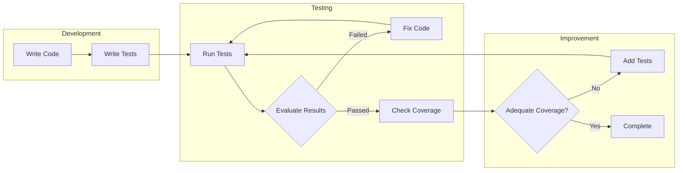
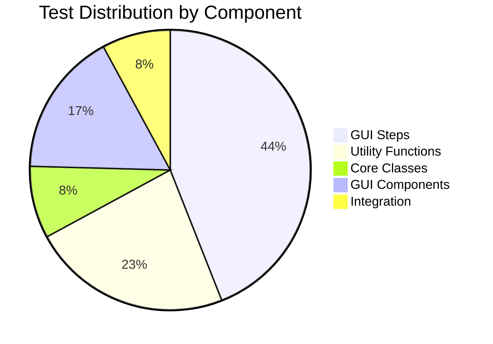

# Unit Tests

## 1. Overview

**CSV to OFX Converter** has a comprehensive test suite using the `unittest` framework from Python's standard library. The suite contains **493 tests** organized in separate modules.

### 1.1 Testing Tools

| Tool | Usage |
|------|-------|
| **unittest** | Main testing framework |
| **unittest.mock** | Object and dependency mocking |
| **tempfile** | Temporary file creation for tests |
| **coverage** | Code coverage (CI/CD) |

### 1.2 Test Structure

```
tests/
├── __init__.py                  # Package initialization
├── run_all_tests.py             # Convenience script
├── test_csv_parser.py           # CSVParser tests (8 tests)
├── test_ofx_generator.py        # OFXGenerator tests (21 tests)
├── test_date_validator.py       # DateValidator tests (12 tests)
├── test_transaction_utils.py    # Utility tests (68 tests)
├── test_gui_utils.py            # GUI utility tests (63 tests)
├── test_gui_integration.py      # GUI integration tests (15 tests)
├── test_gui_balance_manager.py  # BalanceManager tests (14 tests)
├── test_gui_conversion_handler.py # ConversionHandler tests (23 tests)
├── test_gui_transaction_manager.py # TransactionManager tests (26 tests)
├── test_gui_wizard_step.py      # WizardStep class tests (32 tests)
├── test_integration.py          # E2E integration tests (5 tests)
└── test_gui_steps/              # Wizard step tests (206 tests)
    ├── test_file_selection_step.py
    ├── test_csv_format_step.py
    ├── test_data_preview_step.py
    ├── test_ofx_config_step.py
    ├── test_field_mapping_step.py
    ├── test_advanced_options_step.py
    └── test_balance_preview_step.py
```

## 2. Test Cycle Diagram



## 3. Testing Strategy

### 3.1 Test Types

| Type | Description | Examples |
|------|-------------|----------|
| **Unit** | Tests isolated components | CSVParser, OFXGenerator |
| **Integration** | Tests component interaction | Complete CSV→OFX flow |
| **GUI** | Tests user interface | WizardStep, Steps |

### 3.2 Test Patterns

#### Setup and Teardown

```python
class TestCSVParser(unittest.TestCase):
    def setUp(self):
        """Create temporary CSV file before each test."""
        self.temp_file = tempfile.NamedTemporaryFile(
            mode='w', suffix='.csv', delete=False
        )
        self.temp_file.write("date,amount,description\n")
        self.temp_file.write("2025-01-15,-100.50,Test\n")
        self.temp_file.close()

    def tearDown(self):
        """Remove temporary file after each test."""
        os.unlink(self.temp_file.name)
```

#### Mocking

```python
class TestBalanceManager(unittest.TestCase):
    def setUp(self):
        """Create mock parent GUI."""
        self.mock_parent = MagicMock()
        self.mock_parent.csv_data = [
            {'date': '01/10/2025', 'amount': '-100.00', 'desc': 'Test'}
        ]
        self.manager = BalanceManager(self.mock_parent)
```

#### Parameterized Tests

```python
class TestDateValidator(unittest.TestCase):
    def test_date_formats(self):
        """Test multiple date formats."""
        test_cases = [
            ('2025-10-01', '%Y-%m-%d'),
            ('01/10/2025', '%d/%m/%Y'),
            ('10/01/2025', '%m/%d/%Y'),
        ]
        for date_str, expected_format in test_cases:
            with self.subTest(date=date_str):
                result = validator._parse_date_to_datetime(date_str)
                self.assertIsNotNone(result)
```

## 4. Test Module Descriptions

### 4.1 test_csv_parser.py (8 tests)

Tests CSV file parsing and value normalization.

| Test | Description |
|------|-------------|
| `test_parse_standard_csv` | Standard format CSV parsing |
| `test_parse_brazilian_csv` | Brazilian format CSV parsing |
| `test_normalize_standard_amount` | Standard value normalization |
| `test_normalize_brazilian_amount` | Brazilian value normalization |
| `test_normalize_negative_with_currency` | Negative values with currency symbol |
| `test_normalize_parentheses_notation` | Parentheses notation `(100.00)` |
| `test_file_not_found` | Error when file doesn't exist |
| `test_empty_file` | Error when file is empty |

### 4.2 test_ofx_generator.py (21 tests)

Tests OFX file generation.

| Test | Description |
|------|-------------|
| `test_add_transaction` | Add transaction to generator |
| `test_add_credit_transaction` | Credit transaction |
| `test_parse_date_formats` | Multiple date format parsing |
| `test_value_inversion` | Value inversion |
| `test_generate_ofx_file` | Complete file generation |
| `test_multiple_currencies` | Multiple currency support |
| `test_description_limit` | 255 character description limit |
| `test_transaction_sorting` | Transaction sorting by date |
| `test_deterministic_fitid_with_value_inversion` | Ensures deterministic IDs survive value inversion |
| `test_deterministic_fitid_with_long_description` | Verifies memo normalization/truncation for deterministic IDs |

### 4.3 test_date_validator.py (12 tests)

Tests date validation.

| Test | Description |
|------|-------------|
| `test_date_within_range` | Date within period |
| `test_date_before_range` | Date before period |
| `test_date_after_range` | Date after period |
| `test_adjust_to_start_boundary` | Adjust to start date |
| `test_adjust_to_end_boundary` | Adjust to end date |
| `test_invalid_date_format` | Invalid date format |
| `test_year_boundary` | Year transition |

### 4.4 test_transaction_utils.py (68 tests)

Tests transaction utility functions.

| Group | Tests |
|-------|-------|
| **build_transaction_description** | Simple description, composite, separators |
| **determine_transaction_type** | Type by column, by value, edge cases |
| **extract_transaction_id** | ID extraction, unmapped column |
| **calculate_balance_summary** | Balance calculations, edge cases |
| **validate_field_mappings** | Required mapping validation |
| **parse_balance_value** | Balance value parsing |
| **generate_deterministic_fitid** | Deterministic FITID generation, normalization, collision tests |

### 4.5 test_gui_utils.py (63 tests)

Tests GUI utility functions.

| Group | Tests |
|-------|-------|
| **validate_csv_file_selection** | File selection validation |
| **validate_field_mappings** | Mapping validation |
| **format_date_string** | DD/MM/YYYY date formatting |
| **validate_numeric_input** | Numeric input validation |
| **calculate_cursor_position** | Cursor position after formatting |
| **parse_date_for_sorting** | Date parsing for sorting |

### 4.6 test_gui_wizard_step.py (32 tests)

Tests WizardStep base class.

| Group | Tests |
|-------|-------|
| **Lifecycle** | create, show, hide, destroy |
| **StepConfig** | Step configuration |
| **StepData** | Validation data |
| **Helpers** | get_parent_data, set_parent_data, log |
| **Validation** | Validation orchestration |

## 5. Test Case Examples

### 5.1 CSV Parsing Test

```python
class TestCSVParser(unittest.TestCase):
    def test_parse_brazilian_csv(self):
        """Test Brazilian format CSV parsing."""
        # Arrange
        csv_content = "data;valor;descricao\n"
        csv_content += "01/10/2025;-100,50;Compra\n"
        csv_content += "02/10/2025;1.000,00;Salário\n"

        with tempfile.NamedTemporaryFile(
            mode='w', suffix='.csv', delete=False, encoding='utf-8'
        ) as f:
            f.write(csv_content)
            temp_path = f.name

        try:
            # Act
            parser = CSVParser(delimiter=';', decimal_separator=',')
            headers, rows = parser.parse_file(temp_path)

            # Assert
            self.assertEqual(len(headers), 3)
            self.assertEqual(len(rows), 2)
            self.assertEqual(headers[0], 'data')

            # Brazilian value normalization test
            amount = parser.normalize_amount(rows[0]['valor'])
            self.assertEqual(amount, -100.50)
        finally:
            os.unlink(temp_path)
```

### 5.2 Date Validation Test

```python
class TestDateValidator(unittest.TestCase):
    def test_date_status_before(self):
        """Test identifying date before period."""
        # Arrange
        validator = DateValidator('01/10/2025', '31/10/2025')

        # Act
        status = validator.get_date_status('15/09/2025')

        # Assert
        self.assertEqual(status, 'before')

    def test_adjust_to_boundary(self):
        """Test date adjustment to period boundary."""
        # Arrange
        validator = DateValidator('01/10/2025', '31/10/2025')

        # Act
        adjusted = validator.adjust_date_to_boundary('15/09/2025')

        # Assert
        self.assertEqual(adjusted, '2025-10-01')
```

### 5.3 Integration Test

```python
class TestIntegration(unittest.TestCase):
    def test_full_conversion_workflow(self):
        """Test complete CSV to OFX conversion workflow."""
        # Arrange - Create temporary CSV
        csv_content = "date,amount,description\n"
        csv_content += "2025-10-01,-100.50,Test Purchase\n"
        csv_content += "2025-10-02,500.00,Test Deposit\n"

        with tempfile.NamedTemporaryFile(
            mode='w', suffix='.csv', delete=False
        ) as csv_file:
            csv_file.write(csv_content)
            csv_path = csv_file.name

        ofx_path = tempfile.mktemp(suffix='.ofx')

        try:
            # Act - Execute conversion
            parser = CSVParser()
            headers, rows = parser.parse_file(csv_path)

            generator = OFXGenerator()
            for row in rows:
                amount = parser.normalize_amount(row['amount'])
                generator.add_transaction(
                    date=row['date'],
                    amount=amount,
                    description=row['description']
                )
            generator.generate(ofx_path)

            # Assert - Verify generated file
            self.assertTrue(os.path.exists(ofx_path))
            with open(ofx_path, 'r') as f:
                content = f.read()
                self.assertIn('<TRNAMT>-100.50</TRNAMT>', content)
                self.assertIn('<TRNAMT>500.00</TRNAMT>', content)
        finally:
            os.unlink(csv_path)
            if os.path.exists(ofx_path):
                os.unlink(ofx_path)
```

## 6. Commands to Run Tests

### 6.1 Basic Execution

```bash
# Run all tests
python3 -m unittest discover tests

# Run with verbose output
python3 -m unittest discover tests -v

# Using convenience script
python3 tests/run_all_tests.py
```

### 6.2 Module-specific Execution

```bash
# Test specific module
python3 -m unittest tests.test_csv_parser
python3 -m unittest tests.test_ofx_generator
python3 -m unittest tests.test_date_validator

# Test specific class
python3 -m unittest tests.test_csv_parser.TestCSVParser

# Test specific method
python3 -m unittest tests.test_csv_parser.TestCSVParser.test_parse_standard_csv
```

### 6.3 Execution with Coverage

```bash
# Install coverage (if needed)
pip install coverage

# Run with coverage
coverage run -m unittest discover tests

# Generate report
coverage report -m

# Generate HTML report
coverage html
```

## 7. Improvement Recommendations

### 7.1 Test Coverage

| Area | Current Status | Recommendation |
|------|----------------|----------------|
| **Core Classes** | ✅ Complete | Maintain |
| **GUI Steps** | ✅ Complete | Add edge case tests |
| **Integration** | ⚠️ Basic | Expand scenarios |
| **Performance** | ❌ Absent | Add benchmarks |

### 7.2 Suggested Improvements

1. **Performance Tests**
   - Add tests for large CSV files (>10,000 rows)
   - Measure parsing and generation time

2. **Edge Case Tests**
   - Special characters in descriptions
   - Extreme values (very large/small)
   - Dates at month/year boundaries

3. **Regression Tests**
   - Document fixed bugs with specific tests
   - Maintain tests for specific bank formats

4. **Automated UI Tests**
   - Consider using `pyautogui` for complete GUI tests
   - Test complete wizard flow

### 7.3 Coverage Distribution Diagram



## 8. Best Practices Adopted

| Practice | Description |
|----------|-------------|
| **Isolation** | Each test is independent |
| **Cleanup** | tearDown removes temporary files |
| **Naming** | `test_<scenario>_<behavior>` |
| **Assertions** | One main assertion per test |
| **Mocking** | Used for external dependencies |
| **Documentation** | Docstrings explaining each test |

---

*Back to [Main Documentation](README.md)*
