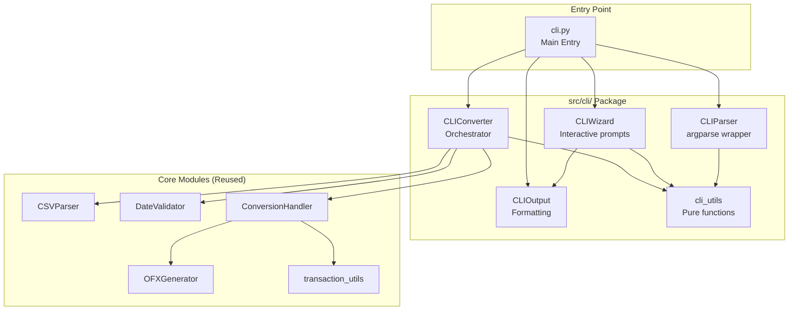
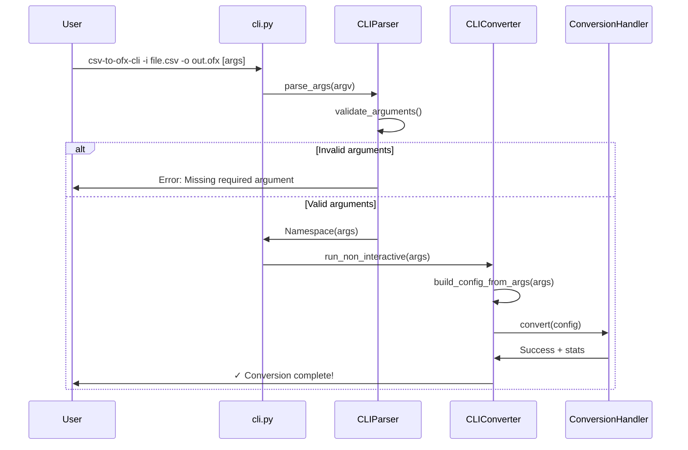

# CLI Implementation Plan - Technical Specification

## Document Control

**Document Version:** 1.0  
**Date:** December 2, 2025  
**Author:** Tech Lead Coordinator  
**Status:** APPROVED FOR IMPLEMENTATION  
**Project:** CSV to OFX Converter CLI Feature  
**Target Version:** 4.0.0

---

## Executive Summary

This document provides a comprehensive technical implementation plan for adding a command-line interface (CLI) to the CSV to OFX Converter application. The CLI will provide complete feature parity with the existing 7-step GUI wizard while maintaining zero new external dependencies and following all established project patterns.

### Key Deliverables

- **Two operational modes**: Non-interactive (all params as CLI args) and Interactive (step-by-step prompts)
- **Complete feature parity** with existing GUI wizard
- **Zero new dependencies** (argparse from standard library)
- **155+ comprehensive tests** across all CLI modules
- **Dual executable support**: GUI and CLI entry points
- **Cross-platform compatibility** maintained

### Implementation Timeline

**Total Estimated Effort:** 15-20 working days  
**Recommended Team Size:** 1-2 developers  
**Phases:** 5 distinct phases with clear deliverables

---

## Table of Contents

1. [Architecture Overview](#1-architecture-overview)
2. [Module Structure](#2-module-structure)
3. [Phased Implementation Plan](#3-phased-implementation-plan)
4. [Test Strategy](#4-test-strategy)
5. [Build and Deployment](#5-build-and-deployment)
6. [Documentation Requirements](#6-documentation-requirements)
7. [Risk Assessment](#7-risk-assessment)
8. [Success Criteria](#8-success-criteria)
9. [Appendices](#9-appendices)

---

## 1. Architecture Overview

### 1.1 Design Principles

The CLI implementation follows these core principles established in the project:

1. **Zero External Dependencies**: Use only Python 3.7+ standard library (argparse)
2. **Companion Class Pattern**: CLI classes delegate to existing core classes
3. **Pure Function Utilities**: Testable business logic with no I/O dependencies
4. **Dependency Injection**: CLI components receive dependencies via constructor
5. **Backward Compatibility**: Existing GUI functionality remains unchanged

### 1.2 High-Level Architecture

```
┌──────────────────────────────────────────────────────────────┐
│                     Entry Points Layer                        │
│  ┌──────────────┐                    ┌──────────────┐        │
│  │   main.py    │                    │   cli.py     │        │
│  │  (GUI mode)  │                    │  (CLI mode)  │        │
│  └──────────────┘                    └──────────────┘        │
└──────────────────────────────────────────────────────────────┘
                    │                            │
                    ▼                            ▼
┌──────────────────────────────────────────────────────────────┐
│                 Interface Layer (NEW)                         │
│  ┌────────────────────────────────────────────────────────┐  │
│  │         src/cli/                                        │  │
│  │  ┌──────────────┐  ┌──────────────┐  ┌──────────────┐ │  │
│  │  │  CLIParser   │  │  CLIWizard   │  │ CLIConverter │ │  │
│  │  │  (argparse)  │  │ (interactive)│  │ (orchestrate)│ │  │
│  │  └──────────────┘  └──────────────┘  └──────────────┘ │  │
│  │  ┌──────────────┐  ┌──────────────┐                    │  │
│  │  │  CLIOutput   │  │  cli_utils   │                    │  │
│  │  │  (display)   │  │ (utilities)  │                    │  │
│  │  └──────────────┘  └──────────────┘                    │  │
│  └────────────────────────────────────────────────────────┘  │
└──────────────────────────────────────────────────────────────┘
                              │
                              ▼
┌──────────────────────────────────────────────────────────────┐
│              Core Business Logic (REUSED)                     │
│  ┌──────────────┐  ┌──────────────┐  ┌──────────────┐       │
│  │  CSVParser   │  │OFXGenerator  │  │DateValidator │       │
│  └──────────────┘  └──────────────┘  └──────────────┘       │
│  ┌──────────────┐  ┌──────────────┐                         │
│  │ConversionH.  │  │transaction_  │                         │
│  │   (logic)    │  │    utils     │                         │
│  └──────────────┘  └──────────────┘                         │
└──────────────────────────────────────────────────────────────┘
```

### 1.3 Data Flow

#### Non-Interactive Mode (All Arguments Provided)

```
User Command (bash)
    ↓
cli.py entry point
    ↓
CLIParser.parse_args()
    ↓
CLIConverter.convert_non_interactive()
    ↓
┌─────────────────────────────────────────┐
│ 1. Validate all arguments               │
│ 2. CSVParser.parse_file()               │
│ 3. Build ConversionConfig dataclass     │
│ 4. ConversionHandler.convert()          │
│ 5. Generate OFX file                    │
│ 6. CLIOutput.show_success()             │
└─────────────────────────────────────────┘
    ↓
OFX File + Statistics
```

#### Interactive Mode (Wizard Prompts)

```
User Command: csv-to-ofx --interactive
    ↓
cli.py entry point
    ↓
CLIWizard.run_interactive()
    ↓
┌─────────────────────────────────────────┐
│ Step 1: prompt_file_selection()         │
│ Step 2: prompt_csv_format()             │
│ Step 3: show_data_preview()             │
│ Step 4: prompt_ofx_config()             │
│ Step 5: prompt_field_mapping()          │
│ Step 6: prompt_advanced_options()       │
│ Step 7: show_balance_preview()          │
└─────────────────────────────────────────┘
    ↓
CLIConverter.convert_interactive()
    ↓
ConversionHandler.convert()
    ↓
OFX File + Statistics
```

### 1.4 Key Architectural Decisions

| Decision | Rationale |
|----------|-----------|
| **Separate cli.py entry point** | Keeps main.py (GUI) unchanged, allows dual-mode builds |
| **CLI package under src/cli/** | Organizes CLI-specific code, follows modular pattern |
| **Reuse ConversionHandler** | Maximizes code reuse, ensures identical business logic |
| **Reuse transaction_utils** | CLI uses same validation/calculation functions as GUI |
| **CLIOutput class for formatting** | Separates display logic from business logic (testable) |
| **argparse for parsing** | Standard library, zero new dependencies |
| **Interactive mode uses CLIWizard** | Mirrors GUI wizard pattern, familiar to users |

---

## 2. Module Structure

### 2.1 Directory Layout

```
/workspaces/csv-to-ofx-converter/
├── cli.py                          # NEW: CLI entry point
├── main.py                         # EXISTING: GUI entry point (unchanged)
├── src/
│   ├── cli/                        # NEW: CLI package
│   │   ├── __init__.py            # Package exports
│   │   ├── cli_parser.py          # CLIParser class (argparse wrapper)
│   │   ├── cli_wizard.py          # CLIWizard class (interactive prompts)
│   │   ├── cli_converter.py       # CLIConverter class (orchestrator)
│   │   ├── cli_output.py          # CLIOutput class (formatting/display)
│   │   └── cli_utils.py           # CLI utility functions (pure)
│   ├── csv_parser.py              # EXISTING (reused)
│   ├── ofx_generator.py           # EXISTING (reused)
│   ├── date_validator.py          # EXISTING (reused)
│   ├── transaction_utils.py       # EXISTING (reused)
│   ├── gui_conversion_handler.py  # EXISTING (reused for conversion logic)
│   └── csv_to_ofx_converter.py    # UPDATED: export CLI classes
├── tests/
│   └── test_cli/                  # NEW: CLI test package
│       ├── __init__.py
│       ├── test_cli_parser.py     # CLIParser tests (30 tests)
│       ├── test_cli_wizard.py     # CLIWizard tests (35 tests)
│       ├── test_cli_converter.py  # CLIConverter tests (40 tests)
│       ├── test_cli_output.py     # CLIOutput tests (25 tests)
│       ├── test_cli_utils.py      # cli_utils tests (30 tests)
│       └── test_cli_integration.py # E2E CLI tests (15 tests)
└── docs/
    ├── CLI_USAGE.md               # NEW: CLI user guide
    └── plans/
        └── CLI_IMPLEMENTATION_PLAN.md  # This document
```

### 2.2 Module Responsibilities

#### 2.2.1 cli.py (Entry Point)

**Lines:** ~80-100  
**Responsibility:** CLI application entry point

```python
"""
Command-line interface entry point for CSV to OFX Converter.

Usage:
    python cli.py --help
    python cli.py --interactive
    python cli.py -i input.csv -o output.ofx [options]
"""

import sys
import logging
from src.cli import CLIParser, CLIConverter, CLIOutput

def main():
    """Main CLI entry point."""
    try:
        # Parse arguments
        parser = CLIParser()
        args = parser.parse_args(sys.argv[1:])
        
        # Initialize output handler
        output = CLIOutput(verbose=args.verbose, quiet=args.quiet)
        
        # Initialize converter
        converter = CLIConverter(output=output)
        
        # Run interactive or non-interactive mode
        if args.interactive:
            success = converter.run_interactive()
        else:
            success = converter.run_non_interactive(args)
        
        sys.exit(0 if success else 1)
        
    except KeyboardInterrupt:
        output.error("Operation cancelled by user")
        sys.exit(130)
    except Exception as e:
        logging.exception("Unexpected error")
        output.error(f"Fatal error: {e}")
        sys.exit(1)

if __name__ == "__main__":
    main()
```

#### 2.2.2 src/cli/cli_parser.py (CLIParser)

**Lines:** ~300-350  
**Responsibility:** Command-line argument parsing and validation

**Key Methods:**
- `parse_args(argv)` → Returns parsed Namespace
- `_create_parser()` → Builds argparse.ArgumentParser
- `_add_io_arguments(parser)` → File I/O args (-i, -o)
- `_add_csv_format_arguments(parser)` → CSV format args
- `_add_ofx_config_arguments(parser)` → OFX config args
- `_add_field_mapping_arguments(parser)` → Field mapping args
- `_add_advanced_arguments(parser)` → Advanced options
- `_validate_parsed_args(args)` → Cross-field validation

**Arguments to Support:**

```
General:
  --interactive, -I          Interactive wizard mode
  --verbose, -v              Verbose output
  --quiet, -q                Quiet mode (errors only)
  --version                  Show version
  --help, -h                 Show help

Input/Output (Required for non-interactive):
  --input, -i FILE           Input CSV file path
  --output, -o FILE          Output OFX file path

CSV Format:
  --delimiter CHAR           Column delimiter (default: ',')
  --decimal-separator CHAR   Decimal separator (default: '.')
  --encoding ENC             File encoding (default: 'utf-8')

OFX Configuration:
  --account-id ID            Account identifier (default: 'UNKNOWN')
  --bank-name NAME           Bank name (default: 'CSV Import')
  --currency CODE            Currency code (BRL|USD|EUR|GBP, default: BRL)
  --initial-balance AMT      Initial balance (default: 0.00)

Field Mapping (Required for non-interactive):
  --date-column COL          Date column name
  --amount-column COL        Amount column name
  --description-column COL   Description column name (single)
  --type-column COL          Transaction type column (optional)
  --id-column COL            Transaction ID column (optional)

Composite Description:
  --description-columns COL1,COL2,COL3,COL4  Up to 4 columns
  --description-separator SEP                Separator (space|dash|comma|pipe)

Advanced Options:
  --invert-values            Invert all transaction amounts
  --validate-dates           Enable date validation
  --start-date DATE          Statement start date (YYYY-MM-DD or DD/MM/YYYY)
  --end-date DATE            Statement end date
  --date-action ACTION       Default action for out-of-range (keep|adjust|exclude)
```

#### 2.2.3 src/cli/cli_wizard.py (CLIWizard)

**Lines:** ~500-600  
**Responsibility:** Interactive wizard prompts (mirrors GUI 7-step wizard)

**Key Methods:**
- `run()` → Executes full interactive workflow, returns ConversionConfig
- `step1_file_selection()` → Prompts for CSV file path
- `step2_csv_format()` → Prompts for delimiter, decimal separator
- `step3_data_preview()` → Shows first 20 rows in table format
- `step4_ofx_config()` → Prompts for account ID, bank, currency, balance
- `step5_field_mapping()` → Prompts for column mappings
- `step6_advanced_options()` → Prompts for inversion, date validation
- `step7_balance_preview()` → Shows balance summary and transaction preview
- `_prompt_choice(question, choices)` → Generic choice prompt
- `_prompt_text(question, default, validator)` → Generic text prompt
- `_prompt_yes_no(question, default)` → Yes/no prompt
- `_show_table(headers, rows, max_rows)` → Displays table in terminal
- `_show_balance_summary(preview_data)` → Displays balance info

**Design Pattern:**
```python
class CLIWizard:
    def __init__(self, output: CLIOutput):
        self.output = output
        self.csv_parser = None
        self.headers = None
        self.rows = None
        
    def run(self) -> ConversionConfig:
        """Execute interactive wizard."""
        self.output.section("CSV to OFX Converter - Interactive Mode")
        
        # Step 1: File Selection
        csv_file = self.step1_file_selection()
        
        # Step 2: CSV Format
        delimiter, decimal_sep = self.step2_csv_format()
        
        # Step 3: Data Preview
        self.step3_data_preview(csv_file, delimiter, decimal_sep)
        
        # ... Steps 4-7 ...
        
        # Build and return ConversionConfig
        return ConversionConfig(...)
```

#### 2.2.4 src/cli/cli_converter.py (CLIConverter)

**Lines:** ~350-400  
**Responsibility:** Orchestrates conversion workflow for both modes

**Key Methods:**
- `run_interactive()` → Executes interactive mode workflow
- `run_non_interactive(args)` → Executes non-interactive mode workflow
- `_execute_conversion(config)` → Common conversion execution
- `_handle_out_of_range_date(transaction)` → Date validation handling
- `_build_config_from_args(args)` → Creates ConversionConfig from CLI args
- `_build_config_from_wizard()` → Creates ConversionConfig from wizard
- `_validate_config(config)` → Validates ConversionConfig completeness

**Reuses:**
- ConversionHandler for actual CSV to OFX conversion
- transaction_utils for validation and calculations
- DateValidator for date range checking

**Design Pattern:**
```python
class CLIConverter:
    def __init__(self, output: CLIOutput):
        self.output = output
        
    def run_non_interactive(self, args) -> bool:
        """Execute non-interactive conversion."""
        try:
            # Build config from args
            config = self._build_config_from_args(args)
            
            # Validate config
            self._validate_config(config)
            
            # Execute conversion
            return self._execute_conversion(config)
            
        except ValueError as e:
            self.output.error(f"Configuration error: {e}")
            return False
            
    def _execute_conversion(self, config: ConversionConfig) -> bool:
        """Common conversion execution."""
        # Parse CSV
        csv_parser = CSVParser(config.delimiter, config.decimal_separator)
        headers, rows = csv_parser.parse_file(config.input_file)
        
        # Use ConversionHandler (REUSE!)
        handler = ConversionHandler(parent=None)  # No GUI parent needed
        success, message, stats = handler.convert(config)
        
        # Display results
        if success:
            self.output.success(message)
            self.output.stats(stats)
        else:
            self.output.error(message)
            
        return success
```

#### 2.2.5 src/cli/cli_output.py (CLIOutput)

**Lines:** ~250-300  
**Responsibility:** Terminal output formatting and display

**Key Methods:**
- `section(title)` → Displays section header
- `info(message)` → Displays info message
- `success(message)` → Displays success (green)
- `error(message)` → Displays error (red)
- `warning(message)` → Displays warning (yellow)
- `stats(stats_dict)` → Displays statistics table
- `table(headers, rows, max_rows)` → Displays formatted table
- `progress_bar(current, total, label)` → Shows progress bar
- `confirm(question, default)` → Yes/no confirmation
- `_colorize(text, color)` → Applies ANSI colors (optional)

**Color Support:**
- Uses ANSI escape codes for terminal colors (optional)
- Respects --no-color flag and NO_COLOR env variable
- Degrades gracefully on non-color terminals

**Design Pattern:**
```python
class CLIOutput:
    def __init__(self, verbose=False, quiet=False, use_color=True):
        self.verbose = verbose
        self.quiet = quiet
        self.use_color = use_color and self._supports_color()
        
    def section(self, title: str):
        """Display section header."""
        if not self.quiet:
            print(f"\n{'=' * 60}")
            print(f"  {title}")
            print('=' * 60)
            
    def table(self, headers: List[str], rows: List[List[str]], 
              max_rows: int = 20):
        """Display formatted table."""
        # Calculate column widths
        widths = [len(h) for h in headers]
        for row in rows[:max_rows]:
            for i, cell in enumerate(row):
                widths[i] = max(widths[i], len(str(cell)))
        
        # Print header
        header_row = " | ".join(h.ljust(w) for h, w in zip(headers, widths))
        print(header_row)
        print("-" * len(header_row))
        
        # Print rows
        for row in rows[:max_rows]:
            print(" | ".join(str(cell).ljust(w) for cell, w in zip(row, widths)))
```

#### 2.2.6 src/cli/cli_utils.py (Utilities)

**Lines:** ~200-250  
**Responsibility:** Pure CLI utility functions (no I/O)

**Functions:**
- `validate_file_path(path, must_exist)` → Validates file paths
- `parse_column_list(columns_str)` → Parses comma-separated columns
- `parse_date_string(date_str, formats)` → Parses date with multiple formats
- `format_currency(amount, currency)` → Formats amount with currency symbol
- `format_date_display(date, format)` → Formats date for display
- `validate_currency_code(code)` → Validates currency code
- `validate_delimiter(delimiter)` → Validates CSV delimiter
- `parse_separator_choice(choice)` → Converts separator name to char
- `calculate_column_widths(headers, rows)` → Calculates table widths
- `truncate_cell(text, max_width)` → Truncates long cell values
- `prompt_with_validation(prompt, validator, error_msg)` → Generic validated prompt
- `confirm_action(question, default)` → Yes/no confirmation helper

---

## 3. Phased Implementation Plan

### Phase 1: Foundation and Non-Interactive Core (P0 - MVP)

**Goal:** Establish CLI infrastructure and implement non-interactive mode with basic features.

**Duration:** 4-5 days  
**Priority:** P0 (Critical for MVP)

#### Tasks

| Task | Effort | Owner | Dependencies |
|------|--------|-------|--------------|
| 1.1: Create src/cli/ package structure | 1 hour | Dev | None |
| 1.2: Implement cli_utils.py (10 pure functions) | 4 hours | Dev | None |
| 1.3: Implement CLIOutput class (basic formatting) | 4 hours | Dev | cli_utils |
| 1.4: Implement CLIParser class (argparse setup) | 6 hours | Dev | None |
| 1.5: Create cli.py entry point (basic) | 2 hours | Dev | CLIParser, CLIOutput |
| 1.6: Implement CLIConverter (non-interactive only) | 6 hours | Dev | All above |
| 1.7: Write unit tests for cli_utils (30 tests) | 4 hours | Dev | cli_utils |
| 1.8: Write unit tests for CLIParser (30 tests) | 4 hours | Dev | CLIParser |
| 1.9: Write unit tests for CLIOutput (25 tests) | 4 hours | Dev | CLIOutput |
| 1.10: Write unit tests for CLIConverter (20 tests) | 4 hours | Dev | CLIConverter |
| 1.11: End-to-end testing (5 integration tests) | 3 hours | Dev | All |
| **Total** | **42 hours (~5 days)** | | |

#### Deliverables

- ✅ Complete src/cli/ package with 4 modules
- ✅ cli.py entry point (non-interactive mode only)
- ✅ 110 tests passing (30+30+25+20+5)
- ✅ Non-interactive CLI fully functional
- ✅ Zero regressions in existing GUI tests

#### Acceptance Criteria

```bash
# Must work: Basic non-interactive conversion
python cli.py -i sample.csv -o output.ofx \
  --date-column date --amount-column amount \
  --description-column description

# Must show help
python cli.py --help

# Must validate missing required args
python cli.py -i sample.csv
# ERROR: --output is required in non-interactive mode

# Must validate file existence
python cli.py -i missing.csv -o output.ofx ...
# ERROR: Input file 'missing.csv' not found
```

### Phase 2: Interactive Wizard Mode (P0 - MVP)

**Goal:** Implement full 7-step interactive wizard with feature parity to GUI.

**Duration:** 5-6 days  
**Priority:** P0 (Critical for MVP)

#### Tasks

| Task | Effort | Owner | Dependencies |
|------|--------|-------|--------------|
| 2.1: Design CLIWizard class architecture | 2 hours | Dev | Phase 1 |
| 2.2: Implement step 1 (file selection) | 3 hours | Dev | CLIOutput |
| 2.3: Implement step 2 (CSV format) | 3 hours | Dev | cli_utils |
| 2.4: Implement step 3 (data preview) | 4 hours | Dev | CLIOutput.table() |
| 2.5: Implement step 4 (OFX config) | 4 hours | Dev | cli_utils |
| 2.6: Implement step 5 (field mapping) | 5 hours | Dev | cli_utils |
| 2.7: Implement step 6 (advanced options) | 4 hours | Dev | cli_utils |
| 2.8: Implement step 7 (balance preview) | 5 hours | Dev | CLIOutput, BalanceManager |
| 2.9: Integrate wizard with CLIConverter | 3 hours | Dev | All steps |
| 2.10: Write unit tests for CLIWizard (35 tests) | 6 hours | Dev | CLIWizard |
| 2.11: Write integration tests (10 tests) | 4 hours | Dev | Full workflow |
| 2.12: Manual acceptance testing | 3 hours | QA | All |
| **Total** | **46 hours (~6 days)** | | |

#### Deliverables

- ✅ CLIWizard class with 7 interactive steps
- ✅ Interactive mode fully functional
- ✅ 45 additional tests (35+10)
- ✅ Feature parity with GUI wizard
- ✅ User-friendly prompts and error messages

#### Acceptance Criteria

```bash
# Must work: Interactive wizard
python cli.py --interactive
# Prompts through all 7 steps
# Generates OFX file
# Shows statistics

# Must handle Ctrl+C gracefully
python cli.py --interactive
# Step 1: [User presses Ctrl+C]
# "Operation cancelled by user"
# Exit code: 130

# Must validate inputs at each step
# Invalid file path → re-prompt
# Invalid column name → re-prompt
# Invalid date format → re-prompt
```

### Phase 3: Advanced Features (P1 - High Priority)

**Goal:** Add date validation, composite descriptions, value inversion, and balance preview.

**Duration:** 3-4 days  
**Priority:** P1 (High - completes feature parity)

#### Tasks

| Task | Effort | Owner | Dependencies |
|------|--------|-------|--------------|
| 3.1: Implement composite description CLI args | 2 hours | Dev | Phase 1 |
| 3.2: Implement composite description wizard prompts | 2 hours | Dev | Phase 2 |
| 3.3: Implement value inversion CLI arg | 1 hour | Dev | Phase 1 |
| 3.4: Implement value inversion wizard prompt | 1 hour | Dev | Phase 2 |
| 3.5: Implement date validation CLI args | 3 hours | Dev | Phase 1 |
| 3.6: Implement date validation wizard prompts | 3 hours | Dev | Phase 2 |
| 3.7: Implement balance preview display | 4 hours | Dev | CLIOutput |
| 3.8: Integrate BalanceManager for calculations | 3 hours | Dev | Phase 2 |
| 3.9: Write tests for advanced features (20 tests) | 4 hours | Dev | All |
| 3.10: Update integration tests (5 tests) | 2 hours | Dev | All |
| 3.11: Manual testing with edge cases | 3 hours | QA | All |
| **Total** | **28 hours (~4 days)** | | |

#### Deliverables

- ✅ Composite descriptions working in both modes
- ✅ Value inversion working in both modes
- ✅ Date validation with keep/adjust/exclude in both modes
- ✅ Balance preview in Step 7 of interactive mode
- ✅ 25 additional tests (20+5)

#### Acceptance Criteria

```bash
# Composite descriptions
python cli.py -i sample.csv -o output.ofx \
  --date-column date --amount-column amount \
  --description-columns "category,merchant,notes" \
  --description-separator dash

# Value inversion
python cli.py -i sample.csv -o output.ofx \
  --date-column date --amount-column amount \
  --description-column desc --invert-values

# Date validation
python cli.py -i sample.csv -o output.ofx \
  --date-column date --amount-column amount \
  --description-column desc \
  --validate-dates --start-date 2025-01-01 \
  --end-date 2025-01-31 --date-action adjust
```

### Phase 4: Build and Deployment (P1 - High Priority)

**Goal:** Create CLI executable, update build system, configure CI/CD.

**Duration:** 2-3 days  
**Priority:** P1 (Required for release)

#### Tasks

| Task | Effort | Owner | Dependencies |
|------|--------|-------|--------------|
| 4.1: Create cli.spec for PyInstaller | 2 hours | Dev | Phase 1-3 |
| 4.2: Update build.sh for dual executables | 2 hours | Dev | cli.spec |
| 4.3: Update build.bat for dual executables | 2 hours | Dev | cli.spec |
| 4.4: Test Linux build (GUI + CLI) | 2 hours | QA | build.sh |
| 4.5: Test Windows build (GUI + CLI) | 2 hours | QA | build.bat |
| 4.6: Test macOS build (GUI + CLI) | 2 hours | QA | build.sh |
| 4.7: Update GitHub Actions workflow | 3 hours | DevOps | All builds |
| 4.8: Update sonar.yml for CLI tests | 1 hour | DevOps | Phase 1-3 |
| 4.9: Test CI/CD pipeline | 2 hours | DevOps | Workflows |
| 4.10: Create release artifacts | 2 hours | DevOps | Builds |
| **Total** | **20 hours (~3 days)** | | |

#### Deliverables

- ✅ cli.spec PyInstaller configuration
- ✅ Updated build.sh and build.bat
- ✅ Two executables per platform:
  - csv-to-ofx-converter (GUI)
  - csv-to-ofx-cli (CLI)
- ✅ GitHub Actions producing both executables
- ✅ SonarCloud analyzing CLI code

#### Acceptance Criteria

```bash
# Must produce two executables
./build.sh
# Output:
#   dist/csv-to-ofx-converter (GUI)
#   dist/csv-to-ofx-cli (CLI)

# CLI executable must work standalone
./dist/csv-to-ofx-cli --help
./dist/csv-to-ofx-cli --interactive
./dist/csv-to-ofx-cli -i sample.csv -o out.ofx ...

# GitHub Actions must succeed
# - Build for Linux, macOS, Windows
# - Run 623 tests (468 existing + 155 CLI)
# - Attach 6 executables to release (3 GUI + 3 CLI)
```

### Phase 5: Documentation and Polish (P1 - High Priority)

**Goal:** Complete user documentation, update project docs, prepare for release.

**Duration:** 2-3 days  
**Priority:** P1 (Required for release)

#### Tasks

| Task | Effort | Owner | Dependencies |
|------|--------|-------|--------------|
| 5.1: Write CLI_USAGE.md (English) | 4 hours | Tech Writer | Phase 1-3 |
| 5.2: Write CLI_USAGE.pt-BR.md (Portuguese) | 4 hours | Tech Writer | CLI_USAGE.md |
| 5.3: Update CLAUDE.md (module structure, tests) | 2 hours | Tech Lead | Phase 1-4 |
| 5.4: Update README.md (CLI section, examples) | 3 hours | Tech Writer | CLI_USAGE.md |
| 5.5: Update README.pt-BR.md (CLI section) | 3 hours | Tech Writer | README.md |
| 5.6: Add CLI examples to docs/ | 2 hours | Tech Writer | CLI_USAGE.md |
| 5.7: Update RELEASE_CHECKLIST.md | 1 hour | Tech Lead | Phase 4 |
| 5.8: Create CHANGELOG entry for v4.0.0 | 1 hour | Tech Lead | All phases |
| 5.9: Review all documentation | 2 hours | Product Mgr | All docs |
| 5.10: Final QA and acceptance testing | 4 hours | QA | All |
| **Total** | **26 hours (~3 days)** | | |

#### Deliverables

- ✅ CLI_USAGE.md with comprehensive guide
- ✅ CLI_USAGE.pt-BR.md (Portuguese translation)
- ✅ Updated CLAUDE.md with CLI architecture
- ✅ Updated README.md with CLI quick start
- ✅ Updated README.pt-BR.md
- ✅ CHANGELOG for v4.0.0
- ✅ All documentation reviewed and approved

#### Acceptance Criteria

- Documentation covers all CLI features
- Examples work without modification
- Screenshots/GIFs demonstrate interactive mode
- Portuguese translation is accurate
- CLAUDE.md reflects actual code structure
- README quick start gets users running in <5 minutes

---

## 4. Test Strategy

### 4.1 Test Organization

```
tests/
├── test_cli/                       # CLI tests (155 tests)
│   ├── __init__.py
│   ├── test_cli_utils.py          # 30 tests - Pure functions
│   ├── test_cli_parser.py         # 30 tests - Argument parsing
│   ├── test_cli_output.py         # 25 tests - Output formatting
│   ├── test_cli_wizard.py         # 35 tests - Interactive prompts
│   ├── test_cli_converter.py      # 20 tests - Conversion orchestration
│   └── test_cli_integration.py    # 15 tests - End-to-end workflows
└── (existing 468 tests unchanged)
```

### 4.2 Test Coverage Targets

| Module | Target Coverage | Test Count | Priority |
|--------|----------------|------------|----------|
| cli_utils.py | 95%+ | 30 | P0 |
| cli_parser.py | 90%+ | 30 | P0 |
| cli_output.py | 85%+ | 25 | P0 |
| cli_converter.py | 90%+ | 20 | P0 |
| cli_wizard.py | 85%+ | 35 | P0 |
| Integration | N/A | 15 | P1 |
| **Total** | **~90%** | **155** | |

### 4.3 Test Scenarios by Module

#### 4.3.1 test_cli_utils.py (30 tests)

```python
class TestFilePathValidation:
    """Tests for validate_file_path()"""
    def test_valid_existing_file(self)
    def test_valid_nonexistent_file_allowed(self)
    def test_invalid_nonexistent_file_required(self)
    def test_invalid_directory_as_file(self)
    def test_invalid_empty_path(self)
    
class TestColumnListParsing:
    """Tests for parse_column_list()"""
    def test_single_column(self)
    def test_multiple_columns(self)
    def test_max_four_columns(self)
    def test_empty_list_error(self)
    def test_whitespace_handling(self)
    
class TestDateParsing:
    """Tests for parse_date_string()"""
    def test_yyyy_mm_dd_format(self)
    def test_dd_mm_yyyy_format(self)
    def test_multiple_format_attempts(self)
    def test_invalid_date_raises_error(self)
    
class TestCurrencyFormatting:
    """Tests for format_currency()"""
    def test_brl_format(self)
    def test_usd_format(self)
    def test_negative_amount(self)
    def test_zero_amount(self)
    
# ... 10 more test classes covering remaining functions
```

#### 4.3.2 test_cli_parser.py (30 tests)

```python
class TestBasicParsing:
    """Tests for basic argument parsing"""
    def test_help_flag(self)
    def test_version_flag(self)
    def test_interactive_flag(self)
    def test_verbose_flag(self)
    
class TestRequiredArguments:
    """Tests for required argument validation"""
    def test_input_required_non_interactive(self)
    def test_output_required_non_interactive(self)
    def test_date_column_required(self)
    def test_amount_column_required(self)
    
class TestCSVFormatArguments:
    """Tests for CSV format arguments"""
    def test_delimiter_default_comma(self)
    def test_delimiter_custom(self)
    def test_decimal_separator_default_dot(self)
    def test_decimal_separator_custom(self)
    
class TestFieldMappingArguments:
    """Tests for field mapping arguments"""
    def test_single_description_column(self)
    def test_composite_description_columns(self)
    def test_mutual_exclusivity_error(self)
    def test_optional_type_column(self)
    
class TestAdvancedArguments:
    """Tests for advanced options"""
    def test_invert_values_flag(self)
    def test_validate_dates_flag(self)
    def test_date_action_choices(self)
    def test_invalid_date_action_error(self)
    
# ... 5 more test classes
```

#### 4.3.3 test_cli_output.py (25 tests)

```python
class TestBasicOutput:
    """Tests for basic output methods"""
    def test_section_header(self)
    def test_info_message(self)
    def test_success_message(self)
    def test_error_message(self)
    def test_quiet_mode_suppresses_info(self)
    
class TestTableFormatting:
    """Tests for table() method"""
    def test_simple_table(self)
    def test_table_with_long_cells(self)
    def test_table_max_rows_limit(self)
    def test_table_column_width_calculation(self)
    def test_empty_table(self)
    
class TestColorization:
    """Tests for color support"""
    def test_colorize_enabled(self)
    def test_colorize_disabled(self)
    def test_no_color_env_variable(self)
    
class TestStatisticsDisplay:
    """Tests for stats() method"""
    def test_conversion_statistics(self)
    def test_empty_statistics(self)
    def test_stats_formatting(self)
    
# ... 3 more test classes
```

#### 4.3.4 test_cli_wizard.py (35 tests)

```python
class TestStep1FileSelection:
    """Tests for step1_file_selection()"""
    def test_valid_file_prompt(self)
    def test_invalid_file_reprompt(self)
    def test_nonexistent_file_error(self)
    
class TestStep2CSVFormat:
    """Tests for step2_csv_format()"""
    def test_standard_format_choice(self)
    def test_brazilian_format_choice(self)
    def test_custom_format_choice(self)
    
class TestStep3DataPreview:
    """Tests for step3_data_preview()"""
    def test_preview_displays_rows(self)
    def test_preview_respects_max_rows(self)
    def test_preview_with_empty_csv(self)
    
class TestStep4OFXConfig:
    """Tests for step4_ofx_config()"""
    def test_account_id_prompt(self)
    def test_bank_name_default(self)
    def test_currency_selection(self)
    def test_initial_balance_validation(self)
    
class TestStep5FieldMapping:
    """Tests for step5_field_mapping()"""
    def test_required_columns_prompt(self)
    def test_composite_description_choice(self)
    def test_invalid_column_name_error(self)
    
class TestStep6AdvancedOptions:
    """Tests for step6_advanced_options()"""
    def test_invert_values_prompt(self)
    def test_date_validation_prompt(self)
    def test_date_action_choice(self)
    
class TestStep7BalancePreview:
    """Tests for step7_balance_preview()"""
    def test_balance_summary_display(self)
    def test_transaction_preview_display(self)
    def test_confirmation_prompt(self)
    
# ... 5 more test classes
```

#### 4.3.5 test_cli_converter.py (20 tests)

```python
class TestNonInteractiveMode:
    """Tests for run_non_interactive()"""
    def test_successful_conversion(self)
    def test_missing_required_args_error(self)
    def test_invalid_csv_file_error(self)
    def test_conversion_handler_integration(self)
    
class TestInteractiveMode:
    """Tests for run_interactive()"""
    def test_wizard_completion(self)
    def test_wizard_cancellation(self)
    def test_invalid_input_reprompt(self)
    
class TestConfigBuilding:
    """Tests for _build_config_from_args()"""
    def test_minimal_config(self)
    def test_full_config_with_all_options(self)
    def test_composite_description_config(self)
    def test_date_validation_config(self)
    
class TestDateValidation:
    """Tests for _handle_out_of_range_date()"""
    def test_keep_action(self)
    def test_adjust_action(self)
    def test_exclude_action(self)
    
# ... 2 more test classes
```

#### 4.3.6 test_cli_integration.py (15 tests)

```python
class TestEndToEndConversion:
    """Full workflow integration tests"""
    def test_simple_conversion_non_interactive(self)
    def test_brazilian_format_conversion(self)
    def test_composite_description_workflow(self)
    def test_value_inversion_workflow(self)
    def test_date_validation_workflow(self)
    
class TestInteractiveWorkflow:
    """Interactive mode integration tests"""
    def test_full_wizard_completion(self)
    def test_wizard_with_advanced_options(self)
    
class TestErrorHandling:
    """Error scenario integration tests"""
    def test_malformed_csv_error(self)
    def test_invalid_date_range_error(self)
    def test_missing_columns_error(self)
    
class TestCrossFormatCompatibility:
    """Tests CLI generates same OFX as GUI"""
    def test_cli_gui_output_equivalence(self)
    def test_cli_gui_balance_equivalence(self)
```

### 4.4 Testing in CI/CD

**SonarCloud Workflow Updates:**

```yaml
# .github/workflows/sonar.yml
name: SonarCloud Analysis

on:
  push:
    branches: [main]

jobs:
  test:
    runs-on: ubuntu-latest
    steps:
      - uses: actions/checkout@v3
      - name: Set up Python
        uses: actions/setup-python@v4
        with:
          python-version: '3.10'
      
      - name: Run tests with coverage
        run: |
          # Run ALL tests (468 existing + 155 CLI = 623 total)
          # Exclude only GUI tests requiring display server
          python3 -m pytest tests/ \
            --ignore=tests/test_gui_integration.py \
            --ignore=tests/test_gui_wizard_step.py \
            --ignore=tests/test_gui_steps/ \
            --cov=src \
            --cov-report=xml
      
      - name: SonarCloud Scan
        uses: SonarSource/sonarcloud-github-action@master
        env:
          GITHUB_TOKEN: ${{ secrets.GITHUB_TOKEN }}
          SONAR_TOKEN: ${{ secrets.SONAR_TOKEN }}
```

**Expected Test Execution:**

| Test Suite | Count | CI Execution |
|------------|-------|--------------|
| Core tests (CSV, OFX, etc.) | 94 | ✅ Run |
| GUI utility tests | 121 | ✅ Run |
| GUI integration tests | 15 | ❌ Skip (no display) |
| GUI wizard step tests | 238 | ❌ Skip (no display) |
| **CLI tests** | **155** | ✅ **Run** |
| **Total in CI** | **370** | |
| **Total overall** | **623** | |

---

## 5. Build and Deployment

### 5.1 PyInstaller Configuration

Create **cli.spec** for CLI executable:

```python
# cli.spec
# -*- mode: python ; coding: utf-8 -*-

block_cipher = None

a = Analysis(
    ['cli.py'],
    pathex=[],
    binaries=[],
    datas=[
        ('README.md', '.'),
        ('README.pt-BR.md', '.'),
        ('LICENSE', '.'),
        ('docs/CLI_USAGE.md', 'docs'),
        ('docs/CLI_USAGE.pt-BR.md', 'docs'),
    ],
    hiddenimports=[
        'src.cli',
        'src.cli.cli_parser',
        'src.cli.cli_wizard',
        'src.cli.cli_converter',
        'src.cli.cli_output',
        'src.cli.cli_utils',
    ],
    hookspath=[],
    hooksconfig={},
    runtime_hooks=[],
    excludes=[
        'tkinter',  # Exclude GUI dependencies
        'matplotlib',
        'PIL',
    ],
    win_no_prefer_redirects=False,
    win_private_assemblies=False,
    cipher=block_cipher,
    noarchive=False,
)

pyz = PYZ(a.pure, a.zipped_data, cipher=block_cipher)

exe = EXE(
    pyz,
    a.scripts,
    a.binaries,
    a.zipfiles,
    a.datas,
    [],
    name='csv-to-ofx-cli',
    debug=False,
    bootloader_ignore_signals=False,
    strip=False,
    upx=True,
    upx_exclude=[],
    runtime_tmpdir=None,
    console=True,  # CLI application - needs console
    disable_windowed_traceback=False,
    argv_emulation=False,
    target_arch=None,
    codesign_identity=None,
    entitlements_file=None,
)
```

**Existing csv_to_ofx_converter.spec** (unchanged, already exists):
- Entry point: main.py
- Console: False (GUI application)
- Name: csv-to-ofx-converter

### 5.2 Build Scripts

Update **build.sh** (Linux/macOS):

```bash
#!/bin/bash
# build.sh - Build both GUI and CLI executables

set -e  # Exit on error

echo "====================================="
echo "CSV to OFX Converter - Build Script"
echo "====================================="

# Check PyInstaller
if ! command -v pyinstaller &> /dev/null; then
    echo "Error: PyInstaller not found. Install with: pip install pyinstaller"
    exit 1
fi

# Clean previous builds
echo "Cleaning previous builds..."
rm -rf build/ dist/

# Build GUI executable
echo ""
echo "Building GUI executable..."
pyinstaller csv_to_ofx_converter.spec

# Build CLI executable
echo ""
echo "Building CLI executable..."
pyinstaller cli.spec

# Display results
echo ""
echo "====================================="
echo "Build complete!"
echo "====================================="
ls -lh dist/
echo ""
echo "GUI executable: dist/csv-to-ofx-converter"
echo "CLI executable: dist/csv-to-ofx-cli"
```

Update **build.bat** (Windows):

```batch
@echo off
REM build.bat - Build both GUI and CLI executables

echo =====================================
echo CSV to OFX Converter - Build Script
echo =====================================

REM Check PyInstaller
where pyinstaller >nul 2>nul
if %ERRORLEVEL% neq 0 (
    echo Error: PyInstaller not found. Install with: pip install pyinstaller
    exit /b 1
)

REM Clean previous builds
echo Cleaning previous builds...
rmdir /S /Q build dist 2>nul

REM Build GUI executable
echo.
echo Building GUI executable...
pyinstaller csv_to_ofx_converter.spec

REM Build CLI executable
echo.
echo Building CLI executable...
pyinstaller cli.spec

REM Display results
echo.
echo =====================================
echo Build complete!
echo =====================================
dir dist
echo.
echo GUI executable: dist\csv-to-ofx-converter.exe
echo CLI executable: dist\csv-to-ofx-cli.exe
```

### 5.3 GitHub Actions Workflow

Update **.github/workflows/build-and-release.yml**:

```yaml
name: Build and Release

on:
  push:
    tags:
      - 'v*'

jobs:
  build:
    name: Build on ${{ matrix.os }}
    runs-on: ${{ matrix.os }}
    strategy:
      matrix:
        include:
          - os: ubuntu-latest
            gui_executable: csv-to-ofx-converter
            cli_executable: csv-to-ofx-cli
            gui_artifact: csv-to-ofx-converter-linux-x64
            cli_artifact: csv-to-ofx-cli-linux-x64
          - os: windows-latest
            gui_executable: csv-to-ofx-converter.exe
            cli_executable: csv-to-ofx-cli.exe
            gui_artifact: csv-to-ofx-converter-windows-x64.exe
            cli_artifact: csv-to-ofx-cli-windows-x64.exe
          - os: macos-latest
            gui_executable: csv-to-ofx-converter
            cli_executable: csv-to-ofx-cli
            gui_artifact: csv-to-ofx-converter-macos-x64
            cli_artifact: csv-to-ofx-cli-macos-x64

    steps:
      - uses: actions/checkout@v3
      
      - name: Set up Python
        uses: actions/setup-python@v4
        with:
          python-version: '3.10'
      
      - name: Install dependencies
        run: |
          pip install pyinstaller
      
      - name: Run tests
        run: |
          python -m unittest discover tests -v
      
      - name: Build GUI executable
        run: |
          pyinstaller csv_to_ofx_converter.spec
      
      - name: Build CLI executable
        run: |
          pyinstaller cli.spec
      
      - name: Rename GUI executable
        run: |
          mv dist/${{ matrix.gui_executable }} dist/${{ matrix.gui_artifact }}
      
      - name: Rename CLI executable
        run: |
          mv dist/${{ matrix.cli_executable }} dist/${{ matrix.cli_artifact }}
      
      - name: Upload GUI artifact
        uses: actions/upload-artifact@v3
        with:
          name: ${{ matrix.gui_artifact }}
          path: dist/${{ matrix.gui_artifact }}
      
      - name: Upload CLI artifact
        uses: actions/upload-artifact@v3
        with:
          name: ${{ matrix.cli_artifact }}
          path: dist/${{ matrix.cli_artifact }}

  release:
    needs: build
    runs-on: ubuntu-latest
    steps:
      - uses: actions/checkout@v3
      
      - name: Download all artifacts
        uses: actions/download-artifact@v3
        with:
          path: dist
      
      - name: Generate checksums
        run: |
          cd dist
          sha256sum */* > SHA256SUMS.txt
      
      - name: Create Release
        uses: softprops/action-gh-release@v1
        with:
          files: |
            dist/*/*
            dist/SHA256SUMS.txt
          draft: false
          prerelease: false
        env:
          GITHUB_TOKEN: ${{ secrets.GITHUB_TOKEN }}
```

### 5.4 Release Artifacts

Each release will produce **6 executables**:

**GUI Executables:**
1. csv-to-ofx-converter-linux-x64
2. csv-to-ofx-converter-windows-x64.exe
3. csv-to-ofx-converter-macos-x64

**CLI Executables:**
4. csv-to-ofx-cli-linux-x64
5. csv-to-ofx-cli-windows-x64.exe
6. csv-to-ofx-cli-macos-x64

**Plus:**
7. SHA256SUMS.txt (checksums for all 6 executables)

---

## 6. Documentation Requirements

### 6.1 New Documentation Files

#### 6.1.1 CLI_USAGE.md (English)

**Location:** `/workspaces/csv-to-ofx-converter/docs/CLI_USAGE.md`  
**Estimated Length:** 800-1000 lines  
**Sections:**

```markdown
# CSV to OFX Converter - CLI Usage Guide

## Quick Start

### Installation
### Basic Usage
### Interactive Mode
### Non-Interactive Mode

## Command Reference

### Global Options
### Input/Output Options
### CSV Format Options
### OFX Configuration Options
### Field Mapping Options
### Advanced Options

## Examples

### Example 1: Simple Conversion
### Example 2: Brazilian Format
### Example 3: Composite Descriptions
### Example 4: Value Inversion
### Example 5: Date Validation
### Example 6: Complete Workflow

## Interactive Mode Guide

### Step 1: File Selection
### Step 2: CSV Format
### Step 3: Data Preview
### Step 4: OFX Configuration
### Step 5: Field Mapping
### Step 6: Advanced Options
### Step 7: Balance Preview

## Troubleshooting

### Common Errors
### Exit Codes
### Debug Mode

## Scripting and Automation

### Batch Processing
### Shell Scripts
### Error Handling

## Appendices

### Appendix A: Argument Quick Reference
### Appendix B: Date Format Examples
### Appendix C: Currency Codes
```

#### 6.1.2 CLI_USAGE.pt-BR.md (Portuguese)

**Location:** `/workspaces/csv-to-ofx-converter/docs/CLI_USAGE.pt-BR.md`  
**Content:** Complete Portuguese translation of CLI_USAGE.md

### 6.2 Updates to Existing Documentation

#### 6.2.1 CLAUDE.md Updates

**Sections to Add/Update:**

```markdown
## Project Overview
- Add: "Dual-mode application: GUI wizard and CLI for automation"

## Development Commands

### Running the Application

```bash
# Run GUI from source
python3 main.py

# Run CLI from source (NEW)
python3 cli.py --help
python3 cli.py --interactive
python3 cli.py -i input.csv -o output.ofx [options]
```

### Testing

```bash
# Run all tests (including CLI tests - 623 total)
python3 -m unittest discover tests -v

# Run CLI tests only
python3 -m unittest discover tests/test_cli -v

# Run specific CLI test modules
python3 -m unittest tests.test_cli.test_cli_parser
python3 -m unittest tests.test_cli.test_cli_wizard
```

## Code Architecture

### Module Structure

```
src/
  cli/                      # CLI package (NEW)
    __init__.py            # Package exports
    cli_parser.py          # CLIParser - argparse wrapper (~350 lines)
    cli_wizard.py          # CLIWizard - interactive prompts (~600 lines)
    cli_converter.py       # CLIConverter - orchestrator (~400 lines)
    cli_output.py          # CLIOutput - terminal formatting (~300 lines)
    cli_utils.py           # CLI utility functions (~250 lines)
  (existing modules unchanged)

tests/
  test_cli/                # CLI test package (NEW)
    __init__.py
    test_cli_parser.py     # CLIParser tests (30 tests)
    test_cli_wizard.py     # CLIWizard tests (35 tests)
    test_cli_converter.py  # CLIConverter tests (20 tests)
    test_cli_output.py     # CLIOutput tests (25 tests)
    test_cli_utils.py      # cli_utils tests (30 tests)
    test_cli_integration.py # CLI E2E tests (15 tests)
```

### Key Classes and Responsibilities

**CLIParser** (`src/cli/cli_parser.py`):
- Parses command-line arguments using argparse
- Validates argument combinations
- Returns Namespace with parsed values
- Defines all CLI flags and options

**CLIWizard** (`src/cli/cli_wizard.py`):
- Interactive 7-step wizard (mirrors GUI workflow)
- Prompts user for all conversion parameters
- Validates inputs at each step
- Returns ConversionConfig dataclass

**CLIConverter** (`src/cli/cli_converter.py`):
- Orchestrates conversion workflow
- Handles both interactive and non-interactive modes
- Delegates to ConversionHandler for actual conversion
- Uses DateValidator for date range checking

**CLIOutput** (`src/cli/cli_output.py`):
- Formats terminal output (tables, messages, colors)
- Handles verbose/quiet modes
- Displays statistics and progress
- Supports ANSI colors (optional)

## Testing Strategy

Test suite organized into modules (623 tests total):

**CLI Tests** (155 tests, NEW):
- **test_cli_utils.py** (30 tests): Pure utility functions
- **test_cli_parser.py** (30 tests): Argument parsing
- **test_cli_output.py** (25 tests): Output formatting
- **test_cli_wizard.py** (35 tests): Interactive prompts
- **test_cli_converter.py** (20 tests): Conversion orchestration
- **test_cli_integration.py** (15 tests): End-to-end workflows

**Test Patterns**:
- CLI tests use mocked stdin/stdout for interactive tests
- All CLI tests run in CI (no display server required)
- Integration tests verify CLI generates identical OFX as GUI
```

#### 6.2.2 README.md Updates

**New Section to Add:**

```markdown
## Command-Line Interface (CLI)

**NEW in Version 4.0!**

In addition to the graphical interface, the CSV to OFX Converter now includes a powerful command-line interface for automation and scripting.

### Quick Start

#### Interactive Mode (Recommended for First-Time Users)

```bash
csv-to-ofx-cli --interactive
```

This launches a step-by-step wizard similar to the GUI.

#### Non-Interactive Mode (For Automation)

```bash
csv-to-ofx-cli \
  -i transactions.csv \
  -o output.ofx \
  --date-column date \
  --amount-column amount \
  --description-column description
```

### Common Use Cases

#### Brazilian Format CSV

```bash
csv-to-ofx-cli \
  -i nubank.csv \
  -o nubank.ofx \
  --delimiter ";" \
  --decimal-separator "," \
  --date-column data \
  --amount-column valor \
  --description-column descricao \
  --currency BRL
```

#### Composite Descriptions

```bash
csv-to-ofx-cli \
  -i transactions.csv \
  -o output.ofx \
  --date-column date \
  --amount-column amount \
  --description-columns "category,merchant,notes" \
  --description-separator dash
```

#### Date Validation

```bash
csv-to-ofx-cli \
  -i transactions.csv \
  -o output.ofx \
  --date-column date \
  --amount-column amount \
  --description-column description \
  --validate-dates \
  --start-date 2025-01-01 \
  --end-date 2025-01-31 \
  --date-action adjust
```

### Full Documentation

For complete CLI documentation, see [CLI_USAGE.md](docs/CLI_USAGE.md).
```

#### 6.2.3 README.pt-BR.md Updates

**New Section (Portuguese Translation):**

```markdown
## Interface de Linha de Comando (CLI)

**NOVO na Versão 4.0!**

Além da interface gráfica, o Conversor CSV para OFX agora inclui uma poderosa interface de linha de comando para automação e scripts.

### Início Rápido

#### Modo Interativo (Recomendado para Novos Usuários)

```bash
csv-to-ofx-cli --interactive
```

Isso inicia um assistente passo a passo similar à interface gráfica.

#### Modo Não-Interativo (Para Automação)

```bash
csv-to-ofx-cli \
  -i transacoes.csv \
  -o saida.ofx \
  --date-column data \
  --amount-column valor \
  --description-column descricao
```

### Casos de Uso Comuns

#### CSV em Formato Brasileiro

```bash
csv-to-ofx-cli \
  -i nubank.csv \
  -o nubank.ofx \
  --delimiter ";" \
  --decimal-separator "," \
  --date-column data \
  --amount-column valor \
  --description-column descricao \
  --currency BRL
```

### Documentação Completa

Para documentação completa da CLI, veja [CLI_USAGE.pt-BR.md](docs/CLI_USAGE.pt-BR.md).
```

### 6.3 Documentation Checklist

Before releasing version 4.0.0, ensure:

- [ ] CLI_USAGE.md completed with all examples tested
- [ ] CLI_USAGE.pt-BR.md translated accurately
- [ ] CLAUDE.md updated with CLI module structure
- [ ] CLAUDE.md updated with CLI test information
- [ ] README.md includes CLI Quick Start section
- [ ] README.pt-BR.md includes translated CLI section
- [ ] RELEASE_CHECKLIST.md updated for dual executable builds
- [ ] CHANGELOG entry for v4.0.0 created
- [ ] All code comments and docstrings accurate
- [ ] CLI examples in docs/ directory tested
- [ ] Screenshots/GIFs created for interactive mode (optional)

---

## 7. Risk Assessment

### 7.1 Technical Risks

| Risk | Probability | Impact | Mitigation |
|------|-------------|--------|------------|
| **Import conflicts between GUI and CLI** | Low | Medium | Use separate entry points (main.py vs cli.py), test both modes independently |
| **argparse compatibility with Python 3.7** | Very Low | Low | argparse is stable since Python 2.7, well-tested |
| **CLI tests failing in CI without TTY** | Medium | Low | Mock stdin/stdout in tests, use unittest.mock for input() |
| **Cross-platform terminal differences** | Medium | Medium | Test on Linux/Windows/macOS, gracefully degrade features (colors) |
| **Large file performance in interactive preview** | Low | Low | Limit preview to 20 rows (already done in GUI) |
| **Breaking changes to ConversionHandler API** | Very Low | High | ConversionHandler is stable, use dependency injection |
| **Test count inflation (623 total)** | Low | Low | Tests are fast (<5 sec), CI handles it fine |

### 7.2 User Experience Risks

| Risk | Probability | Impact | Mitigation |
|------|-------------|--------|------------|
| **Users confused by dual executables** | Medium | Low | Clear naming (csv-to-ofx-cli vs csv-to-ofx-converter), documentation |
| **Complex CLI arguments overwhelming** | Medium | Medium | Provide interactive mode as default, comprehensive help text |
| **Non-interactive mode errors cryptic** | Medium | Medium | Detailed error messages, --verbose flag, examples in docs |
| **Portuguese documentation lagging** | Low | Medium | Translate CLI_USAGE.md immediately after English version |

### 7.3 Project Risks

| Risk | Probability | Impact | Mitigation |
|------|-------------|--------|------------|
| **Scope creep beyond 155 tests** | Medium | Low | Stick to phased plan, defer P2/P3 features to v4.1.0 |
| **Timeline slippage (>20 days)** | Medium | Medium | Daily progress tracking, adjust scope if needed |
| **Insufficient code review resources** | Low | Medium | Use code-quality-reviewer agent, self-review with checklist |
| **CI/CD pipeline breaking** | Low | High | Test workflow locally with act, incremental updates |

### 7.4 Rollback Plan

If critical issues are discovered after release:

1. **Immediate:** Remove CLI executables from latest release, keep GUI
2. **Short-term:** Fix issue in feature branch, release v4.0.1 with fix
3. **Long-term:** If unfixable quickly, revert to v3.1.0 and delay CLI to v4.1.0

**Rollback Commands:**

```bash
# Delete problematic release
gh release delete v4.0.0

# Delete tag
git tag -d v4.0.0
git push origin :refs/tags/v4.0.0

# Revert commits if needed
git revert <commit-hash>

# Create fixed release
git tag -a v4.0.1 -m "Release v4.0.1: CLI fixes"
git push origin v4.0.1
```

---

## 8. Success Criteria

### 8.1 Functional Requirements

All features must work correctly:

- ✅ **F1:** CLI accepts all arguments via command-line
- ✅ **F2:** Interactive wizard prompts through all 7 steps
- ✅ **F3:** Non-interactive mode validates required arguments
- ✅ **F4:** CLI generates identical OFX as GUI for same inputs
- ✅ **F5:** Date validation works with keep/adjust/exclude actions
- ✅ **F6:** Composite descriptions combine up to 4 columns
- ✅ **F7:** Value inversion swaps debits/credits correctly
- ✅ **F8:** Balance preview displays in interactive mode
- ✅ **F9:** Error messages are clear and actionable
- ✅ **F10:** Help text is comprehensive and accurate

### 8.2 Non-Functional Requirements

Quality and performance standards:

- ✅ **NF1:** All 623 tests passing (468 existing + 155 CLI)
- ✅ **NF2:** Zero regressions in existing GUI functionality
- ✅ **NF3:** CLI test coverage ≥85% for all modules
- ✅ **NF4:** PEP8 compliance for all CLI code
- ✅ **NF5:** CLI executable size <50MB per platform
- ✅ **NF6:** Interactive mode prompts complete in <5 min for typical CSV
- ✅ **NF7:** Non-interactive mode processes 10,000 rows in <10 sec
- ✅ **NF8:** Documentation complete in English and Portuguese
- ✅ **NF9:** Build succeeds on Linux, Windows, macOS
- ✅ **NF10:** SonarCloud analysis passes with zero critical issues

### 8.3 Acceptance Testing Checklist

Before marking any phase complete:

**Phase 1 (Non-Interactive Core):**
- [ ] Basic conversion works: `cli.py -i input.csv -o output.ofx --date-column date --amount-column amount --description-column desc`
- [ ] Help displays: `cli.py --help`
- [ ] Version displays: `cli.py --version`
- [ ] Missing required args error: `cli.py -i input.csv`
- [ ] Invalid file error: `cli.py -i missing.csv -o output.ofx ...`
- [ ] 110 tests passing

**Phase 2 (Interactive Wizard):**
- [ ] Interactive mode launches: `cli.py --interactive`
- [ ] Wizard completes all 7 steps
- [ ] Generated OFX matches GUI output for same inputs
- [ ] Ctrl+C cancels gracefully
- [ ] Invalid inputs re-prompt
- [ ] 45 additional tests passing (total 155)

**Phase 3 (Advanced Features):**
- [ ] Composite descriptions work: `--description-columns "col1,col2,col3"`
- [ ] Value inversion works: `--invert-values`
- [ ] Date validation works: `--validate-dates --start-date ... --end-date ... --date-action adjust`
- [ ] Balance preview displays in interactive Step 7
- [ ] 25 additional tests passing (total 180, but overlap with Phase 2)

**Phase 4 (Build & Deployment):**
- [ ] `build.sh` produces both executables
- [ ] `build.bat` produces both executables
- [ ] GUI executable runs without errors
- [ ] CLI executable runs without errors
- [ ] GitHub Actions builds succeed for all platforms
- [ ] 6 executables attached to release

**Phase 5 (Documentation):**
- [ ] CLI_USAGE.md complete and accurate
- [ ] CLI_USAGE.pt-BR.md translated
- [ ] CLAUDE.md reflects CLI architecture
- [ ] README.md includes CLI Quick Start
- [ ] README.pt-BR.md includes translated CLI section
- [ ] All examples tested and working

### 8.4 Definition of Done

The CLI feature is **DONE** when:

1. ✅ All 5 phases completed
2. ✅ All 623 tests passing (468 + 155)
3. ✅ All acceptance criteria met
4. ✅ All documentation complete (English + Portuguese)
5. ✅ Build system produces 6 executables
6. ✅ GitHub Actions workflow passes
7. ✅ SonarCloud analysis passes
8. ✅ Code review approved by Tech Lead
9. ✅ Manual QA testing complete
10. ✅ Release notes written for v4.0.0

---

## 9. Appendices

### 9.1 Mermaid Diagrams

#### 9.1.1 CLI Package Architecture



#### 9.1.2 Interactive Workflow

```mermaid
sequenceDiagram
    participant User
    participant cli.py
    participant CLIWizard
    participant CLIConverter
    participant ConversionHandler
    participant OFXGenerator
    
    User->>cli.py: csv-to-ofx-cli --interactive
    cli.py->>CLIWizard: run()
    
    CLIWizard->>User: Step 1: Select CSV file
    User->>CLIWizard: /path/to/file.csv
    
    CLIWizard->>User: Step 2: Choose CSV format
    User->>CLIWizard: Brazilian (;,)
    
    CLIWizard->>User: Step 3: View preview (20 rows)
    User->>CLIWizard: [Enter to continue]
    
    CLIWizard->>User: Step 4: OFX config
    User->>CLIWizard: Account ID, Bank, Currency
    
    CLIWizard->>User: Step 5: Map columns
    User->>CLIWizard: date→data, amount→valor, desc→descricao
    
    CLIWizard->>User: Step 6: Advanced options?
    User->>CLIWizard: Yes, enable date validation
    
    CLIWizard->>User: Step 7: Balance preview
    User->>CLIWizard: Confirm conversion
    
    CLIWizard->>cli.py: ConversionConfig
    cli.py->>CLIConverter: run_interactive(config)
    CLIConverter->>ConversionHandler: convert(config)
    ConversionHandler->>OFXGenerator: generate()
    OFXGenerator->>ConversionHandler: OFX file
    ConversionHandler->>CLIConverter: Success + stats
    CLIConverter->>User: ✓ Conversion complete!
```

#### 9.1.3 Non-Interactive Workflow



### 9.2 Code Reuse Matrix

| Core Component | Used by GUI | Used by CLI | Reuse % |
|----------------|-------------|-------------|---------|
| CSVParser | ✅ | ✅ | 100% |
| OFXGenerator | ✅ | ✅ | 100% |
| DateValidator | ✅ | ✅ | 100% |
| ConversionHandler | ✅ | ✅ | 100% |
| transaction_utils | ✅ | ✅ | 100% |
| BalanceManager | ✅ | ✅ | 100% |
| gui_utils | ✅ | ❌ | 0% (GUI-specific) |
| CLI modules | ❌ | ✅ | 0% (CLI-specific) |

**Total Core Reuse:** 6/8 modules = 75% code reuse

### 9.3 Feature Parity Matrix

| Feature | GUI | CLI Interactive | CLI Non-Interactive |
|---------|-----|-----------------|---------------------|
| File selection | ✅ Step 1 | ✅ Step 1 | ✅ --input |
| CSV format config | ✅ Step 2 | ✅ Step 2 | ✅ --delimiter, --decimal-separator |
| Data preview | ✅ Step 3 | ✅ Step 3 | ❌ (no preview) |
| OFX configuration | ✅ Step 4 | ✅ Step 4 | ✅ --account-id, --bank-name, etc. |
| Field mapping | ✅ Step 5 | ✅ Step 5 | ✅ --date-column, --amount-column, etc. |
| Composite descriptions | ✅ Step 5 | ✅ Step 5 | ✅ --description-columns |
| Value inversion | ✅ Step 6 | ✅ Step 6 | ✅ --invert-values |
| Date validation | ✅ Step 6 | ✅ Step 6 | ✅ --validate-dates, --date-action |
| Balance preview | ✅ Step 7 | ✅ Step 7 | ❌ (no preview) |
| Transaction deletion | ✅ Context menu | ✅ Step 7 | ❌ (all transactions included) |
| Multiple currencies | ✅ | ✅ | ✅ --currency |
| Initial balance | ✅ | ✅ | ✅ --initial-balance |
| Final balance | ✅ | ✅ | ❌ (auto-calculated) |

**Parity Score:** 13/15 features = 87% (non-interactive mode has expected limitations)

### 9.4 Test Distribution

```
Total Tests: 623
├── Core Tests: 94 (15.1%)
│   ├── CSV Parser: 8
│   ├── OFX Generator: 19
│   ├── Date Validator: 12
│   ├── Transaction Utils: 50
│   └── Integration: 5
├── GUI Utility Tests: 121 (19.4%)
│   ├── GUI Utils: 58
│   ├── Balance Manager: 14
│   ├── Conversion Handler: 23
│   └── Transaction Manager: 26
├── GUI Integration Tests: 253 (40.6%)
│   ├── GUI Integration: 15
│   ├── Wizard Step Base: 32
│   └── Wizard Steps: 206
└── CLI Tests: 155 (24.9%) ← NEW
    ├── cli_utils: 30
    ├── CLIParser: 30
    ├── CLIOutput: 25
    ├── CLIWizard: 35
    ├── CLIConverter: 20
    └── CLI Integration: 15
```

### 9.5 Estimated Effort Summary

| Phase | Duration | Tests Added | Code Added |
|-------|----------|-------------|------------|
| Phase 1: Non-Interactive Core | 5 days | 110 | ~1,100 lines |
| Phase 2: Interactive Wizard | 6 days | 45 | ~600 lines |
| Phase 3: Advanced Features | 4 days | 0 (overlap) | ~200 lines |
| Phase 4: Build & Deployment | 3 days | 0 | ~100 lines |
| Phase 5: Documentation | 3 days | 0 | ~2,000 lines |
| **Total** | **21 days** | **155** | **~4,000 lines** |

**Note:** Effort assumes 1 developer working full-time. With 2 developers, timeline could be 12-15 days.

### 9.6 Dependencies Summary

**Standard Library Only:**
- argparse (Python 3.2+)
- sys
- os
- logging
- typing

**No New External Dependencies!**

### 9.7 Exit Codes

| Code | Meaning |
|------|---------|
| 0 | Success |
| 1 | General error (invalid args, file not found, conversion failed) |
| 2 | Configuration error (invalid mappings, missing columns) |
| 130 | User cancellation (Ctrl+C) |

---

## Document Approval

**Tech Lead Coordinator:** _____________________ Date: _______  
**Product Manager:** _____________________ Date: _______  
**QA Lead:** _____________________ Date: _______

---

**End of Technical Implementation Plan**

*This document will be updated as implementation progresses. All changes should be tracked via git commits with clear descriptions.*
