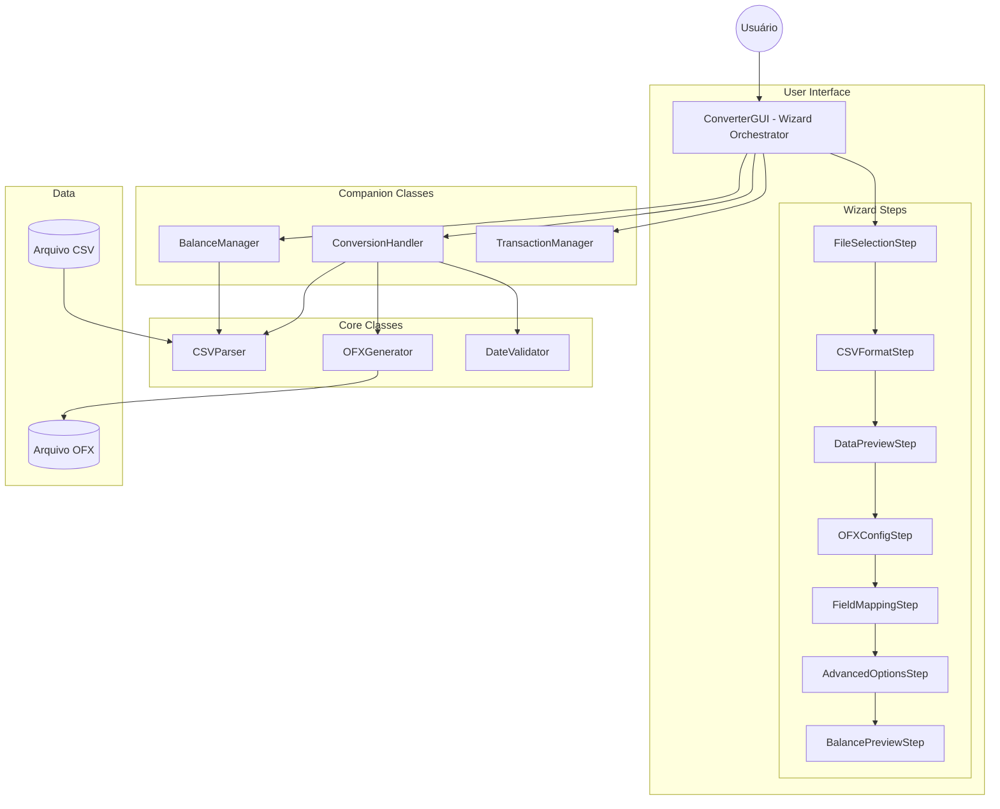

# CSV to OFX Converter - Documentação Técnica

## 1. Descrição

O **CSV to OFX Converter** é uma aplicação desktop desenvolvida em Python que converte arquivos CSV (Comma-Separated Values) para o formato OFX (Open Financial Exchange). A aplicação oferece suporte completo para formatos bancários brasileiros e possui uma interface gráfica intuitiva baseada em um assistente de 7 passos.

### 1.1 Objetivo Geral

Fornecer uma ferramenta robusta e fácil de usar para conversão de extratos financeiros em formato CSV para o padrão OFX 1.0.2 (SGML), permitindo a importação em softwares de gestão financeira como GnuCash, Microsoft Money, Quicken e outros.

### 1.2 Público-Alvo

Esta documentação é destinada a **desenvolvedores** que desejam:
- Compreender a arquitetura e funcionamento interno da aplicação
- Contribuir com melhorias e correções de bugs
- Estender funcionalidades ou integrar com outros sistemas
- Realizar manutenção e testes no código

## 2. Índice Remissivo

### Documentos Globais

| Documento | Descrição |
|-----------|-----------|
| [Visão Geral](visao-geral.md) | Descrição funcional, fluxos e regras de negócio |
| [Arquitetura](arquitetura.md) | Arquitetura do sistema, camadas e tecnologias |
| [Testes de Unidade](testes-de-unidade.md) | Estratégia de testes, ferramentas e exemplos |

### Documentação de Classes

#### Classes Core

| Classe | Descrição |
|--------|-----------|
| [CSVParser](classes/CSVParser.md) | Parser de arquivos CSV com suporte a formatos brasileiros |
| [OFXGenerator](classes/OFXGenerator.md) | Gerador de arquivos OFX 1.0.2 |
| [DateValidator](classes/DateValidator.md) | Validador de datas para períodos de extrato |

#### Classes GUI - Orquestração

| Classe | Descrição |
|--------|-----------|
| [ConverterGUI](classes/ConverterGUI.md) | Orquestrador principal da interface gráfica |
| [WizardStep](classes/WizardStep.md) | Classe base abstrata para passos do wizard |
| [BalanceManager](classes/BalanceManager.md) | Gerenciador de cálculos de saldo |
| [ConversionHandler](classes/ConversionHandler.md) | Orquestrador do processo de conversão |
| [TransactionManager](classes/TransactionManager.md) | Gerenciador de operações de transações |

#### Classes GUI - Passos do Wizard

| Classe | Descrição |
|--------|-----------|
| [FileSelectionStep](classes/WizardSteps.md#fileselectionstep-passo-1) | Passo 1: Seleção de arquivo CSV |
| [CSVFormatStep](classes/WizardSteps.md#csvformatstep-passo-2) | Passo 2: Configuração de formato CSV |
| [DataPreviewStep](classes/WizardSteps.md#datapreviewstep-passo-3) | Passo 3: Prévia dos dados |
| [OFXConfigStep](classes/WizardSteps.md#ofxconfigstep-passo-4) | Passo 4: Configuração OFX |
| [FieldMappingStep](classes/WizardSteps.md#fieldmappingstep-passo-5) | Passo 5: Mapeamento de campos |
| [AdvancedOptionsStep](classes/WizardSteps.md#advancedoptionsstep-passo-6) | Passo 6: Opções avançadas |
| [BalancePreviewStep](classes/WizardSteps.md#balancepreviewstep-passo-7) | Passo 7: Prévia de saldo |

#### Módulos Utilitários e Passos do Wizard

| Documento | Descrição |
|-----------|-----------|
| [Passos do Wizard](classes/WizardSteps.md) | Documentação de todos os 7 passos do wizard |
| [Módulos Utilitários](classes/UtilityModules.md) | Funções utilitárias e constantes |

## 3. Diagrama Geral do Sistema



## 4. Estrutura de Diretórios

```
csv-to-ofx-converter/
├── main.py                      # Ponto de entrada da aplicação
├── src/                         # Código fonte
│   ├── csv_to_ofx_converter.py  # Módulo principal
│   ├── csv_parser.py            # Parser CSV
│   ├── ofx_generator.py         # Gerador OFX
│   ├── date_validator.py        # Validador de datas
│   ├── converter_gui.py         # GUI principal
│   ├── gui_wizard_step.py       # Classe base WizardStep
│   ├── gui_balance_manager.py   # Gerenciador de saldo
│   ├── gui_conversion_handler.py # Handler de conversão
│   ├── gui_transaction_manager.py # Gerenciador de transações
│   ├── gui_utils.py             # Utilitários GUI
│   ├── transaction_utils.py     # Utilitários de transação
│   ├── constants.py             # Constantes
│   └── gui_steps/               # Implementações dos passos
│       ├── file_selection_step.py
│       ├── csv_format_step.py
│       ├── data_preview_step.py
│       ├── ofx_config_step.py
│       ├── field_mapping_step.py
│       ├── advanced_options_step.py
│       └── balance_preview_step.py
├── tests/                       # Testes unitários
│   ├── test_csv_parser.py
│   ├── test_ofx_generator.py
│   ├── test_date_validator.py
│   └── ...
└── docs/                        # Documentação técnica
    ├── README.md                # Este arquivo
    ├── visao-geral.md
    ├── arquitetura.md
    ├── testes-de-unidade.md
    └── classes/                 # Documentação de classes
```

## 5. Tecnologias Utilizadas

| Tecnologia | Versão | Uso |
|------------|--------|-----|
| Python | 3.7+ | Linguagem principal |
| Tkinter | Standard | Interface gráfica |
| unittest | Standard | Framework de testes |
| PyInstaller | dev | Build de executáveis |

## 6. Informações Adicionais

- **Versão Atual**: 3.2.0 (Janeiro 2026)
- **Licença**: MIT
- **Autor**: André Claudinei Barsotti Salvadeo
- **Repositório**: [GitHub](https://github.com/andrebarsotti/csv-to-ofx-converter)

---

*Documentação gerada em Janeiro 2026*
