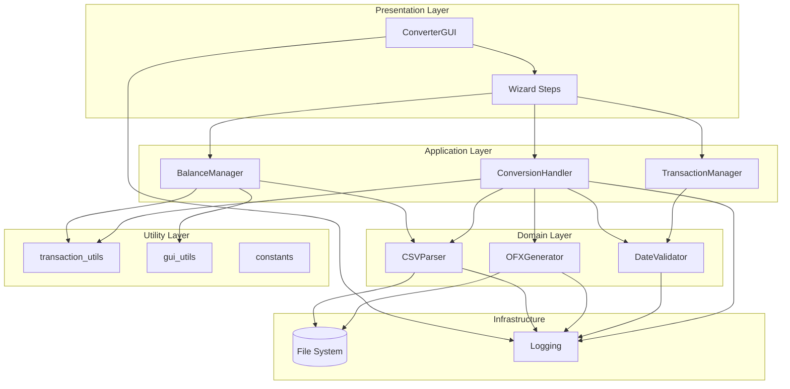
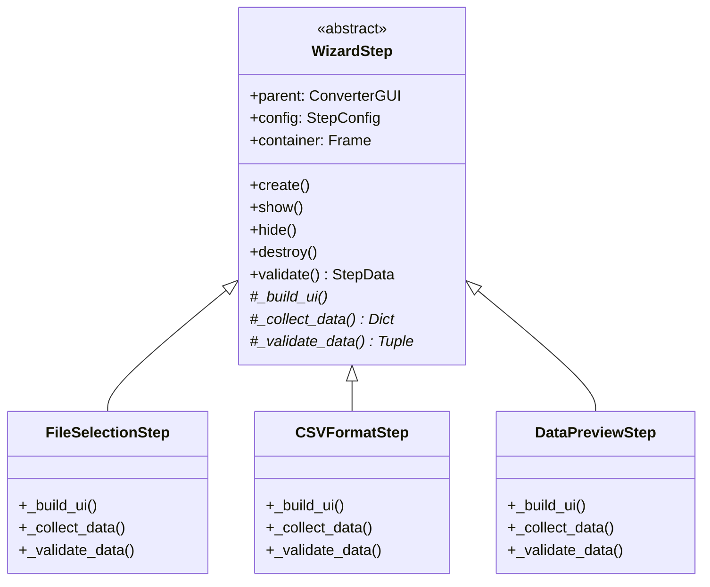
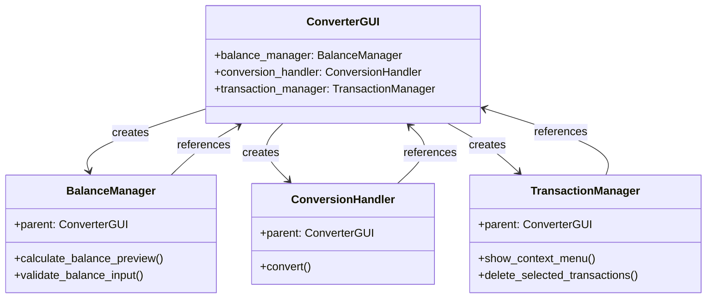
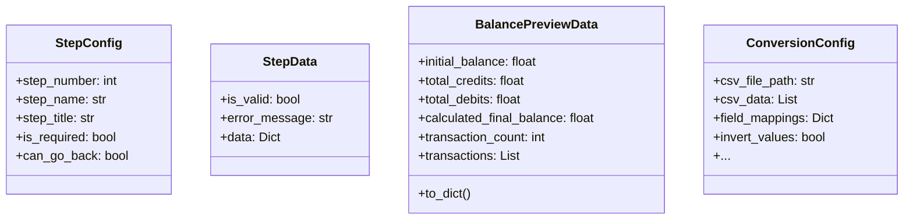
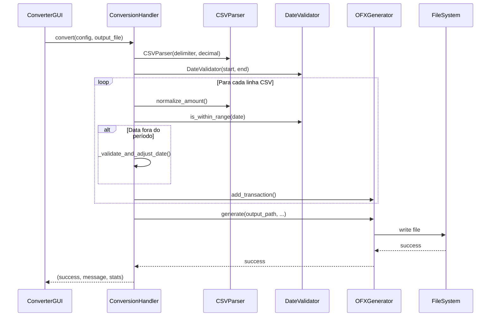
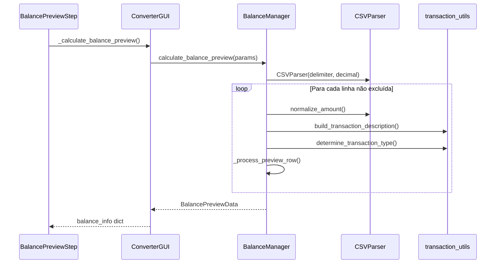
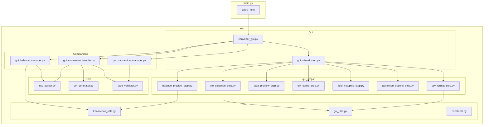
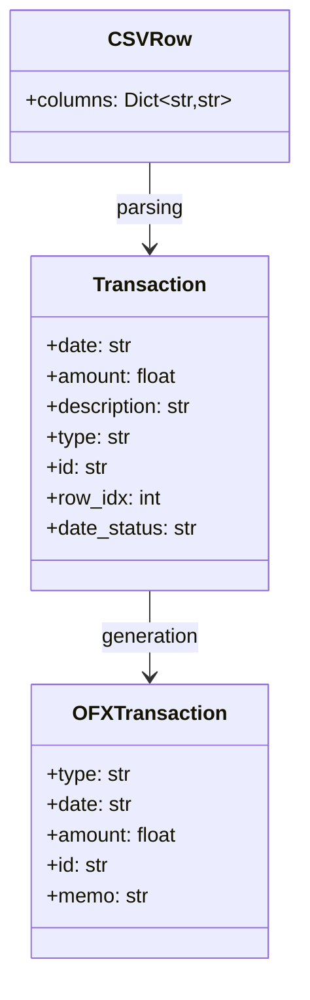
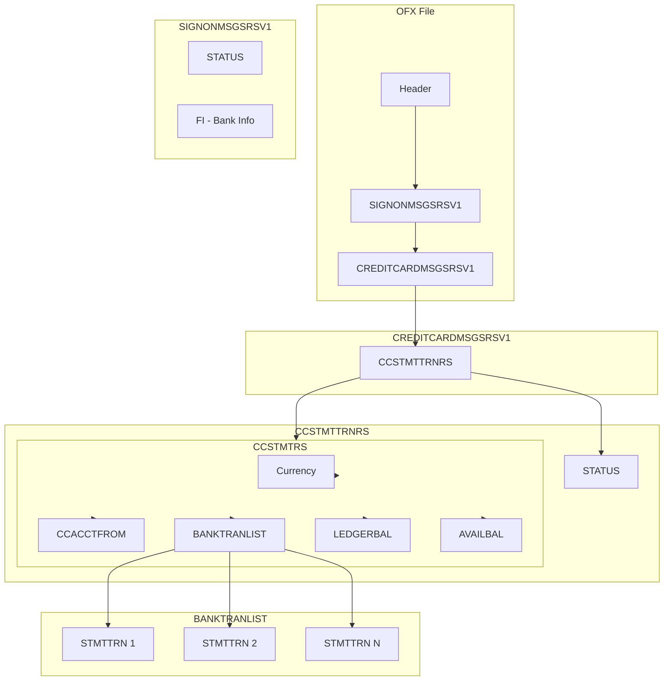

# Arquitetura do Sistema

## 1. Visão Geral da Arquitetura

O **CSV to OFX Converter** segue uma arquitetura em camadas com separação clara de responsabilidades. A aplicação utiliza o padrão **Model-View-Controller (MVC)** adaptado, com ênfase em:

- **Separação de Concerns**: Lógica de negócio separada da interface gráfica
- **Dependency Injection**: Classes companion recebem a GUI como parâmetro
- **Testabilidade**: Funções puras e classes testáveis independentemente

### 1.1 Diagrama de Arquitetura de Camadas



## 2. Descrição das Camadas

### 2.1 Presentation Layer (Camada de Apresentação)

Responsável pela interface com o usuário através de widgets Tkinter.

| Componente | Responsabilidade |
|------------|------------------|
| **ConverterGUI** | Orquestrador principal do wizard, gerencia navegação e estado global |
| **WizardStep** | Classe base abstrata para todos os passos do wizard |
| **FileSelectionStep** | UI para seleção de arquivo CSV |
| **CSVFormatStep** | UI para configuração de formato CSV |
| **DataPreviewStep** | UI para prévia dos dados em tabela |
| **OFXConfigStep** | UI para configuração OFX (conta, banco, moeda) |
| **FieldMappingStep** | UI para mapeamento de campos CSV→OFX |
| **AdvancedOptionsStep** | UI para opções avançadas (inversão, validação) |
| **BalancePreviewStep** | UI para prévia de saldo e confirmação |

### 2.2 Application Layer (Camada de Aplicação)

Classes companion que orquestram operações de negócio sem dependência direta do Tkinter.

| Componente | Responsabilidade |
|------------|------------------|
| **BalanceManager** | Cálculos de saldo e prévia de transações |
| **ConversionHandler** | Orquestração do processo de conversão CSV→OFX |
| **TransactionManager** | Gestão de transações e menus de contexto |

### 2.3 Domain Layer (Camada de Domínio)

Classes core que implementam a lógica de negócio principal.

| Componente | Responsabilidade |
|------------|------------------|
| **CSVParser** | Parsing de arquivos CSV com suporte a múltiplos formatos |
| **OFXGenerator** | Geração de arquivos OFX 1.0.2 |
| **DateValidator** | Validação de datas contra período do extrato |

### 2.4 Utility Layer (Camada Utilitária)

Funções puras e constantes compartilhadas.

| Componente | Responsabilidade |
|------------|------------------|
| **transaction_utils** | Funções para processamento de transações |
| **gui_utils** | Funções utilitárias para operações GUI |
| **constants** | Constantes compartilhadas (NOT_MAPPED, NOT_SELECTED) |

## 3. Padrões de Projeto Utilizados

### 3.1 Wizard Pattern

A interface de usuário implementa o padrão Wizard para guiar o usuário através de um processo multi-etapas.



### 3.2 Dependency Injection

Classes companion recebem a GUI como parâmetro, permitindo testes com mocks.



### 3.3 Template Method

A classe `WizardStep` utiliza o padrão Template Method para definir o esqueleto do algoritmo de validação.

```python
# Template Method em WizardStep
def validate(self) -> StepData:
    data = self._collect_data()      # Hook para subclasse
    is_valid, error = self._validate_data(data)  # Hook para subclasse
    return StepData(is_valid, error, data)
```

### 3.4 Data Transfer Objects (DTOs)

Uso de dataclasses para transferência de dados entre camadas.



## 4. Comunicação entre Componentes

### 4.1 Fluxo de Dados na Conversão



### 4.2 Fluxo de Cálculo de Saldo



## 5. Frameworks e Tecnologias

### 5.1 Stack Tecnológica

| Camada | Tecnologia | Justificativa |
|--------|------------|---------------|
| **Linguagem** | Python 3.7+ | Portabilidade, biblioteca padrão rica |
| **GUI** | Tkinter/ttk | Incluído na biblioteca padrão, cross-platform |
| **Testes** | unittest | Framework padrão, sem dependências externas |
| **Build** | PyInstaller | Geração de executáveis standalone |
| **Logging** | logging | Módulo padrão, configurável |

### 5.2 Dependências

A aplicação utiliza **apenas a biblioteca padrão do Python** para runtime, garantindo:
- Zero dependências externas
- Fácil instalação
- Portabilidade máxima

Dependências de desenvolvimento:
- **PyInstaller**: Apenas para build de executáveis

## 6. Diagrama de Componentes



## 7. Modelo de Dados

### 7.1 Estrutura de Transação



### 7.2 Estrutura do Arquivo OFX



## 8. Considerações de Design

### 8.1 Decisões de Arquitetura

| Decisão | Justificativa |
|---------|---------------|
| **Sem dependências externas** | Simplifica instalação e distribuição |
| **Tkinter para GUI** | Cross-platform, incluído no Python |
| **Classes companion** | Separa lógica de negócio de UI |
| **Funções puras em utils** | Facilita testes unitários |
| **Wizard pattern** | Guia usuário em processo complexo |
| **Dataclasses para DTOs** | Código limpo e type hints |

### 8.2 Trade-offs

| Escolha | Benefício | Custo |
|---------|-----------|-------|
| **Python** | Portabilidade, legibilidade | Performance (não crítico) |
| **Tkinter** | Sem dependências | Interface menos moderna |
| **OFX 1.0.2** | Compatibilidade ampla | Formato verboso |
| **Single-file executable** | Fácil distribuição | Tamanho do arquivo |

---

*Voltar para [Documentação Principal](README.md)*
