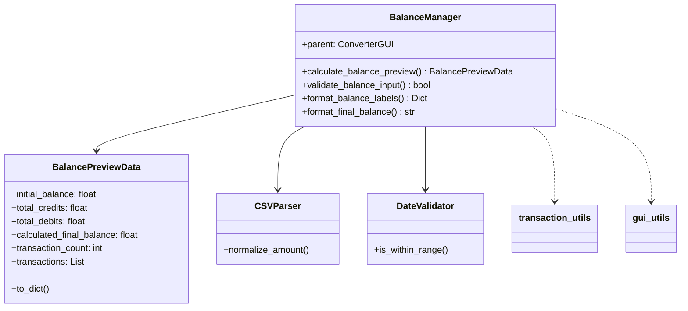

# BalanceManager

## 1. Informações Gerais

| Atributo | Valor |
|----------|-------|
| **Módulo** | `src/gui_balance_manager.py` |
| **Tipo** | Classe Companion |
| **Responsabilidade** | Cálculos de saldo e prévia de transações |

## 2. Descrição

A classe `BalanceManager` é uma classe companion que gerencia cálculos de saldo e geração de prévia de transações. Utiliza o padrão Dependency Injection, recebendo a GUI pai como parâmetro.

### 2.1 Responsabilidade Principal

- Calcular saldo inicial, créditos, débitos e saldo final
- Processar transações para prévia
- Validar entrada numérica de saldo
- Formatar valores para exibição

## 3. Dataclass BalancePreviewData

```python
class BalancePreviewData:
    initial_balance: float
    total_credits: float
    total_debits: float
    calculated_final_balance: float
    transaction_count: int
    transactions: List[Dict]
```

## 4. Métodos Principais

### 4.1 `calculate_balance_preview(...) -> BalancePreviewData`

Calcula informações de saldo para prévia.

**Parâmetros:**
- `initial_balance_str`: Saldo inicial como string
- `csv_data`: Lista de dicionários de dados CSV
- `field_mappings`: Mapeamento de campos
- `description_columns`: Colunas para descrição composta
- `invert_values`: Se deve inverter valores
- `deleted_transactions`: Set de transações excluídas
- `enable_date_validation`: Se validação de data está ativa

### 4.2 `validate_balance_input(action, value) -> bool`

Valida entrada numérica para campos de saldo.

### 4.3 `format_final_balance(value) -> str`

Formata valor de saldo para exibição.

## 5. Diagrama de Dependências



## 6. Exemplo de Uso

```python
from src.gui_balance_manager import BalanceManager

# Criar com GUI pai
manager = BalanceManager(parent_gui)

# Calcular prévia
result = manager.calculate_balance_preview(
    initial_balance_str="1000.00",
    csv_data=csv_data,
    field_mappings={'date': 'Date', 'amount': 'Amount'},
    description_columns=[],
    description_separator=' ',
    delimiter=',',
    decimal_separator='.',
    invert_values=False,
    deleted_transactions=set()
)

print(f"Total Créditos: {result.total_credits}")
print(f"Total Débitos: {result.total_debits}")
print(f"Saldo Final: {result.calculated_final_balance}")
```

## 7. Padrões de Projeto

| Padrão | Aplicação |
|--------|-----------|
| **Companion Class** | Extrai lógica de ConverterGUI |
| **Dependency Injection** | Recebe parent no construtor |
| **Data Transfer Object** | BalancePreviewData |

## 8. Testes Relacionados

- `tests/test_gui_balance_manager.py` - 14 testes

---

*Voltar para [Documentação Principal](../README.md)*
