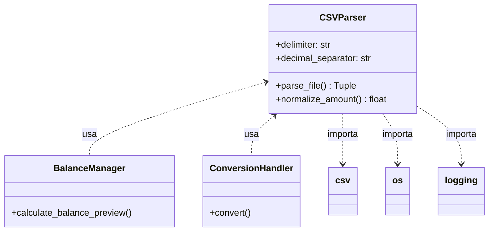
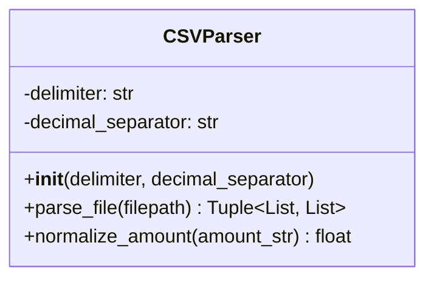

# CSVParser

## 1. Informações Gerais

| Atributo | Valor |
|----------|-------|
| **Módulo** | `src/csv_parser.py` |
| **Tipo** | Classe |
| **Responsabilidade** | Parser de arquivos CSV com suporte a formatos brasileiros e internacionais |

## 2. Descrição

A classe `CSVParser` é responsável por ler e interpretar arquivos CSV, oferecendo suporte a diferentes formatos de delimitadores e separadores decimais. É especialmente otimizada para lidar com extratos bancários brasileiros.

### 2.1 Responsabilidade Principal

- Parsing de arquivos CSV com detecção de cabeçalhos
- Normalização de valores monetários para float
- Suporte a formatos brasileiro e internacional

## 3. Atributos

| Atributo | Tipo | Descrição |
|----------|------|-----------|
| `delimiter` | `str` | Caractere separador de colunas (padrão: `,`) |
| `decimal_separator` | `str` | Caractere separador decimal (padrão: `.`) |

## 4. Métodos

### 4.1 `__init__(delimiter: str = ',', decimal_separator: str = '.')`

Inicializa o parser com as configurações de formato.

**Parâmetros:**
- `delimiter`: Caractere usado para separar colunas
- `decimal_separator`: Caractere usado como ponto decimal

### 4.2 `parse_file(filepath: str) -> Tuple[List[str], List[Dict[str, str]]]`

Lê e parseia um arquivo CSV, retornando cabeçalhos e linhas de dados.

**Parâmetros:**
- `filepath`: Caminho para o arquivo CSV

**Retorna:**
- Tupla contendo lista de cabeçalhos e lista de dicionários (linhas)

**Exceções:**
- `FileNotFoundError`: Se o arquivo não existir
- `ValueError`: Se o arquivo estiver vazio ou malformado

### 4.3 `normalize_amount(amount_str: str) -> float`

Converte string de valor monetário para float.

**Parâmetros:**
- `amount_str`: String representando o valor (ex: "R$ -100,50")

**Retorna:**
- Valor como float

**Formatos Suportados:**
- Valores negativos com sinal: `-100,50`, `-R$ 100,00`
- Valores negativos após moeda: `R$ -100,00`
- Notação com parênteses: `(R$ 100,50)` → `-100.50`
- Milhares com ponto: `1.234,56` (formato brasileiro)
- Milhares com vírgula: `1,234.56` (formato internacional)

## 5. Dependências



## 6. Diagrama de Classe



## 7. Exemplo de Uso

```python
from src.csv_parser import CSVParser

# Parser para formato brasileiro
parser = CSVParser(delimiter=';', decimal_separator=',')

# Ler arquivo CSV
headers, rows = parser.parse_file('/path/to/extrato.csv')

print(f"Colunas encontradas: {headers}")
print(f"Total de linhas: {len(rows)}")

# Processar cada linha
for row in rows:
    amount = parser.normalize_amount(row['valor'])
    print(f"Valor normalizado: {amount}")
```

### Exemplo com formato padrão

```python
# Parser para formato internacional
parser = CSVParser(delimiter=',', decimal_separator='.')

# Normalizar valores
valor1 = parser.normalize_amount("-100.50")  # -100.5
valor2 = parser.normalize_amount("1,234.56")  # 1234.56
```

### Exemplo com formato brasileiro

```python
# Parser para formato brasileiro
parser = CSVParser(delimiter=';', decimal_separator=',')

# Normalizar valores brasileiros
valor1 = parser.normalize_amount("-R$ 100,50")  # -100.5
valor2 = parser.normalize_amount("1.234,56")    # 1234.56
valor3 = parser.normalize_amount("(R$ 100,50)") # -100.5 (parênteses = negativo)
```

## 8. Padrões de Projeto

| Padrão | Aplicação |
|--------|-----------|
| **Single Responsibility** | Classe focada apenas em parsing CSV |
| **Factory-like** | Parser configurável via construtor |

## 9. Testes Relacionados

- `tests/test_csv_parser.py` - 8 testes
  - `test_parse_standard_csv`
  - `test_parse_brazilian_csv`
  - `test_normalize_standard_amount`
  - `test_normalize_brazilian_amount`
  - `test_normalize_negative_with_currency`
  - `test_normalize_parentheses_notation`
  - `test_file_not_found`
  - `test_empty_file`

---

*Voltar para [Documentação Principal](../README.md)*
