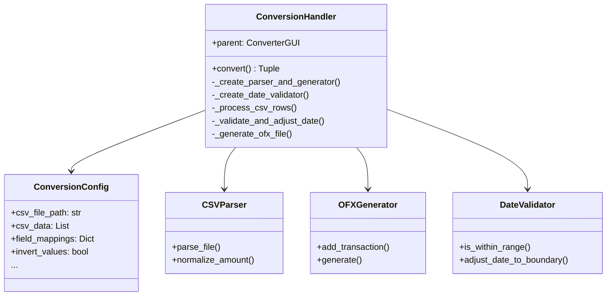
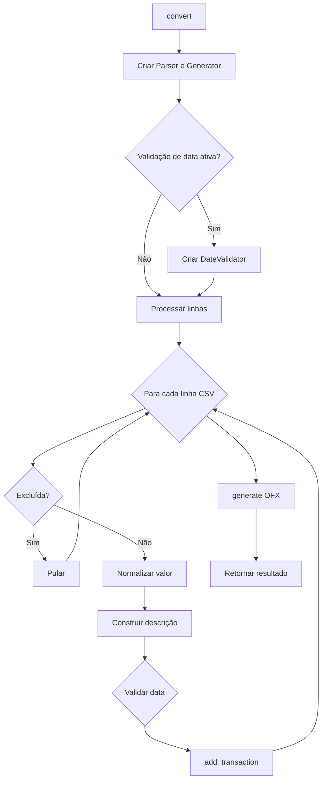

# ConversionHandler

## 1. Informações Gerais

| Atributo | Valor |
|----------|-------|
| **Módulo** | `src/gui_conversion_handler.py` |
| **Tipo** | Classe Companion |
| **Responsabilidade** | Orquestração do processo de conversão CSV para OFX |

## 2. Descrição

A classe `ConversionHandler` é uma classe companion que orquestra todo o processo de conversão de CSV para OFX. Utiliza o padrão Dependency Injection e retorna resultados estruturados.

### 2.1 Responsabilidade Principal

- Coordenar fluxo de conversão
- Processar linhas CSV
- Gerenciar validação e ajuste de datas
- Gerar arquivo OFX final

## 3. Dataclass ConversionConfig

```python
@dataclass
class ConversionConfig:
    csv_file_path: str
    csv_data: List[Dict[str, str]]
    field_mappings: Dict[str, str]
    description_columns: List[str]
    description_separator: str
    delimiter: str
    decimal_separator: str
    invert_values: bool
    account_id: str
    bank_name: str
    currency: str
    initial_balance: float
    statement_start_date: str
    statement_end_date: str
    date_action: str
    deleted_transactions: set
    date_action_decisions: Dict[int, str]
    enable_date_validation: bool
    final_balance: Optional[float] = None
```

## 4. Métodos Principais

### 4.1 `convert(config, output_file) -> Tuple[bool, str, Dict]`

Executa a conversão CSV para OFX.

**Retorna:**
- `success`: True se conversão bem-sucedida
- `message`: Mensagem de sucesso ou erro
- `stats`: Estatísticas da conversão

### 4.2 `_process_csv_rows(...) -> Dict`

Processa todas as linhas CSV e adiciona transações ao gerador.

### 4.3 `_validate_and_adjust_date(...) -> Tuple[Optional[str], Dict]`

Valida e ajusta datas fora do período.

## 5. Diagrama de Dependências



## 6. Fluxo de Conversão



## 7. Exemplo de Uso

```python
from src.gui_conversion_handler import ConversionHandler, ConversionConfig

# Criar handler
handler = ConversionHandler(parent_gui)

# Criar configuração
config = ConversionConfig(
    csv_file_path='/path/to/file.csv',
    csv_data=csv_data,
    field_mappings={'date': 'Date', 'amount': 'Amount'},
    # ... outros parâmetros
)

# Executar conversão
success, message, stats = handler.convert(config, '/path/to/output.ofx')

if success:
    print(f"Conversão concluída: {stats['processed']} transações")
else:
    print(f"Erro: {message}")
```

## 8. Padrões de Projeto

| Padrão | Aplicação |
|--------|-----------|
| **Companion Class** | Extrai lógica de conversão |
| **Dependency Injection** | Recebe parent no construtor |
| **Configuration Object** | ConversionConfig agrupa parâmetros |

## 9. Testes Relacionados

- `tests/test_gui_conversion_handler.py` - 23 testes

---

*Voltar para [Documentação Principal](../README.md)*
