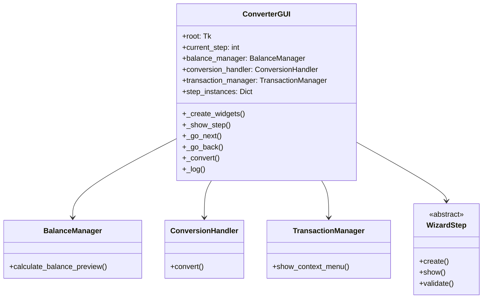
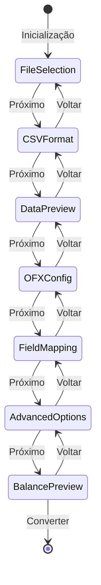

# ConverterGUI

## 1. Informações Gerais

| Atributo | Valor |
|----------|-------|
| **Módulo** | `src/converter_gui.py` |
| **Tipo** | Classe |
| **Responsabilidade** | Orquestrador principal da interface gráfica com wizard de 7 passos |

## 2. Descrição

A classe `ConverterGUI` é o orquestrador principal da interface gráfica do usuário. Implementa um wizard de 7 passos que guia o usuário através do processo de conversão CSV para OFX.

### 2.1 Responsabilidade Principal

- Gerenciar navegação entre passos do wizard
- Coordenar estado global da aplicação
- Delegar operações para classes companion
- Orquestrar validação e conversão

## 3. Atributos Principais

| Atributo | Tipo | Descrição |
|----------|------|-----------|
| `root` | `tk.Tk` | Janela principal do Tkinter |
| `current_step` | `int` | Passo atual do wizard (0-6) |
| `step_instances` | `Dict` | Instâncias dos passos do wizard |
| `csv_headers` | `List[str]` | Cabeçalhos do CSV carregado |
| `csv_data` | `List[Dict]` | Dados do CSV carregado |
| `balance_manager` | `BalanceManager` | Gerenciador de cálculos de saldo |
| `conversion_handler` | `ConversionHandler` | Handler de conversão |
| `transaction_manager` | `TransactionManager` | Gerenciador de transações |

## 4. Métodos Principais

### 4.1 `__init__(root: tk.Tk)`

Inicializa a GUI com a janela principal.

### 4.2 `_create_widgets()`

Cria todos os widgets da interface.

### 4.3 `_show_step(step_num: int)`

Exibe o passo especificado do wizard.

### 4.4 `_go_next()` / `_go_back()`

Navega para o próximo/anterior passo.

### 4.5 `_convert()`

Executa a conversão CSV para OFX.

### 4.6 `_log(message: str)`

Adiciona mensagem ao log de atividades.

## 5. Diagrama de Dependências



## 6. Fluxo do Wizard



## 7. Exemplo de Uso

```python
import tkinter as tk
from src.converter_gui import ConverterGUI

# Criar janela principal
root = tk.Tk()

# Inicializar GUI
app = ConverterGUI(root)

# Iniciar loop de eventos
root.mainloop()
```

## 8. Padrões de Projeto

| Padrão | Aplicação |
|--------|-----------|
| **Wizard** | Interface de múltiplos passos |
| **Dependency Injection** | Classes companion injetadas |
| **Observer** | Variáveis Tkinter para estado |
| **Template Method** | Validação via WizardStep |

## 9. Testes Relacionados

- `tests/test_gui_integration.py` - 15 testes
- `tests/test_gui_wizard_step.py` - 32 testes
- `tests/test_gui_steps/` - 206 testes

---

*Voltar para [Documentação Principal](../README.md)*
