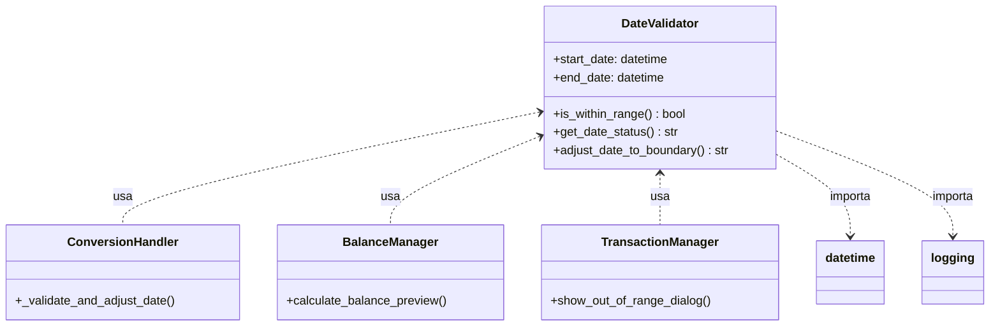
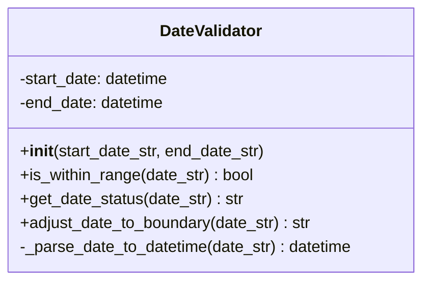
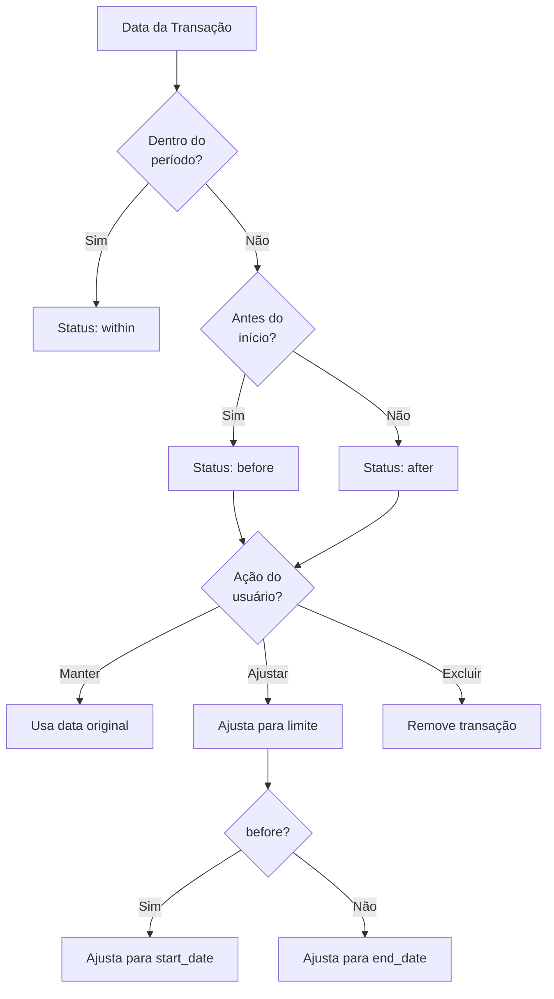

# DateValidator

## 1. Informações Gerais

| Atributo | Valor |
|----------|-------|
| **Módulo** | `src/date_validator.py` |
| **Tipo** | Classe |
| **Responsabilidade** | Validação de datas de transações contra período de extrato |

## 2. Descrição

A classe `DateValidator` valida se transações estão dentro de um período específico de extrato (como um período de fatura de cartão de crédito). Fornece funcionalidades para verificar, categorizar e ajustar datas fora do período.

### 2.1 Responsabilidade Principal

- Validar se datas estão dentro de um intervalo
- Identificar se datas estão antes ou depois do período
- Ajustar datas fora do período para os limites

## 3. Atributos

| Atributo | Tipo | Descrição |
|----------|------|-----------|
| `start_date` | `datetime` | Data de início do período válido |
| `end_date` | `datetime` | Data de término do período válido |

## 4. Métodos

### 4.1 `__init__(start_date_str: str, end_date_str: str)`

Inicializa o validador com o período de datas.

**Parâmetros:**
- `start_date_str`: Data de início (vários formatos aceitos)
- `end_date_str`: Data de término (vários formatos aceitos)

**Exceções:**
- `ValueError`: Se as datas não puderem ser parseadas ou se início > fim

### 4.2 `is_within_range(date_str: str) -> bool`

Verifica se uma data está dentro do período válido.

**Parâmetros:**
- `date_str`: Data a verificar

**Retorna:**
- `True` se a data está dentro do período, `False` caso contrário

### 4.3 `get_date_status(date_str: str) -> str`

Determina a posição da data em relação ao período.

**Parâmetros:**
- `date_str`: Data a verificar

**Retorna:**
- `'before'`: Data anterior ao início do período
- `'within'`: Data dentro do período
- `'after'`: Data posterior ao fim do período

**Exceções:**
- `ValueError`: Se a data não puder ser parseada

### 4.4 `adjust_date_to_boundary(date_str: str) -> str`

Ajusta uma data fora do período para o limite mais próximo.

**Parâmetros:**
- `date_str`: Data a ajustar

**Retorna:**
- Data ajustada no formato `YYYY-MM-DD`
  - Se `before`: retorna `start_date`
  - Se `after`: retorna `end_date`
  - Se `within`: retorna a data original formatada

### 4.5 `_parse_date_to_datetime(date_str: str) -> datetime`

Método privado que converte string de data para objeto datetime.

**Formatos Suportados:**
- `YYYY-MM-DD`
- `DD/MM/YYYY`
- `MM/DD/YYYY`
- `YYYY/MM/DD`
- `DD-MM-YYYY`
- `DD.MM.YYYY`
- `YYYYMMDD`

## 5. Dependências



## 6. Diagrama de Classe



## 7. Fluxo de Validação



## 8. Exemplo de Uso

```python
from src.date_validator import DateValidator

# Criar validador para período de outubro/2025
validator = DateValidator('01/10/2025', '31/10/2025')

# Verificar datas
print(validator.is_within_range('15/10/2025'))  # True
print(validator.is_within_range('15/09/2025'))  # False
print(validator.is_within_range('15/11/2025'))  # False

# Obter status
print(validator.get_date_status('15/10/2025'))  # 'within'
print(validator.get_date_status('15/09/2025'))  # 'before'
print(validator.get_date_status('15/11/2025'))  # 'after'

# Ajustar datas
print(validator.adjust_date_to_boundary('15/09/2025'))  # '2025-10-01'
print(validator.adjust_date_to_boundary('15/11/2025'))  # '2025-10-31'
print(validator.adjust_date_to_boundary('15/10/2025'))  # '2025-10-15'
```

### Exemplo de Integração com Conversão

```python
from src.date_validator import DateValidator
from src.csv_parser import CSVParser

validator = DateValidator('01/10/2025', '31/10/2025')
parser = CSVParser()

headers, rows = parser.parse_file('extrato.csv')

for row in rows:
    date = row['date']
    
    if validator.is_within_range(date):
        # Processa normalmente
        process_transaction(row)
    else:
        status = validator.get_date_status(date)
        if status == 'before':
            # Ajusta para início do período
            adjusted = validator.adjust_date_to_boundary(date)
            row['date'] = adjusted
            process_transaction(row)
        else:  # after
            # Exclui transação
            print(f"Excluindo transação de {date}")
```

## 9. Padrões de Projeto

| Padrão | Aplicação |
|--------|-----------|
| **Single Responsibility** | Focado apenas em validação de datas |
| **Immutable Configuration** | Período definido na construção |

## 10. Casos de Borda

| Cenário | Comportamento |
|---------|---------------|
| Data = início do período | `within` |
| Data = fim do período | `within` |
| Transição de ano | Suportado (ex: 2024-12-31 a 2025-01-31) |
| Ano bissexto (29/02) | Suportado via datetime |
| Formato de data inválido | Lança `ValueError` |
| Início > Fim | Lança `ValueError` no construtor |

## 11. Testes Relacionados

- `tests/test_date_validator.py` - 12 testes
  - `test_date_within_range`
  - `test_date_before_range`
  - `test_date_after_range`
  - `test_adjust_to_start_boundary`
  - `test_adjust_to_end_boundary`
  - `test_date_at_boundaries`
  - `test_year_boundary`
  - `test_multiple_date_formats`
  - `test_invalid_date_format`
  - `test_invalid_date_range`

---

*Voltar para [Documentação Principal](../README.md)*
