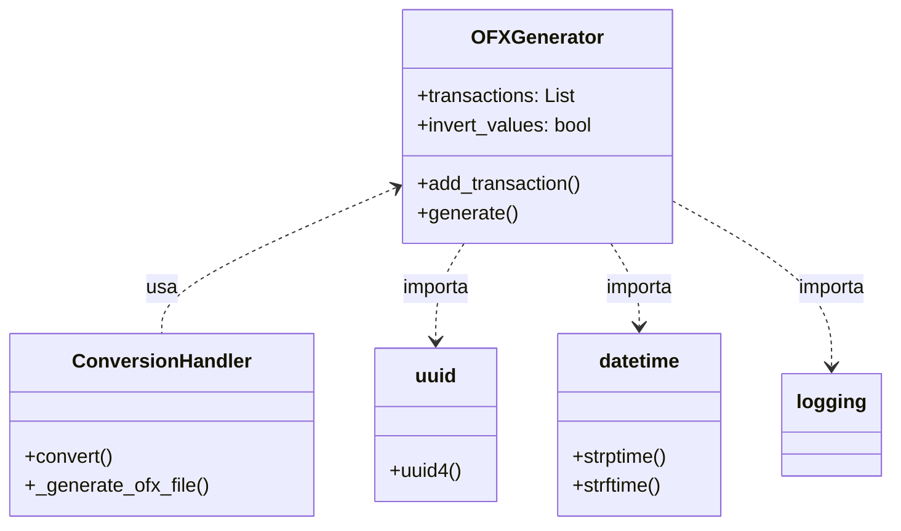
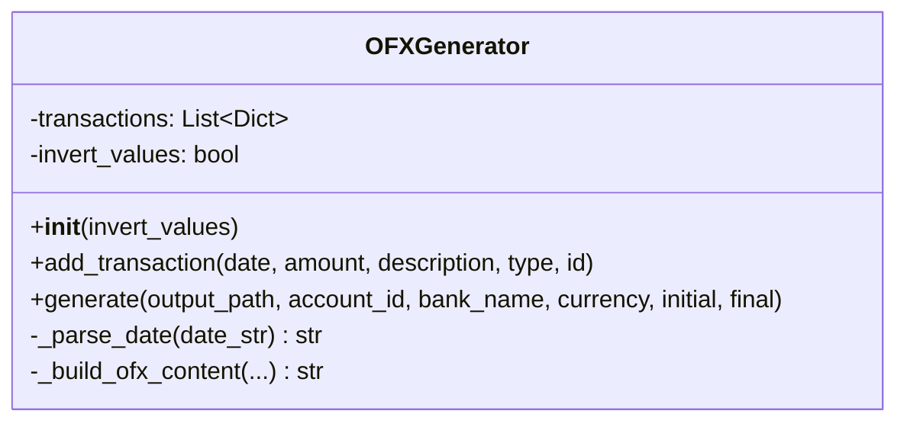
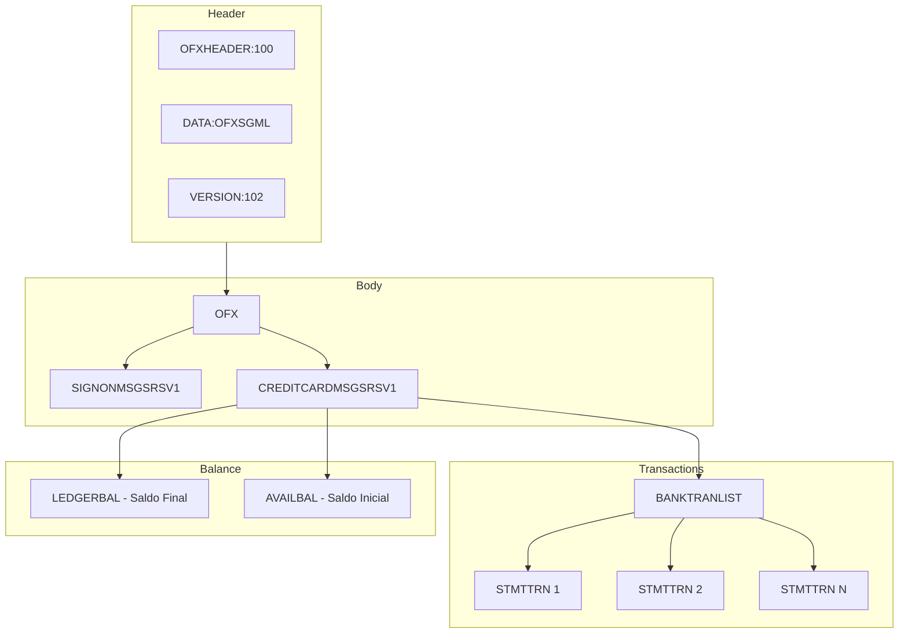

# OFXGenerator

## 1. Informações Gerais

| Atributo | Valor |
|----------|-------|
| **Módulo** | `src/ofx_generator.py` |
| **Tipo** | Classe |
| **Responsabilidade** | Geração de arquivos OFX 1.0.2 (SGML) para extratos de cartão de crédito |

## 2. Descrição

A classe `OFXGenerator` é responsável por criar arquivos no formato OFX (Open Financial Exchange) versão 1.0.2. O formato gerado é SGML (não XML) e específico para extratos de cartão de crédito (CREDITCARDMSGSRSV1).

### 2.1 Responsabilidade Principal

- Acumular transações para exportação
- Gerar arquivo OFX válido com estrutura completa
- Suporte a inversão de valores (débitos ↔ créditos)
- Cálculo automático de saldo final

## 3. Atributos

| Atributo | Tipo | Descrição |
|----------|------|-----------|
| `transactions` | `List[Dict]` | Lista de transações a serem exportadas |
| `invert_values` | `bool` | Se True, inverte todos os valores |

## 4. Métodos

### 4.1 `__init__(invert_values: bool = False)`

Inicializa o gerador OFX.

**Parâmetros:**
- `invert_values`: Se True, inverte todos os valores de transação

### 4.2 `add_transaction(date, amount, description, transaction_type, transaction_id)`

Adiciona uma transação à lista de exportação.

**Parâmetros:**
- `date` (str): Data da transação (vários formatos aceitos)
- `amount` (float): Valor da transação
- `description` (str): Descrição/memo da transação
- `transaction_type` (str): Tipo: 'DEBIT' ou 'CREDIT'
- `transaction_id` (str, opcional): ID único (UUID gerado se não fornecido)

**Comportamento de Inversão:**
Quando `invert_values=True`:
- Valor é multiplicado por -1
- DEBIT ↔ CREDIT são trocados

### 4.3 `generate(output_path, account_id, bank_name, currency, initial_balance, final_balance)`

Gera o arquivo OFX com todas as transações.

**Parâmetros:**
- `output_path` (str): Caminho do arquivo de saída
- `account_id` (str): Identificador da conta (padrão: "UNKNOWN")
- `bank_name` (str): Nome do banco (padrão: "CSV Import")
- `currency` (str): Código da moeda (padrão: "BRL")
- `initial_balance` (float): Saldo inicial (padrão: 0.0)
- `final_balance` (float, opcional): Saldo final (calculado automaticamente se não fornecido)

**Exceções:**
- `ValueError`: Se não houver transações para exportar

### 4.4 `_parse_date(date_str: str) -> str`

Método privado que converte data para formato OFX.

**Formatos de Entrada Suportados:**
- `YYYY-MM-DD` (2025-10-22)
- `DD/MM/YYYY` (22/10/2025)
- `MM/DD/YYYY` (10/22/2025)
- `YYYY/MM/DD` (2025/10/22)
- `DD-MM-YYYY` (22-10-2025)
- `DD.MM.YYYY` (22.10.2025)
- `YYYYMMDD` (20251022)

**Formato de Saída:**
- `YYYYMMDD000000[-3:BRT]`

### 4.5 `_build_ofx_content(...) -> str`

Método privado que constrói o conteúdo completo do arquivo OFX.

## 5. Dependências



## 6. Diagrama de Classe



## 7. Estrutura do OFX Gerado



## 8. Exemplo de Uso

```python
from src.ofx_generator import OFXGenerator

# Criar gerador
generator = OFXGenerator(invert_values=False)

# Adicionar transações
generator.add_transaction(
    date='01/10/2025',
    amount=-100.50,
    description='Supermercado ABC',
    transaction_type='DEBIT'
)

generator.add_transaction(
    date='02/10/2025',
    amount=1000.00,
    description='Salário',
    transaction_type='CREDIT'
)

# Gerar arquivo
generator.generate(
    output_path='/path/to/output.ofx',
    account_id='12345',
    bank_name='Meu Banco',
    currency='BRL',
    initial_balance=500.00
)
```

### Exemplo com Inversão de Valores

```python
# Gerador com inversão
generator = OFXGenerator(invert_values=True)

# Transação originalmente DEBIT com valor negativo
generator.add_transaction(
    date='01/10/2025',
    amount=-100.50,  # Será invertido para +100.50
    description='Compra',
    transaction_type='DEBIT'  # Será trocado para CREDIT
)
```

## 9. Padrões de Projeto

| Padrão | Aplicação |
|--------|-----------|
| **Builder** | Acumula transações antes de gerar arquivo |
| **Template Method** | `_build_ofx_content` estrutura o documento |
| **Single Responsibility** | Focado apenas em geração OFX |

## 10. Formato OFX de Saída

```xml
OFXHEADER:100
DATA:OFXSGML
VERSION:102
SECURITY:NONE
ENCODING:USASCII
CHARSET:1252
COMPRESSION:NONE
OLDFILEUID:NONE
NEWFILEUID:NONE
<OFX>
<SIGNONMSGSRSV1>
  <SONRS>
    <STATUS><CODE>0</CODE><SEVERITY>INFO</SEVERITY></STATUS>
    <DTSERVER>20251001120000[0:GMT]</DTSERVER>
    <LANGUAGE>POR</LANGUAGE>
    <FI><ORG>Meu Banco</ORG><FID>0</FID></FI>
  </SONRS>
</SIGNONMSGSRSV1>
<CREDITCARDMSGSRSV1>
  <CCSTMTTRNRS>
    <TRNUID>1001</TRNUID>
    <STATUS><CODE>0</CODE><SEVERITY>INFO</SEVERITY></STATUS>
    <CCSTMTRS>
      <CURDEF>BRL</CURDEF>
      <CCACCTFROM><ACCTID>12345</ACCTID></CCACCTFROM>
      <BANKTRANLIST>
        <DTSTART>20251001000000[-3:BRT]</DTSTART>
        <DTEND>20251002000000[-3:BRT]</DTEND>
        <STMTTRN>
          <TRNTYPE>DEBIT</TRNTYPE>
          <DTPOSTED>20251001000000[-3:BRT]</DTPOSTED>
          <TRNAMT>-100.50</TRNAMT>
          <FITID>uuid-here</FITID>
          <MEMO>Supermercado ABC</MEMO>
        </STMTTRN>
      </BANKTRANLIST>
      <LEDGERBAL>
        <BALAMT>1399.50</BALAMT>
        <DTASOF>20251002000000[-3:BRT]</DTASOF>
      </LEDGERBAL>
    </CCSTMTRS>
  </CCSTMTTRNRS>
</CREDITCARDMSGSRSV1>
</OFX>
```

## 11. Testes Relacionados

- `tests/test_ofx_generator.py` - 19 testes
  - `test_add_transaction`
  - `test_add_credit_transaction`
  - `test_parse_date_formats`
  - `test_value_inversion`
  - `test_generate_ofx_file`
  - `test_multiple_currencies`
  - `test_description_limit`
  - `test_transaction_sorting`

---

*Voltar para [Documentação Principal](../README.md)*
