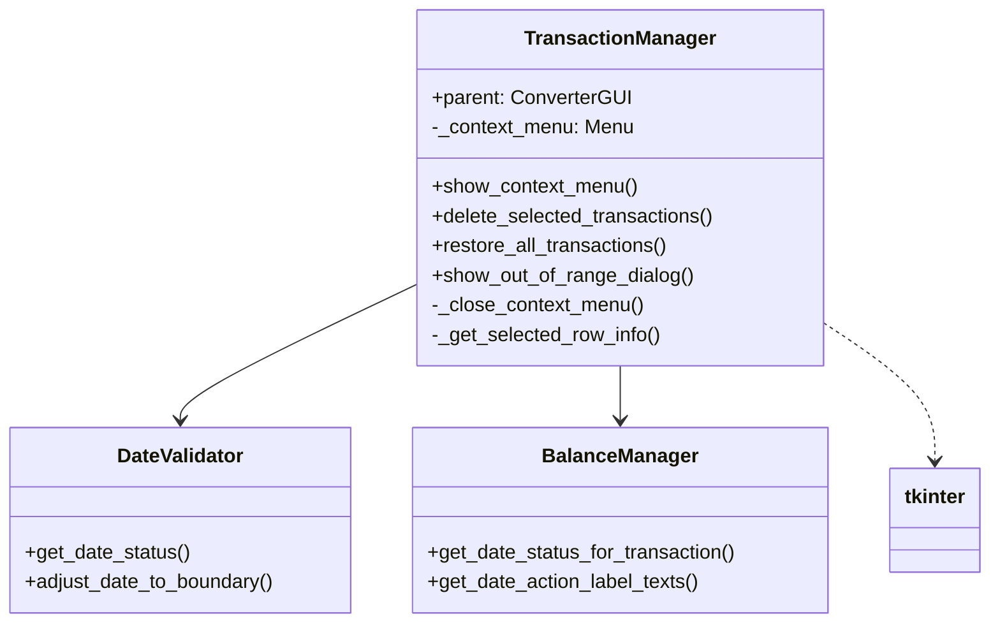
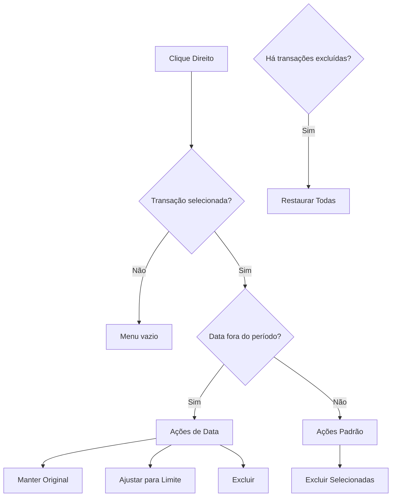

# TransactionManager

## 1. Informações Gerais

| Atributo | Valor |
|----------|-------|
| **Módulo** | `src/gui_transaction_manager.py` |
| **Tipo** | Classe Companion |
| **Responsabilidade** | Gerenciamento de transações e menus de contexto |

## 2. Descrição

A classe `TransactionManager` é uma classe companion que gerencia operações de transações, incluindo exclusão, restauração e ações de data. Também gerencia menus de contexto para o preview de transações.

### 2.1 Responsabilidade Principal

- Exibir menus de contexto para transações
- Gerenciar exclusão e restauração de transações
- Lidar com decisões de ações de data
- Exibir diálogos para transações fora do período

## 3. Métodos Principais

### 3.1 `show_context_menu(event, tree_widget, ...)`

Exibe menu de contexto para operações de transação.

### 3.2 `delete_selected_transactions(tree, items, deleted)`

Exclui transações selecionadas do preview.

### 3.3 `restore_all_transactions(deleted)`

Restaura todas as transações excluídas.

### 3.4 `show_out_of_range_dialog(...) -> Tuple[str, str]`

Exibe diálogo para lidar com transação fora do período.

## 4. Diagrama de Dependências



## 5. Menu de Contexto



## 6. Exemplo de Uso

```python
from src.gui_transaction_manager import TransactionManager

# Criar com GUI pai
manager = TransactionManager(parent_gui)

# Mostrar menu de contexto
def on_right_click(event):
    manager.show_context_menu(
        event,
        tree_widget,
        transaction_tree_items,
        deleted_transactions,
        date_action_decisions
    )

# Excluir transações selecionadas
manager.delete_selected_transactions(
    tree_widget,
    transaction_tree_items,
    deleted_transactions
)

# Restaurar todas
manager.restore_all_transactions(deleted_transactions)
```

## 7. Padrões de Projeto

| Padrão | Aplicação |
|--------|-----------|
| **Companion Class** | Extrai lógica de transações |
| **Command** | Ações do menu como comandos |
| **Dependency Injection** | Recebe parent no construtor |

## 8. Testes Relacionados

- `tests/test_gui_transaction_manager.py` - 26 testes

---

*Voltar para [Documentação Principal](../README.md)*
