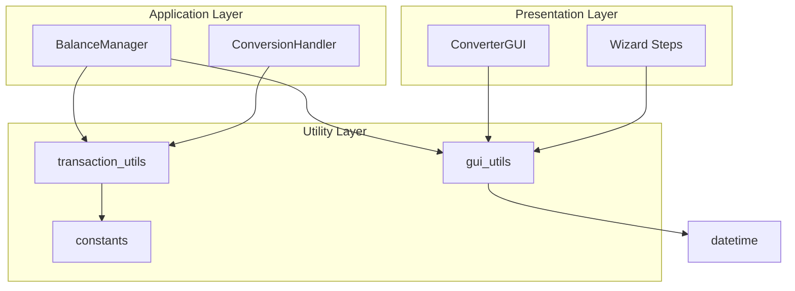

# Módulos Utilitários

Esta página documenta os módulos utilitários que fornecem funções puras e constantes compartilhadas.

## transaction_utils

| Atributo | Valor |
|----------|-------|
| **Módulo** | `src/transaction_utils.py` |
| **Tipo** | Funções Puras |
| **Testes** | 50 |

### Descrição

Funções utilitárias para processamento de transações sem dependências de UI.

### Funções

| Função | Descrição |
|--------|-----------|
| `build_transaction_description()` | Constrói descrição a partir de colunas |
| `determine_transaction_type()` | Determina DEBIT/CREDIT |
| `extract_transaction_id()` | Extrai ID da transação |
| `calculate_balance_summary()` | Calcula resumo de saldo |
| `validate_field_mappings()` | Valida mapeamentos obrigatórios |
| `parse_balance_value()` | Parseia string de saldo para float |

### Exemplo

```python
from src.transaction_utils import (
    build_transaction_description,
    determine_transaction_type,
    calculate_balance_summary
)

# Construir descrição composta
row = {'memo': 'Compra', 'vendor': 'Loja'}
desc = build_transaction_description(
    row=row,
    desc_col='memo',
    description_columns=['memo', 'vendor'],
    separator=' - ',
    use_composite=True
)
# Resultado: 'Compra - Loja'

# Determinar tipo
trans_type = determine_transaction_type(
    type_col='<Not Mapped>',
    row={},
    amount=-100.0
)
# Resultado: 'DEBIT'

# Calcular saldo
transactions = [{'amount': 100}, {'amount': -50}]
summary = calculate_balance_summary(transactions, 1000)
# Resultado: {'total_credits': 100, 'total_debits': 50, ...}
```

---

## gui_utils

| Atributo | Valor |
|----------|-------|
| **Módulo** | `src/gui_utils.py` |
| **Tipo** | Funções Puras |
| **Testes** | 58 |

### Descrição

Funções utilitárias para operações GUI sem dependências do Tkinter.

### Seções de Funções

| Seção | Funções |
|-------|---------|
| **File Validation** | `validate_csv_file_selection()` |
| **Field Mapping** | `validate_required_field_mappings()`, `validate_description_mapping()` |
| **Date Formatting** | `format_date_string()`, `validate_date_format()` |
| **Numeric Validation** | `validate_numeric_input()`, `parse_numeric_value()` |
| **Balance Calculations** | `calculate_cursor_position_after_format()`, `format_balance_value()` |
| **Date Parsing** | `parse_date_for_sorting()` |
| **Conversion Validation** | `validate_conversion_prerequisites()`, `validate_date_range_inputs()` |
| **Statistics** | `format_preview_stats()`, `format_conversion_stats()` |

### Exemplo

```python
from src import gui_utils

# Validar seleção de arquivo
is_valid, error = gui_utils.validate_csv_file_selection('/path/to/file.csv')

# Formatar data
formatted = gui_utils.format_date_string('01102025')
# Resultado: '01/10/2025'

# Validar entrada numérica
is_valid = gui_utils.validate_numeric_input('-100.50')
# Resultado: True

# Parsear data para ordenação
from datetime import datetime
dt = gui_utils.parse_date_for_sorting('01/10/2025')
# Resultado: datetime(2025, 10, 1)
```

---

## constants

| Atributo | Valor |
|----------|-------|
| **Módulo** | `src/constants.py` |
| **Tipo** | Constantes |

### Descrição

Constantes compartilhadas usadas em toda a aplicação.

### Constantes

```python
NOT_MAPPED = "<Not Mapped>"    # Valor para campo não mapeado
NOT_SELECTED = "<Not Selected>" # Valor para coluna não selecionada
```

### Uso

```python
from src.constants import NOT_MAPPED, NOT_SELECTED

# Verificar se campo está mapeado
if field_mapping == NOT_MAPPED:
    print("Campo não mapeado")

# Verificar se coluna está selecionada
if column == NOT_SELECTED:
    print("Coluna não selecionada")
```

---

## Diagrama de Dependências



---

*Voltar para [Documentação Principal](../README.md)*
