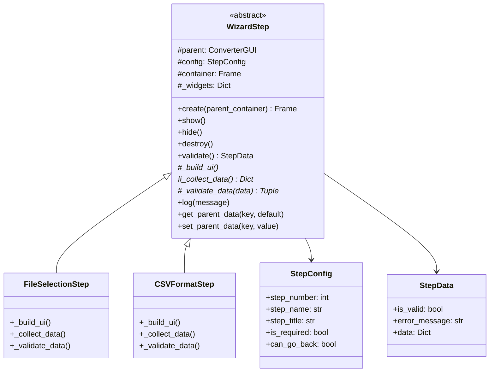
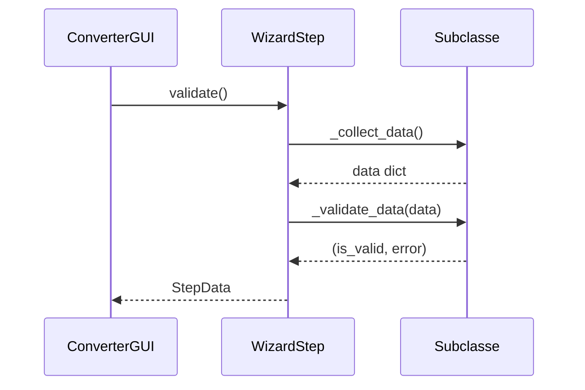

# WizardStep

## 1. Informações Gerais

| Atributo | Valor |
|----------|-------|
| **Módulo** | `src/gui_wizard_step.py` |
| **Tipo** | Classe Abstrata |
| **Responsabilidade** | Classe base para implementações de passos do wizard |

## 2. Descrição

A classe `WizardStep` é uma classe base abstrata que define a interface e comportamento comum para todos os passos do wizard. Utiliza o padrão Template Method para orquestrar validação e coleta de dados.

### 2.1 Responsabilidade Principal

- Definir ciclo de vida dos passos (create, show, hide, destroy)
- Fornecer interface comum para validação
- Gerenciar comunicação com o orquestrador pai

## 3. Dataclasses Auxiliares

### 3.1 StepConfig

```python
@dataclass
class StepConfig:
    step_number: int      # Posição no wizard (0-based)
    step_name: str        # Nome de exibição
    step_title: str       # Título completo
    is_required: bool     # Se pode ser pulado
    can_go_back: bool     # Se permite voltar
    show_next: bool       # Exibir botão próximo
    show_convert: bool    # Exibir botão converter
```

### 3.2 StepData

```python
@dataclass
class StepData:
    is_valid: bool              # Se dados são válidos
    error_message: Optional[str] # Mensagem de erro
    data: Dict[str, Any]        # Dados coletados
```

## 4. Métodos

### 4.1 Ciclo de Vida

| Método | Descrição |
|--------|-----------|
| `create(parent_container)` | Cria UI no container pai |
| `show()` | Exibe o passo (quando ativo) |
| `hide()` | Oculta o passo (quando deixa de ser ativo) |
| `destroy()` | Destrói o passo e limpa recursos |

### 4.2 Métodos Abstratos (Devem ser implementados)

| Método | Descrição |
|--------|-----------|
| `_build_ui()` | Constrói elementos UI específicos |
| `_collect_data()` | Coleta dados dos elementos UI |
| `_validate_data(data)` | Valida dados coletados |

### 4.3 Helpers

| Método | Descrição |
|--------|-----------|
| `log(message)` | Registra mensagem no log do pai |
| `get_parent_data(key, default)` | Obtém dado do orquestrador |
| `set_parent_data(key, value)` | Define dado no orquestrador |

## 5. Diagrama de Classe



## 6. Template Method Pattern



## 7. Exemplo de Implementação

```python
from src.gui_wizard_step import WizardStep, StepConfig, StepData

class MyCustomStep(WizardStep):
    def __init__(self, parent):
        config = StepConfig(
            step_number=0,
            step_name="Custom Step",
            step_title="Step 1: Custom Step"
        )
        super().__init__(parent, config)

    def _build_ui(self):
        # Criar widgets
        self._widgets['entry'] = ttk.Entry(self.container)
        self._widgets['entry'].grid(row=0, column=0)

    def _collect_data(self):
        return {
            'value': self._widgets['entry'].get()
        }

    def _validate_data(self, data):
        if not data['value']:
            return False, "Please enter a value"
        return True, None
```

## 8. Padrões de Projeto

| Padrão | Aplicação |
|--------|-----------|
| **Template Method** | `validate()` chama hooks abstratos |
| **Factory Method** | `create()` constrói UI |
| **Dependency Injection** | Recebe parent no construtor |

## 9. Testes Relacionados

- `tests/test_gui_wizard_step.py` - 32 testes
  - Testes de ciclo de vida
  - Testes de StepConfig e StepData
  - Testes de helpers
  - Testes de validação

---

*Voltar para [Documentação Principal](../README.md)*
