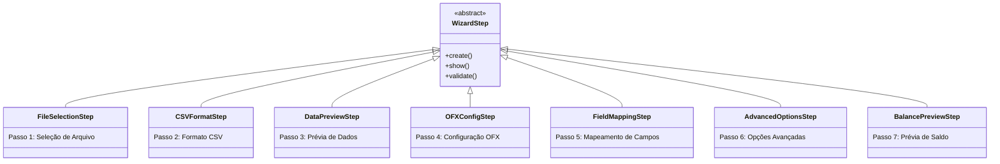
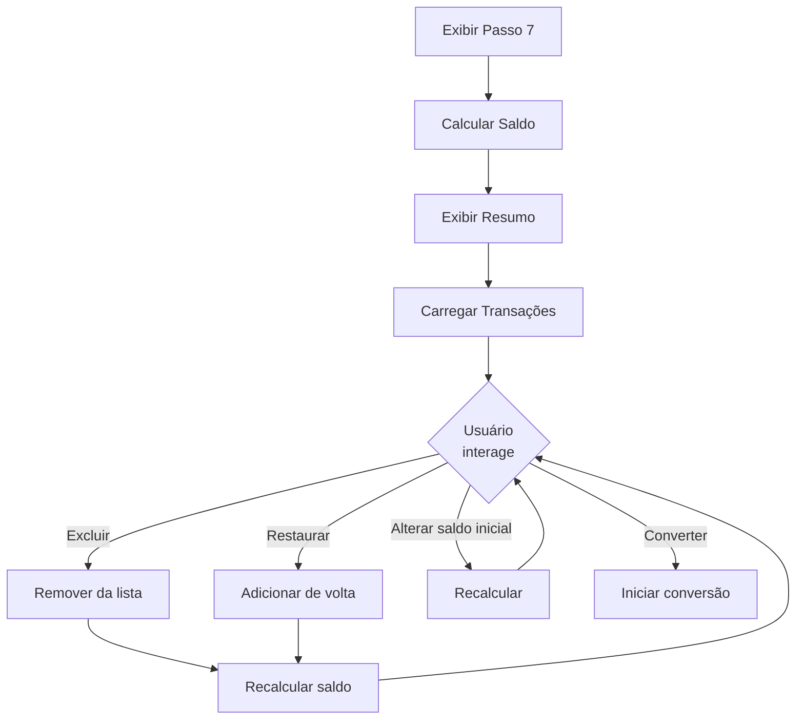

# Passos do Wizard (Wizard Steps)

Esta página documenta todos os 7 passos do wizard implementados no pacote `src/gui_steps/`.

## Visão Geral

Todos os passos herdam da classe base `WizardStep` e implementam os métodos abstratos:
- `_build_ui()`: Constrói elementos UI específicos
- `_collect_data()`: Coleta dados dos elementos UI
- `_validate_data()`: Valida dados coletados

## Diagrama de Hierarquia

---

## FileSelectionStep (Passo 1)

| Atributo | Valor |
|----------|-------|
| **Módulo** | `src/gui_steps/file_selection_step.py` |
| **Linhas** | ~174 |
| **Testes** | 7 |

### Responsabilidade

Permite ao usuário selecionar o arquivo CSV a ser convertido.

### Widgets

- Label com instruções
- Entry para caminho do arquivo
- Botão "Browse..." para seleção

### Validação

- Arquivo deve ser selecionado
- Arquivo deve existir
- Caminho deve ser um arquivo válido

---

## CSVFormatStep (Passo 2)

| Atributo | Valor |
|----------|-------|
| **Módulo** | `src/gui_steps/csv_format_step.py` |
| **Linhas** | ~197 |
| **Testes** | 31 |

### Responsabilidade

Configura o formato do arquivo CSV (delimitador e separador decimal).

### Widgets

- Radiobuttons para formatos predefinidos (Padrão, Brasileiro, Tab)
- Combobox para delimitador personalizado
- Combobox para separador decimal

### Formatos Predefinidos

| Formato | Delimitador | Decimal |
|---------|-------------|---------|
| Padrão | `,` | `.` |
| Brasileiro | `;` | `,` |
| Tab | `\t` | `.` |

---

## DataPreviewStep (Passo 3)

| Atributo | Valor |
|----------|-------|
| **Módulo** | `src/gui_steps/data_preview_step.py` |
| **Linhas** | ~285 |
| **Testes** | 31 |

### Responsabilidade

Exibe prévia dos dados CSV em uma tabela para verificação.

### Widgets

- Treeview com dados CSV
- Scrollbars horizontal e vertical
- Label com estatísticas (linhas exibidas/total)
- Botão "Reload Data"

### Comportamento

- Carrega automaticamente ao exibir o passo
- Limita prévia a 100 linhas para performance
- Permite recarregar dados após mudança de formato

---

## OFXConfigStep (Passo 4)

| Atributo | Valor |
|----------|-------|
| **Módulo** | `src/gui_steps/ofx_config_step.py` |
| **Linhas** | ~271 |
| **Testes** | 40 |

### Responsabilidade

Configura parâmetros do arquivo OFX de saída.

### Widgets

- Entry para ID da conta
- Entry para nome do banco
- Combobox para moeda (BRL, USD, EUR, GBP)

### Valores Padrão

- ID da Conta: (vazio - opcional)
- Banco: "CSV Import"
- Moeda: BRL

---

## FieldMappingStep (Passo 5)

| Atributo | Valor |
|----------|-------|
| **Módulo** | `src/gui_steps/field_mapping_step.py` |
| **Linhas** | ~390 |
| **Testes** | 38 |

### Responsabilidade

Mapeia colunas CSV para campos OFX.

### Widgets

- Comboboxes para mapeamento de campos
  - Data (obrigatório)
  - Valor (obrigatório)
  - Descrição
  - Tipo
  - ID
- Seção de descrição composta
  - 4 Comboboxes para colunas
  - Combobox para separador

### Validação

- Data deve ser mapeada
- Valor deve ser mapeado
- Descrição deve ser mapeada OU descrição composta configurada

---

## AdvancedOptionsStep (Passo 6)

| Atributo | Valor |
|----------|-------|
| **Módulo** | `src/gui_steps/advanced_options_step.py` |
| **Linhas** | ~354 |
| **Testes** | 30 |

### Responsabilidade

Configura opções avançadas de conversão.

### Widgets

- Checkbox para inversão de valores
- Checkbox para validação de datas
- Entries para data início e fim (formato DD/MM/YYYY)

### Funcionalidades

- **Inversão de Valores**: Multiplica todos os valores por -1 e troca DEBIT↔CREDIT
- **Validação de Datas**: Verifica se transações estão dentro do período

---

## BalancePreviewStep (Passo 7)

| Atributo | Valor |
|----------|-------|
| **Módulo** | `src/gui_steps/balance_preview_step.py` |
| **Linhas** | ~641 |
| **Testes** | 29 |

### Responsabilidade

Exibe prévia de saldo e permite gestão de transações antes da conversão.

### Widgets

- Entry para saldo inicial
- Labels para créditos, débitos e saldo calculado
- Treeview com todas as transações
- Checkbox para cálculo automático de saldo final
- Entry para saldo final manual

### Funcionalidades

- Exclui transações via menu de contexto
- Ajusta ações de data para transações fora do período
- Recalcula saldo ao modificar saldo inicial
- Restaura transações excluídas

### Diagrama de Fluxo

---

## Resumo de Testes

| Passo | Módulo de Teste | Testes |
|-------|-----------------|--------|
| 1 | `test_file_selection_step.py` | 7 |
| 2 | `test_csv_format_step.py` | 31 |
| 3 | `test_data_preview_step.py` | 31 |
| 4 | `test_ofx_config_step.py` | 40 |
| 5 | `test_field_mapping_step.py` | 38 |
| 6 | `test_advanced_options_step.py` | 30 |
| 7 | `test_balance_preview_step.py` | 29 |
| **Total** | | **206** |

---

*Voltar para [Documentação Principal](../README.md)*
