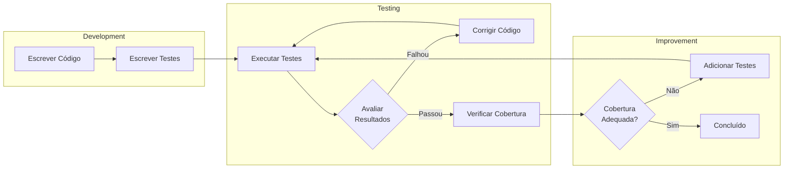
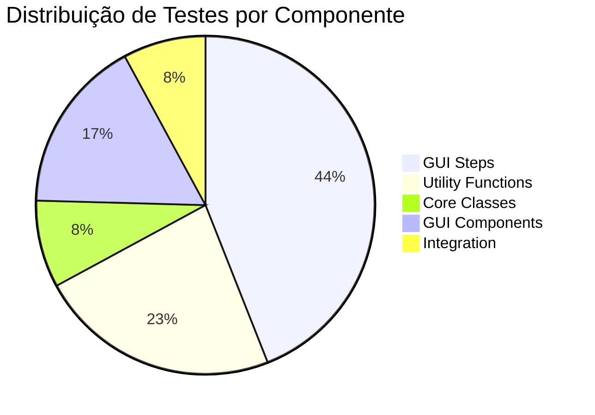

# Testes de Unidade

## 1. Visão Geral

O **CSV to OFX Converter** possui uma suíte de testes abrangente utilizando o framework `unittest` da biblioteca padrão do Python. A suíte contém **468 testes** organizados em módulos separados.

### 1.1 Ferramentas de Teste

| Ferramenta | Uso |
|------------|-----|
| **unittest** | Framework principal de testes |
| **unittest.mock** | Mocking de objetos e dependências |
| **tempfile** | Criação de arquivos temporários para testes |
| **coverage** | Cobertura de código (CI/CD) |

### 1.2 Estrutura de Testes

```
tests/
├── __init__.py                  # Inicialização do pacote
├── run_all_tests.py             # Script de conveniência
├── test_csv_parser.py           # Testes do CSVParser (8 testes)
├── test_ofx_generator.py        # Testes do OFXGenerator (19 testes)
├── test_date_validator.py       # Testes do DateValidator (12 testes)
├── test_transaction_utils.py    # Testes das utilities (50 testes)
├── test_gui_utils.py            # Testes das GUI utilities (58 testes)
├── test_gui_integration.py      # Testes de integração GUI (15 testes)
├── test_gui_balance_manager.py  # Testes do BalanceManager (14 testes)
├── test_gui_conversion_handler.py # Testes do ConversionHandler (23 testes)
├── test_gui_transaction_manager.py # Testes do TransactionManager (26 testes)
├── test_gui_wizard_step.py      # Testes da classe WizardStep (32 testes)
├── test_integration.py          # Testes de integração E2E (5 testes)
└── test_gui_steps/              # Testes dos passos do wizard (206 testes)
    ├── test_file_selection_step.py
    ├── test_csv_format_step.py
    ├── test_data_preview_step.py
    ├── test_ofx_config_step.py
    ├── test_field_mapping_step.py
    ├── test_advanced_options_step.py
    └── test_balance_preview_step.py
```

## 2. Diagrama do Ciclo de Testes



## 3. Estratégia de Testes

### 3.1 Tipos de Testes

| Tipo | Descrição | Exemplos |
|------|-----------|----------|
| **Unitário** | Testa componentes isolados | CSVParser, OFXGenerator |
| **Integração** | Testa interação entre componentes | Fluxo completo CSV→OFX |
| **GUI** | Testa interface do usuário | WizardStep, Steps |

### 3.2 Padrões de Teste

#### Setup e Teardown

```python
class TestCSVParser(unittest.TestCase):
    def setUp(self):
        """Cria arquivo CSV temporário antes de cada teste."""
        self.temp_file = tempfile.NamedTemporaryFile(
            mode='w', suffix='.csv', delete=False
        )
        self.temp_file.write("date,amount,description\n")
        self.temp_file.write("2025-01-15,-100.50,Test\n")
        self.temp_file.close()

    def tearDown(self):
        """Remove arquivo temporário após cada teste."""
        os.unlink(self.temp_file.name)
```

#### Mocking

```python
class TestBalanceManager(unittest.TestCase):
    def setUp(self):
        """Cria mock do parent GUI."""
        self.mock_parent = MagicMock()
        self.mock_parent.csv_data = [
            {'date': '01/10/2025', 'amount': '-100.00', 'desc': 'Test'}
        ]
        self.manager = BalanceManager(self.mock_parent)
```

#### Testes Parametrizados

```python
class TestDateValidator(unittest.TestCase):
    def test_date_formats(self):
        """Testa múltiplos formatos de data."""
        test_cases = [
            ('2025-10-01', '%Y-%m-%d'),
            ('01/10/2025', '%d/%m/%Y'),
            ('10/01/2025', '%m/%d/%Y'),
        ]
        for date_str, expected_format in test_cases:
            with self.subTest(date=date_str):
                result = validator._parse_date_to_datetime(date_str)
                self.assertIsNotNone(result)
```

## 4. Descrição dos Módulos de Teste

### 4.1 test_csv_parser.py (8 testes)

Testa o parsing de arquivos CSV e normalização de valores.

| Teste | Descrição |
|-------|-----------|
| `test_parse_standard_csv` | Parsing de CSV formato padrão |
| `test_parse_brazilian_csv` | Parsing de CSV formato brasileiro |
| `test_normalize_standard_amount` | Normalização de valor padrão |
| `test_normalize_brazilian_amount` | Normalização de valor brasileiro |
| `test_normalize_negative_with_currency` | Valores negativos com símbolo de moeda |
| `test_normalize_parentheses_notation` | Notação com parênteses `(100,00)` |
| `test_file_not_found` | Erro quando arquivo não existe |
| `test_empty_file` | Erro quando arquivo está vazio |

### 4.2 test_ofx_generator.py (19 testes)

Testa a geração de arquivos OFX.

| Teste | Descrição |
|-------|-----------|
| `test_add_transaction` | Adicionar transação ao gerador |
| `test_add_credit_transaction` | Transação de crédito |
| `test_parse_date_formats` | Parsing de múltiplos formatos de data |
| `test_value_inversion` | Inversão de valores |
| `test_generate_ofx_file` | Geração de arquivo completo |
| `test_multiple_currencies` | Suporte a múltiplas moedas |
| `test_description_limit` | Limite de 255 caracteres na descrição |
| `test_transaction_sorting` | Ordenação de transações por data |

### 4.3 test_date_validator.py (12 testes)

Testa a validação de datas.

| Teste | Descrição |
|-------|-----------|
| `test_date_within_range` | Data dentro do período |
| `test_date_before_range` | Data antes do período |
| `test_date_after_range` | Data após o período |
| `test_adjust_to_start_boundary` | Ajuste para data inicial |
| `test_adjust_to_end_boundary` | Ajuste para data final |
| `test_invalid_date_format` | Formato de data inválido |
| `test_year_boundary` | Transição entre anos |

### 4.4 test_transaction_utils.py (50 testes)

Testa funções utilitárias de transações.

| Grupo | Testes |
|-------|--------|
| **build_transaction_description** | Descrição simples, composta, separadores |
| **determine_transaction_type** | Tipo por coluna, por valor, edge cases |
| **extract_transaction_id** | Extração de ID, coluna não mapeada |
| **calculate_balance_summary** | Cálculos de saldo, edge cases |
| **validate_field_mappings** | Validação de mapeamentos obrigatórios |
| **parse_balance_value** | Parsing de valores de saldo |

### 4.5 test_gui_utils.py (58 testes)

Testa funções utilitárias da GUI.

| Grupo | Testes |
|-------|--------|
| **validate_csv_file_selection** | Validação de seleção de arquivo |
| **validate_field_mappings** | Validação de mapeamentos |
| **format_date_string** | Formatação de data DD/MM/YYYY |
| **validate_numeric_input** | Validação de entrada numérica |
| **calculate_cursor_position** | Posição do cursor após formatação |
| **parse_date_for_sorting** | Parsing de data para ordenação |

### 4.6 test_gui_wizard_step.py (32 testes)

Testa a classe base WizardStep.

| Grupo | Testes |
|-------|--------|
| **Lifecycle** | create, show, hide, destroy |
| **StepConfig** | Configuração do passo |
| **StepData** | Dados de validação |
| **Helpers** | get_parent_data, set_parent_data, log |
| **Validation** | Orquestração de validação |

## 5. Exemplos de Casos de Teste

### 5.1 Teste de Parsing CSV

```python
class TestCSVParser(unittest.TestCase):
    def test_parse_brazilian_csv(self):
        """Testa parsing de CSV no formato brasileiro."""
        # Arrange
        csv_content = "data;valor;descricao\n"
        csv_content += "01/10/2025;-100,50;Compra\n"
        csv_content += "02/10/2025;1.000,00;Salário\n"

        with tempfile.NamedTemporaryFile(
            mode='w', suffix='.csv', delete=False, encoding='utf-8'
        ) as f:
            f.write(csv_content)
            temp_path = f.name

        try:
            # Act
            parser = CSVParser(delimiter=';', decimal_separator=',')
            headers, rows = parser.parse_file(temp_path)

            # Assert
            self.assertEqual(len(headers), 3)
            self.assertEqual(len(rows), 2)
            self.assertEqual(headers[0], 'data')

            # Teste normalização de valor brasileiro
            amount = parser.normalize_amount(rows[0]['valor'])
            self.assertEqual(amount, -100.50)
        finally:
            os.unlink(temp_path)
```

### 5.2 Teste de Validação de Datas

```python
class TestDateValidator(unittest.TestCase):
    def test_date_status_before(self):
        """Testa identificação de data antes do período."""
        # Arrange
        validator = DateValidator('01/10/2025', '31/10/2025')

        # Act
        status = validator.get_date_status('15/09/2025')

        # Assert
        self.assertEqual(status, 'before')

    def test_adjust_to_boundary(self):
        """Testa ajuste de data para limite do período."""
        # Arrange
        validator = DateValidator('01/10/2025', '31/10/2025')

        # Act
        adjusted = validator.adjust_date_to_boundary('15/09/2025')

        # Assert
        self.assertEqual(adjusted, '2025-10-01')
```

### 5.3 Teste de Integração

```python
class TestIntegration(unittest.TestCase):
    def test_full_conversion_workflow(self):
        """Testa fluxo completo de conversão CSV para OFX."""
        # Arrange - Criar CSV temporário
        csv_content = "date,amount,description\n"
        csv_content += "2025-10-01,-100.50,Test Purchase\n"
        csv_content += "2025-10-02,500.00,Test Deposit\n"

        with tempfile.NamedTemporaryFile(
            mode='w', suffix='.csv', delete=False
        ) as csv_file:
            csv_file.write(csv_content)
            csv_path = csv_file.name

        ofx_path = tempfile.mktemp(suffix='.ofx')

        try:
            # Act - Executar conversão
            parser = CSVParser()
            headers, rows = parser.parse_file(csv_path)

            generator = OFXGenerator()
            for row in rows:
                amount = parser.normalize_amount(row['amount'])
                generator.add_transaction(
                    date=row['date'],
                    amount=amount,
                    description=row['description']
                )
            generator.generate(ofx_path)

            # Assert - Verificar arquivo gerado
            self.assertTrue(os.path.exists(ofx_path))
            with open(ofx_path, 'r') as f:
                content = f.read()
                self.assertIn('<TRNAMT>-100.50</TRNAMT>', content)
                self.assertIn('<TRNAMT>500.00</TRNAMT>', content)
        finally:
            os.unlink(csv_path)
            if os.path.exists(ofx_path):
                os.unlink(ofx_path)
```

## 6. Comandos para Executar Testes

### 6.1 Execução Básica

```bash
# Executar todos os testes
python3 -m unittest discover tests

# Executar com saída verbosa
python3 -m unittest discover tests -v

# Usando script de conveniência
python3 tests/run_all_tests.py
```

### 6.2 Execução por Módulo

```bash
# Testar módulo específico
python3 -m unittest tests.test_csv_parser
python3 -m unittest tests.test_ofx_generator
python3 -m unittest tests.test_date_validator

# Testar classe específica
python3 -m unittest tests.test_csv_parser.TestCSVParser

# Testar método específico
python3 -m unittest tests.test_csv_parser.TestCSVParser.test_parse_standard_csv
```

### 6.3 Execução com Cobertura

```bash
# Instalar coverage (se necessário)
pip install coverage

# Executar com cobertura
coverage run -m unittest discover tests

# Gerar relatório
coverage report -m

# Gerar relatório HTML
coverage html
```

## 7. Recomendações de Melhorias

### 7.1 Cobertura de Testes

| Área | Status Atual | Recomendação |
|------|--------------|--------------|
| **Classes Core** | ✅ Completo | Manter |
| **GUI Steps** | ✅ Completo | Adicionar testes de borda |
| **Integração** | ⚠️ Básico | Expandir cenários |
| **Performance** | ❌ Ausente | Adicionar benchmarks |

### 7.2 Melhorias Sugeridas

1. **Testes de Performance**
   - Adicionar testes para arquivos CSV grandes (>10.000 linhas)
   - Medir tempo de parsing e geração

2. **Testes de Edge Cases**
   - Caracteres especiais em descrições
   - Valores extremos (muito grandes/pequenos)
   - Datas em limites de mês/ano

3. **Testes de Regressão**
   - Documentar bugs corrigidos com testes específicos
   - Manter testes para formatos específicos de bancos

4. **Testes de UI Automatizados**
   - Considerar uso de `pyautogui` para testes de GUI completos
   - Testar fluxo completo do wizard

### 7.3 Diagrama de Cobertura por Componente



## 8. Boas Práticas Adotadas

| Prática | Descrição |
|---------|-----------|
| **Isolamento** | Cada teste é independente |
| **Limpeza** | tearDown remove arquivos temporários |
| **Nomenclatura** | `test_<cenário>_<comportamento>` |
| **Assertions** | Uma assertion principal por teste |
| **Mocking** | Usado para dependências externas |
| **Documentação** | Docstrings explicando cada teste |

---

*Voltar para [Documentação Principal](README.md)*
