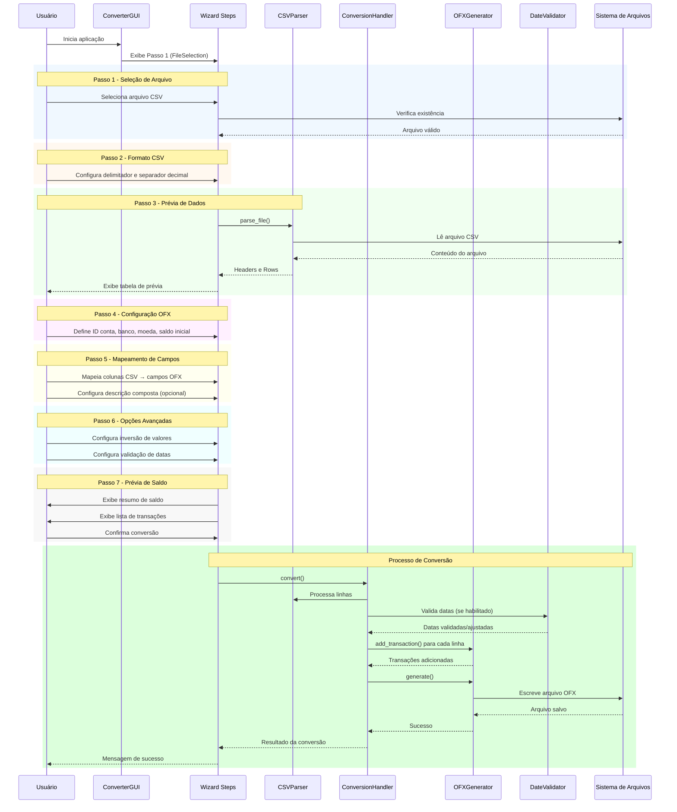
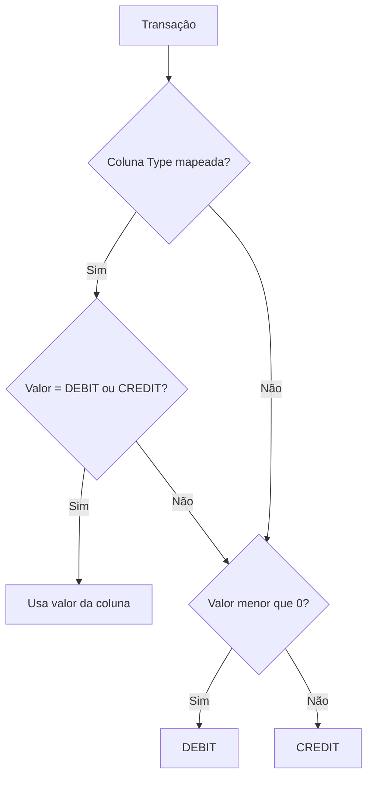
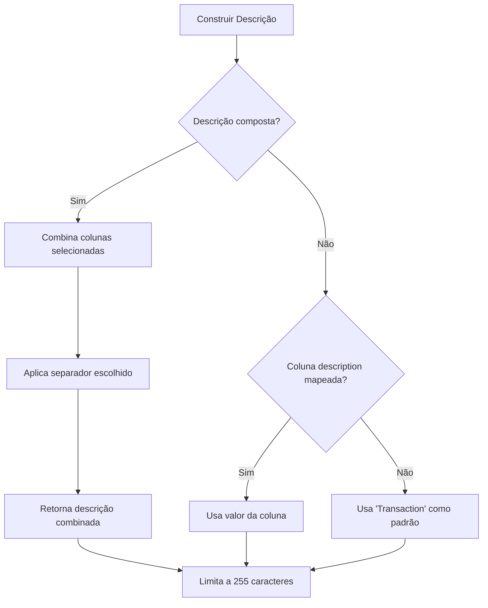
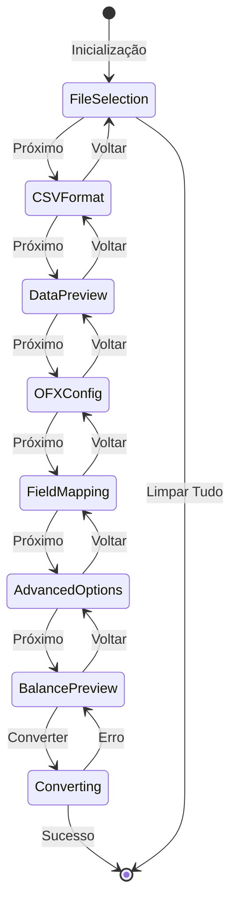

# Visão Geral do Sistema

## 1. Descrição Funcional

O **CSV to OFX Converter** é uma aplicação desktop que permite aos usuários converter arquivos de extrato bancário em formato CSV para o formato OFX (Open Financial Exchange). A aplicação foi desenvolvida com foco especial no suporte a formatos bancários brasileiros.

### 1.1 Funcionalidades Principais

| Funcionalidade | Descrição |
|----------------|-----------|
| **Importação CSV** | Suporte a múltiplos formatos de CSV (padrão e brasileiro) |
| **Prévia de Dados** | Visualização tabular dos dados antes da conversão |
| **Mapeamento Flexível** | Mapeamento customizável de colunas CSV para campos OFX |
| **Descrições Compostas** | Combinação de até 4 colunas para criar descrições |
| **Inversão de Valores** | Opção para inverter débitos/créditos |
| **Validação de Datas** | Validação de transações contra período do extrato |
| **Gestão de Saldo** | Cálculo automático ou manual de saldo inicial/final |
| **IDs de Transação Determinísticos** | FITIDs em UUID v5 gerados automaticamente quando nenhuma coluna de ID é mapeada |
| **Exportação OFX** | Geração de arquivo OFX 1.0.2 (SGML) compatível |

### 1.2 Formatos Suportados

#### Formato CSV Padrão (Internacional)
```csv
date,amount,description
2025-10-01,-100.50,Grocery Store
2025-10-02,1000.00,Salary
```
- Delimitador: Vírgula (`,`)
- Separador decimal: Ponto (`.`)

#### Formato CSV Brasileiro
```csv
data;valor;descricao
01/10/2025;-100,50;Supermercado
02/10/2025;1.000,00;Salário
```
- Delimitador: Ponto e vírgula (`;`)
- Separador decimal: Vírgula (`,`)

### 1.3 Formato OFX Gerado

A aplicação gera arquivos OFX 1.0.2 no formato SGML (não XML), específico para extratos de cartão de crédito (CREDITCARDMSGSRSV1).

## 2. Fluxo Funcional Passo a Passo

### 2.1 Diagrama de Sequência do Fluxo Principal



### 2.2 Fluxo Detalhado por Passo

#### Passo 1: Seleção de Arquivo
1. Usuário clica em "Browse..."
2. Sistema abre diálogo de seleção de arquivo
3. Usuário seleciona arquivo CSV
4. Sistema valida existência do arquivo
5. Caminho é armazenado para próximos passos

#### Passo 2: Formato CSV
1. Usuário seleciona formato predefinido (Padrão/Brasileiro/Tab)
2. Ou configura manualmente delimitador e separador decimal
3. Sistema prepara parser com configurações selecionadas

#### Passo 3: Prévia de Dados
1. Sistema carrega automaticamente o arquivo CSV
2. Exibe primeiras 100 linhas em tabela
3. Usuário verifica se dados foram parseados corretamente
4. Pode voltar ao passo 2 para ajustar formato

#### Passo 4: Configuração OFX
1. Usuário define ID da conta (opcional)
2. Define nome do banco (padrão: "CSV Import")
3. Seleciona moeda (BRL, USD, EUR, GBP)
4. Sistema prepara configurações para geração OFX

#### Passo 5: Mapeamento de Campos
1. Usuário mapeia coluna de Data (obrigatório)
2. Mapeia coluna de Valor (obrigatório)
3. Mapeia coluna de Descrição ou configura descrição composta
4. Opcionalmente mapeia Tipo e ID da transação
5. Se nenhuma coluna de ID for mapeada, a geração determinística de FITIDs (UUID v5) é aplicada automaticamente

#### Passo 6: Opções Avançadas
1. Usuário habilita inversão de valores (se necessário)
2. Habilita validação de datas (se desejado)
3. Define período do extrato (data início e fim)

#### Passo 7: Prévia de Saldo e Conversão
1. Sistema calcula saldo inicial, créditos, débitos e saldo final
2. Exibe lista completa de transações
3. Usuário pode excluir transações individuais
4. Usuário pode ajustar ações para datas fora do período
5. Clica em "Convert to OFX" para gerar arquivo

## 3. Regras de Negócio

### 3.1 Processamento de Valores

| Regra | Descrição |
|-------|-----------|
| **Normalização** | Valores são normalizados para float considerando separador decimal configurado |
| **Moeda** | Símbolos de moeda (R$, $) são removidos antes da conversão |
| **Negativos** | Suporta notação com sinal (`-100,00`) e parênteses (`(100,00)`) |
| **Inversão** | Quando habilitada, multiplica todos os valores por -1 e inverte DEBIT↔CREDIT |

### 3.2 Determinação de Tipo de Transação



### 3.3 Validação de Datas

Quando habilitada, a validação de datas verifica se cada transação está dentro do período do extrato:

| Status | Ação Padrão | Opções do Usuário |
|--------|-------------|-------------------|
| **Antes do início** | Ajusta para data inicial | Manter / Ajustar / Excluir |
| **Dentro do período** | Processa normalmente | - |
| **Após o fim** | Mantém data original | Manter / Ajustar / Excluir |

### 3.4 Geração Determinística de FITID

Quando o usuário não mapeia uma coluna de ID no Passo 5, o conversor gera FITIDs determinísticos usando o helper `generate_deterministic_fitid()` de `transaction_utils.py`.

**Componentes de entrada:**
- Data normalizada (`YYYYMMDD` extraída do timestamp OFX)
- Valor normalizado (duas casas decimais, já invertido se aplicável)
- Memo normalizado (sem espaços extras, minúsculo, máximo 255 caracteres)
- ID da conta (quando informado) e um campo reservado de desambiguação

**Comportamento:**
- Utiliza UUID v5 com o namespace da aplicação `NAMESPACE_CSV_TO_OFX`
- Mesmos dados normalizados → mesmo FITID em exportações futuras
- IDs explícitos vindos do CSV sempre têm precedência
- Garante que arquivos regerados não criem duplicidades em softwares financeiros

### 3.5 Construção de Descrição



### 3.6 Cálculo de Saldo

| Campo | Fórmula |
|-------|---------|
| **Saldo Final Calculado** | `Saldo Inicial + Total Créditos - Total Débitos` |
| **Total Créditos** | Soma de todos os valores positivos |
| **Total Débitos** | Soma dos valores absolutos de todos os valores negativos |

### 3.7 Exclusão de Transações

Transações podem ser excluídas da conversão por:
- Exclusão manual pelo usuário no Passo 7
- Ação "Excluir" para datas fora do período
- Erro no processamento da linha (valor inválido, data inválida)

## 4. Diagrama de Estados do Wizard



## 5. Formatos de Data Suportados

A aplicação reconhece automaticamente os seguintes formatos de data:

| Formato | Exemplo | Padrão |
|---------|---------|--------|
| `YYYY-MM-DD` | 2025-10-22 | ISO |
| `DD/MM/YYYY` | 22/10/2025 | Brasileiro |
| `MM/DD/YYYY` | 10/22/2025 | Americano |
| `YYYY/MM/DD` | 2025/10/22 | ISO alternativo |
| `DD-MM-YYYY` | 22-10-2025 | Europeu |
| `DD.MM.YYYY` | 22.10.2025 | Alemão |
| `YYYYMMDD` | 20251022 | Compacto |

---

*Voltar para [Documentação Principal](README.md)*
